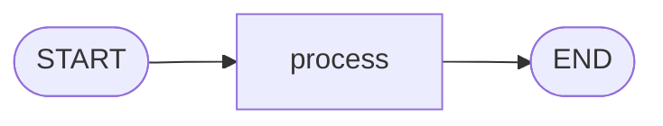
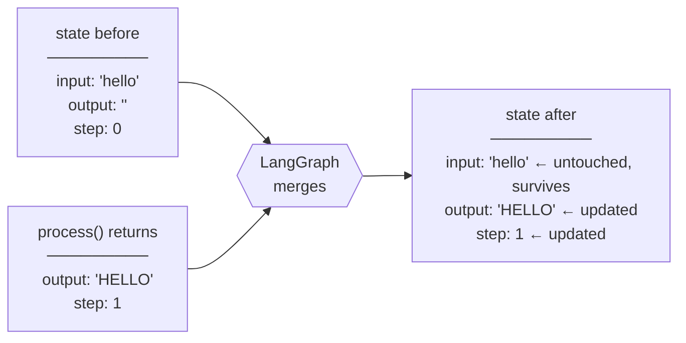

# 1. LangGraph Basics — Your First Graph

**Example file:** [`00_simple_graph.py`](00_simple_graph.py)

This tutorial builds the smallest complete LangGraph program: one state schema, one node, one straight path from `START` to `END`. Every later tutorial in this repo — reducers, routing, agents, checkpointing — is this same shape with more parts attached, so it is worth understanding this one deeply before moving on.

## The Concept: Graphs as Programs

**What is it?** LangGraph models a program as a *graph*: a set of functions (**nodes**) connected by **edges**, all reading from and writing to a shared **state** object. Instead of calling functions yourself in sequence, you declare the wiring once and let the framework drive execution.

**What problem does it solve?** In plain Python, orchestration logic (what runs next, what data flows where, what happens on failure) is tangled into your business logic. As LLM applications grow — retries, branches, parallel calls, human pauses — that tangle becomes unmanageable. A graph separates *what each step does* (node functions) from *how steps connect* (edges), which makes the flow inspectable, visualizable, and resumable.

**When is it appropriate?** Any multi-step process where the flow itself matters: pipelines, decision trees, agent loops, anything you might otherwise draw on a whiteboard.

**When is it overkill?** A single function call, or a fixed two-line sequence, doesn't need a graph. This example is deliberately trivial *as a teaching device* — in real code you'd only reach for LangGraph once branching, state, or persistence enter the picture.

**Intuition:** think of a relay race. The state is the baton. Each node is a runner: it receives the baton, does its leg of the race, and hands the baton off. The edges are the track — laid out before the race starts. The runners never decide the route; the track does.

## Architecture

The example graph could not be simpler:



| Stage | Reads | Writes | Execution |
|---|---|---|---|
| `process` | `input`, `step` | `output`, `step` | Sequential — the only node |

`START` and `END` are not nodes you write. They are markers provided by LangGraph: `START` says "the initial state enters here," and `END` says "whatever state exists here is the final result."

## Code Highlights

### The state schema

```python
class SimpleState(TypedDict):
    input: str
    output: str
    step: int
```

The state is a `TypedDict` — a plain dictionary with declared keys. This schema is the *contract* for the whole graph: every node receives a dict with these fields and may only update these fields. `input` carries the user's data in, `output` carries the result out, and `step` exists purely to demonstrate that numeric state can be read and rewritten as the graph runs.

Passing the schema to `StateGraph(SimpleState)` is what tells LangGraph the shape of the baton.

### The node returns a partial update — not the whole state

```python
def process(state: SimpleState) -> dict:
    output = state["input"].upper()
    step = state["step"] + 1
    return {"output": output, "step": step}
```

This is the single most important idiom in LangGraph. The node receives the **full** current state but returns **only the keys it changed**. Notice `input` is absent from the return value — and yet it survives in the final result. LangGraph merges the returned dict into the existing state; untouched keys pass through unchanged.

*What happens if you return the full state instead?* Here, nothing bad — but it's a habit that breaks later. Once multiple nodes run in parallel (tutorial 5), a node that returns keys it didn't change will clobber other nodes' writes. Returning minimal updates is what makes the rest of the series work.

The merge, visualized:



### Graph construction and compilation

```python
graph = StateGraph(SimpleState)
graph.add_node("process", process)
graph.add_edge(START, "process")
graph.add_edge("process", END)
app = graph.compile()
```

Four declarative steps: create a builder bound to the schema, register the function under the name `"process"`, wire the path, compile. The node *name* (the string) and the node *function* are separate things — edges refer to names, which is what lets you rewire a graph without touching node code.

`compile()` is the boundary between *description* and *machine*. Before it, `graph` is an editable blueprint; after it, `app` is a runnable object with `.invoke()`, `.stream()`, and (later in the series) checkpointing support. If your wiring is invalid — say, a node with no path to `END` — compile is where you find out, not mid-run.

## Execution Walkthrough

Mentally run the program before reading the source:

```text
1. app.invoke() receives the initial state.
2. LangGraph follows the edge START → process.
3. process() runs: uppercases "hello", increments step, returns {"output": "HELLO", "step": 1}.
4. LangGraph merges that update into the state.
5. The edge process → END terminates execution.
6. invoke() returns the merged final state.
```

State evolution:

```text
Initial:      {"input": "hello", "output": "",      "step": 0}
                  ↓  process returns {"output": "HELLO", "step": 1}
Final:        {"input": "hello", "output": "HELLO", "step": 1}
```

Note that `input` was never re-written by any node, yet it appears in the final state — merge semantics, not replacement.

## Running It

From the repo root:

```bash
python "1-Langgraph basics/00_simple_graph.py"
```

Expected output (the script also prints a Mermaid diagram and saves `graph.png` via the shared `util.plot_graph` helper):

```python
Simple graph result: {'input': 'hello', 'output': 'HELLO', 'step': 1}
```

Change `"hello"` in `initial_state` to any other word and re-run: the flow is identical, only the data differs. That separation — fixed wiring, variable data — is the whole point.

## Design Questions Worth Asking

- **Why is `process` a separate named node rather than inline code?** Because edges connect *names*. Naming the step is what lets you later insert a validator before it or a formatter after it without rewriting the step itself.
- **What does the framework handle vs. you?** LangGraph handles: execution order, state merging, termination. You handle: the state schema, the node logic, and returning correct partial updates. Keeping that division in mind prevents most beginner bugs.
- **What if a node returns a key not in the schema?** LangGraph state is schema-driven; stick to declared keys. Undeclared keys are not part of the contract and won't be carried reliably.

## Exercises

**Exercise 1 — Add a second node.** Add a `reverse_node` after `process` that reverses `output`. Path: `START → process → reverse → END`. Final `output` for `"hello"` should be `"OLLEH"`. *Hint: `add_node` and `add_edge` are all you need.*

**Exercise 2 — Track visited nodes.** Add a `visited: list` field. Each node appends its own name. *Hint: without a reducer, returning `{"visited": [...]}` replaces the list — how do you work around that with only what this tutorial covered? (Tutorial 2 shows the proper fix.)*

**Exercise 3 — Input validation.** Add a `validate_node` before `process`. Empty input → set `output` to `"error: empty input"` and go straight to `END`; otherwise continue. *Hint: this needs a conditional edge — peek at tutorial 4 if stuck.*

Solutions live in [`Exercise-Solutions/1-basics/`](../Exercise-Solutions/1-basics/).

## Key Takeaways

1. A LangGraph program is **state in → nodes transform → state out**, with edges deciding order.
2. Nodes return **partial updates**; LangGraph merges them, and untouched fields pass through.
3. Node **names** and node **functions** are separate — edges wire names, which makes flows rewireable.
4. `compile()` turns the blueprint into a runnable app and validates the wiring; `invoke()` executes one run.

## Next Step

[Tutorial 2 — Reducers](../2-Reducer/README.md): what "merging a state update" actually means, and how to control it when the default (overwrite) is wrong.
