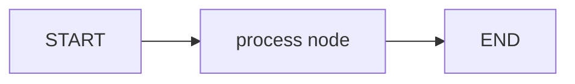

# 1. LangGraph Basics

This folder introduces the simplest LangGraph workflow.

## What This Covers

- Defining a graph state with `TypedDict`
- Creating a `StateGraph`
- Adding one node function
- Connecting `START -> node -> END`
- Compiling and running the graph

## File

| File | Purpose |
|---|---|
| `00_simple_graph.py` | A minimal graph that converts input text to uppercase and increments a step counter |

## Flow



## Run

```bash
python "1-Langgraph basics/00_simple_graph.py"
```
