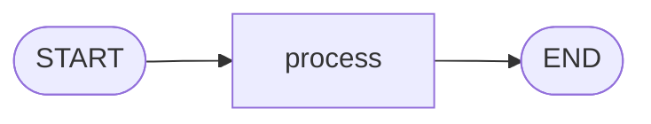
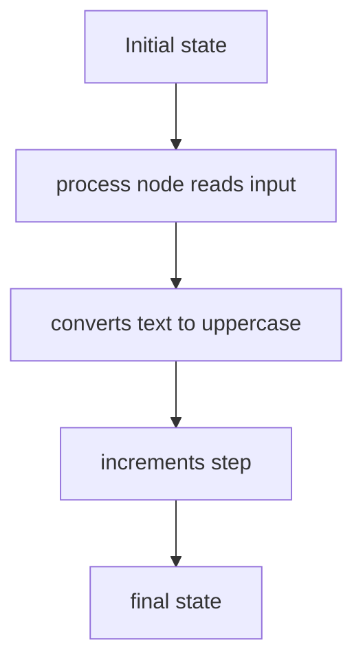

# 1. LangGraph Basics

This folder introduces the smallest useful LangGraph: one state, one node, one path.

## Objective

Understand the basic building blocks of a LangGraph workflow:

1. **State** carries data through the graph.
2. **Node** does work and returns updates.
3. **Edges** decide what runs next.
4. **Compile** turns the graph definition into something you can run.

## Graph Plot



## How The Example Works



## File

| File | Covers |
|---|---|
| `00_simple_graph.py` | Builds a simple graph that turns `hello` into `HELLO` and increments `step` |

## Key Code Ideas

- `SimpleState` defines the shape of the state.
- `process()` is the node function.
- `graph.add_edge(START, "process")` sets the entry path.
- `graph.add_edge("process", END)` ends the graph.
- `graph.compile()` creates the runnable app.

## Run

```bash
python "1-Langgraph basics/00_simple_graph.py"
```

## Takeaway

A LangGraph app is just state moving through functions connected by edges.
