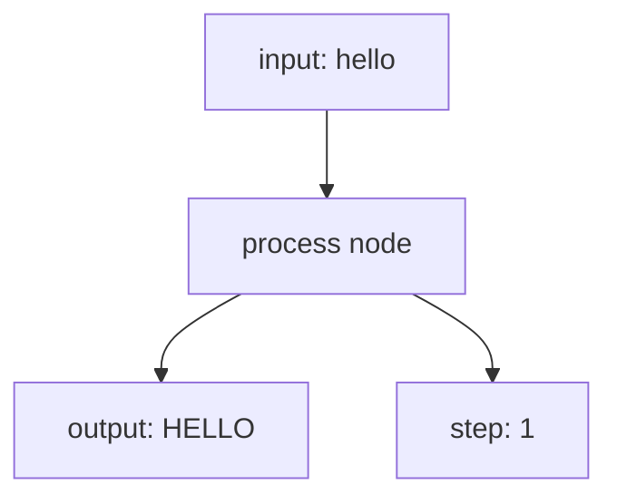

# 1. LangGraph Basics

This tutorial starts with the smallest useful LangGraph: one state, one node, and one path.

## Part 1 — Concept

A LangGraph workflow is a graph. The graph receives some state, passes it into a node, and gets an updated state back.

Think of it like a tiny assembly line:


The path is always:

```text
START -> process -> END
```

There are no branches yet. No reducers yet. No LLM yet. Just the core idea.

### The Three Pieces

| Piece | In This Example | Meaning |
|---|---|---|
| State | `SimpleState` | The data the graph carries |
| Node | `process()` | The function that changes the data |
| Edges | `START -> process -> END` | The order of execution |

## Part 2 — Code Illustration

File:

```text
00_simple_graph.py
```

The graph starts with this state:

```python
initial_state = {
    "input": "hello",
    "output": "",
    "step": 0
}
```

The node reads `input`, converts it to uppercase, increments `step`, and returns the update.



Final result:

```python
{
    "input": "hello",
    "output": "HELLO",
    "step": 1
}
```

Run it:

```bash
python "1-Langgraph basics/00_simple_graph.py"
```

## Code Explanation

```python
class SimpleState(TypedDict):
    input: str
    output: str
    step: int
```

This defines the state shape. Every graph run carries these fields.

```python
def process(state: SimpleState) -> dict:
    output = state["input"].upper()
    step = state["step"] + 1
    return {"output": output, "step": step}
```

This is the node. It receives the current state and returns only the fields it wants to update.

```python
graph = StateGraph(SimpleState)
graph.add_node("process", process)
graph.add_edge(START, "process")
graph.add_edge("process", END)
app = graph.compile()
```

This creates the graph, adds the node, connects the path, and compiles the graph into a runnable app.

```python
result = app.invoke(initial_state)
```

This runs the graph. The final state contains the original input plus the updated output and step.
