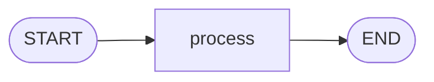

# 1. LangGraph Basics

This folder teaches the simplest LangGraph workflow: one state, one node, and one path from `START` to `END`.

## Goal

By the end of this example, you should understand how to:

- define graph state
- create a node function
- connect nodes with edges
- compile and run a graph

## Graph Plot



This graph always runs the same path:

```text
START -> process -> END
```

## What The Example Does

The file `00_simple_graph.py` starts with this state:

```python
{
    "input": "hello",
    "output": "",
    "step": 0
}
```

The `process` node:

1. reads `input`
2. converts it to uppercase
3. increments `step`
4. returns the updated values

Final result:

```python
{
    "input": "hello",
    "output": "HELLO",
    "step": 1
}
```

## Run

```bash
python "1-Langgraph basics/00_simple_graph.py"
```

## Code Explanation

```python
class SimpleState(TypedDict):
    input: str
    output: str
    step: int
```

This defines the shape of the graph state.

```python
def process(state: SimpleState) -> dict:
    output = state["input"].upper()
    step = state["step"] + 1
    return {"output": output, "step": step}
```

This is the node. It reads state and returns only the fields it wants to update.

```python
graph = StateGraph(SimpleState)
graph.add_node("process", process)
graph.add_edge(START, "process")
graph.add_edge("process", END)
app = graph.compile()
```

This builds the graph, connects the flow, and compiles it into a runnable app.

```python
result = app.invoke(initial_state)
```

This runs the graph with the starting state.
