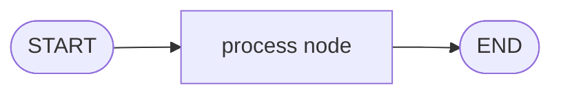
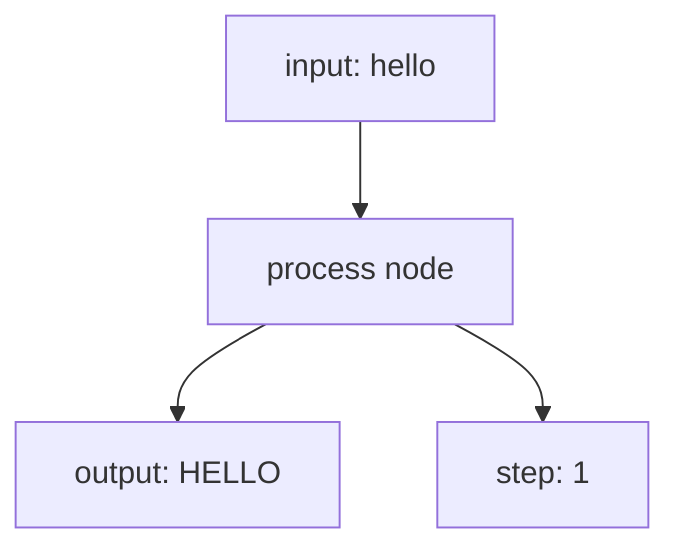

# 1. LangGraph Basics

This tutorial starts with the smallest useful LangGraph: one state, one node, and one path.

## What You'll Learn

After this tutorial, you will be able to:

- Define a state schema with `TypedDict`
- Write a node function that returns a partial state update
- Build, compile, and run a graph with `StateGraph`, `START`, and `END`

## Part 1 — Core Tutorial

A LangGraph workflow is a graph. The graph receives some state, passes it into a node, and gets an updated state back.

Think of it like a tiny assembly line:



The path is always:

```text
START -> process -> END
```

There are no branches yet. No reducers yet. No LLM yet. Just the core idea.

### The Three Pieces

| Piece | In This Example | Meaning |
|---|---|---|
| State | `SimpleState` | The data the graph carries |
| Node | `process()` | The function that changes the data |
| Edges | `START -> process -> END` | The order of execution |

### What To Look For In The Code Example

Part 2 is not a new concept. It is the code version of this tutorial. Before reading it, look for these names:

| Concept | Code Name |
|---|---|
| State schema | `SimpleState` |
| Node function | `process()` |
| Graph object | `graph = StateGraph(SimpleState)` |
| Flow | `graph.add_edge(...)` |
| Run step | `app.invoke(initial_state)` |

The code example uses these exact pieces to build the first graph.

## Part 2 — Code Example That Reinforces The Concept

File:

```text
00_simple_graph.py
```

The graph starts with this state:

```python
initial_state = {
    "input": "hello",
    "output": "",
    "step": 0
}
```

The node reads `input`, converts it to uppercase, increments `step`, and returns the update.



Final result:

```python
{
    "input": "hello",
    "output": "HELLO",
    "step": 1
}
```

Run it from the repo root:

```bash
python "1-Langgraph basics/00_simple_graph.py"
```

### Expected Output

You should see the graph result with uppercase text and an incremented step:

```python
{'input': 'hello', 'output': 'HELLO', 'step': 1}
```

### Try It Yourself

Change the initial `input` value from `"hello"` to another word, then run the script again. The graph flow stays the same, but the output changes.

### Graph Visualization

This example also prints a Mermaid diagram to the terminal and saves a PNG file named `graph.png` in your current directory. That helps you see the graph shape before you run it.

## Code Explanation

```python
class SimpleState(TypedDict):
    input: str
    output: str
    step: int
```

This defines the state shape. Every graph run carries these fields.

```python
def process(state: SimpleState) -> dict:
    output = state["input"].upper()
    step = state["step"] + 1
    return {"output": output, "step": step}
```

This is the node. It receives the current state and returns only the fields it wants to update.

```python
graph = StateGraph(SimpleState)
graph.add_node("process", process)
graph.add_edge(START, "process")
graph.add_edge("process", END)
app = graph.compile()
```

This creates the graph, adds the node, connects the path, and compiles the graph into a runnable app.

```python
result = app.invoke(initial_state)
```

This runs the graph. The final state contains the original input plus the updated output and step.

## What You Learned

- A LangGraph workflow is **state in → node → state out**
- Nodes return **partial updates**, not the full state
- `compile()` turns a graph definition into a runnable app
- `invoke()` runs the app with an initial state

## Next Step

Continue to [2. Reducers](../2-Reducer/README.md) to learn how LangGraph merges state updates.
