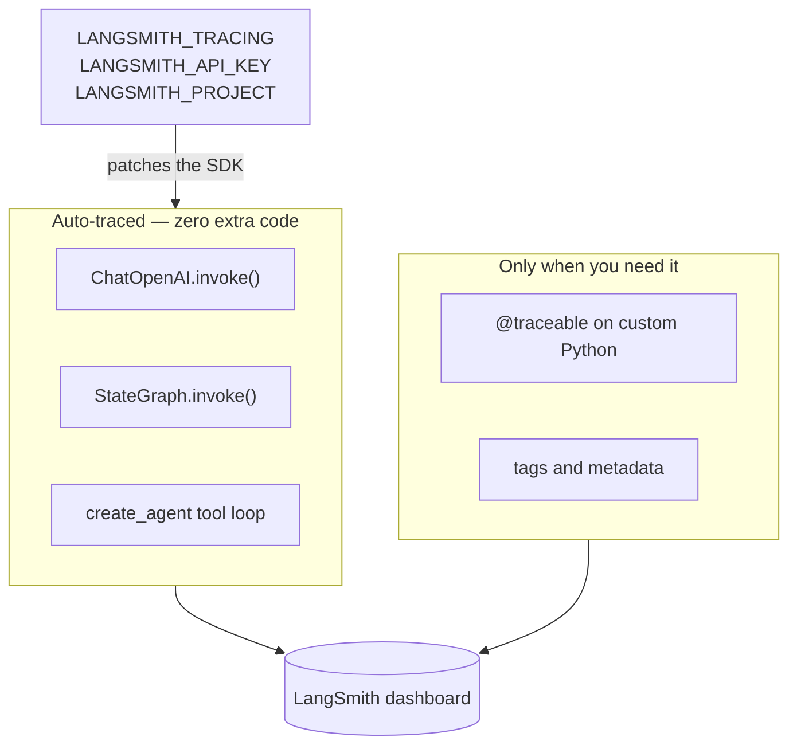
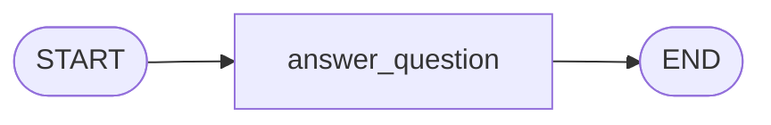
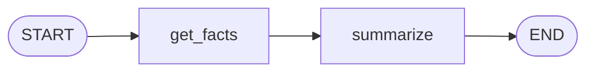
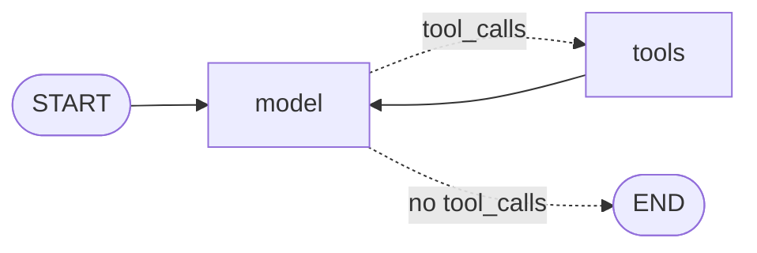

# 10. Observability — Tracing Graphs with LangSmith

**Example files (in reading order):**
- [`01_langsmith_basic_tracing.py`](01_langsmith_basic_tracing.py) — one node, one LLM call, automatic tracing
- [`02_langsmith_traces_and_runs.py`](02_langsmith_traces_and_runs.py) — two chained nodes; one trace, nested runs
- [`03_multi_tool_agent.py`](03_multi_tool_agent.py) — `create_agent` with local-docs + web-search tools

**Requires:** `OPENAI_API_KEY`, `LANGSMITH_TRACING=true`, `LANGSMITH_API_KEY`, and `LANGSMITH_PROJECT` in `10-observability/.env` (copy [`.env.example`](.env.example)). File 03 also uses OpenAI embeddings and optional `SERPER_API_KEY` for live web search. Install this folder's extras with `pip install -r requirements.txt`.

Tutorials 1–9 taught you to *build* graphs. This one teaches you to *see* them run. With three environment variables, LangSmith records every graph invoke and nested LLM call — prompts, responses, tokens, latency — without adding tracing code to the nodes.

## The Concept: Tracing Is Configuration, Not Instrumentation

**What is it?** LangSmith is LangChain's observability dashboard. A **trace** is one logical execution (`graph.invoke()`). A **run** is one recorded step inside that trace (a node, an LLM call, a tool). A **project** groups traces so you can filter later.

**What problem does it solve?** Without tracing, a bad answer is a black box: you see the final string, not the prompt that produced it, which node ran, or how long it took. Production questions — "why did this fail?", "which step is slow?", "is the agent looping?" — need the exact nested tree of calls.

**When is it appropriate?** Any graph you would debug more than once: multi-node pipelines, tool loops, anything that hits a paid model. Turn it on in development first; keep it on in production with tags and metadata so you can filter by user or environment.

**When is it overkill?** A local experiment with no model calls does not need LangSmith. Don't add `@traceable` until you have a custom Python function that LangChain will *not* wrap for you. Files 01 and 02 deliberately skip it. Learn local RAG in tutorial 5 before file 03.

**Intuition:** the graph is a play. A trace is one performance. Each run is a scene. `run_name` is the title on the playbill so you can find tonight's show in a long list of untitled "LangGraph" entries.

```text
Without LangSmith:   graph.invoke(...)  →  answer only

With LangSmith:      graph.invoke(...)  →  answer PLUS a trace tree:
                       graph run (chain)
                         └── ChatOpenAI (llm)
                               prompt, response, tokens, latency, cost
```

### The three env vars that activate everything

```bash
LANGSMITH_TRACING=true          # master switch
LANGSMITH_API_KEY=lsv2_...      # from smith.langchain.com
LANGSMITH_PROJECT=10-observability
```

No `configure()` call, no spans in node code. The SDK reads these at import time.

## Architecture



| Term | Meaning in this tutorial |
|---|---|
| Trace | One `graph.invoke()` — the whole tree |
| Run | One node or LLM call inside that tree |
| `run_name` | Title of the top-level trace (`"Zamalek Facts"`) |
| `@traceable` | Wrap *your* functions so they appear as parent runs (not used in files 01–03) |

---

## File 01 — Basic tracing ([`01_langsmith_basic_tracing.py`](01_langsmith_basic_tracing.py))

The smallest LangGraph that still hits a model: one node asks for a brief overview of a team.



| Stage | Reads | Calls | Writes |
|---|---|---|---|
| `answer_question` | `team` | one `llm.invoke()` | `answer` |

**Why it matters:** tracing is "free." There is no LangSmith import in the graph. `run_name` is the only observability knob — it names the trace so you can find it instead of scrolling past default `"LangGraph"` titles.

```python
result = graph.invoke(
    {"team": "Zamalek SC in Egypt"},
    config={"run_name": "Zamalek Facts"},
)
```

This file does **not** use `@traceable`, tags, or metadata. Those come later. The job here is: env vars on → invoke → open the dashboard and see one graph run with one nested LLM run.

**Expected result:** a short overview of Zamalek SC printed in the terminal, and a trace named **Zamalek Facts** under project `10-observability`. The wording varies; the team you passed in must be the subject.

## File 02 — Traces vs runs ([`02_langsmith_traces_and_runs.py`](02_langsmith_traces_and_runs.py))

Two nodes in a chain. The second consumes the first node's output. Same automatic tracing; the dashboard now has a *tree*.



| Stage | Reads | Writes |
|---|---|---|
| `get_facts` | `team` | `facts` (3 facts from the LLM) |
| `summarize` | `facts` | `summary` (two sentences) |

**The design insight:** one `graph.invoke()` is still **one trace**. `get_facts`, `summarize`, and each `ChatOpenAI` call are **runs** nested under it. That vocabulary is the whole point of this file.

```text
Trace: Zamalek Research1  (the invoke)
  ├── get_facts           (node run)
  │     └── ChatOpenAI    (llm run)
  └── summarize           (node run)
        └── ChatOpenAI    (llm run)
```

State evolution:

```text
{team: "Zamalek SC in Egypt"}
   ↓ get_facts     writes facts
   ↓ summarize     reads facts, writes summary
```

**Expected result:** a two-sentence summary in the terminal, and a trace named **Zamalek Research1**. Open it and confirm `get_facts` feeds `summarize`. Then run [`03_multi_tool_agent.py`](03_multi_tool_agent.py).

## File 03 — Multi-tool agent ([`03_multi_tool_agent.py`](03_multi_tool_agent.py))

Build the **local RAG workflow** first: [`../5-Workflows/01_rag_retrieve_generate.py`](../5-Workflows/01_rag_retrieve_generate.py) (`retrieve → generate` on every question). This file is only the observability step: the same FAISS helper (`rag_index.build_vectorstore`) is a **tool** beside web search, inside `create_agent`, so LangSmith can show which tool the model picked.

| Tool | Typical use | Data |
|---|---|---|
| `search_local_docs` | RAG, security, deployment in local docs | FAISS over `.txt` files in a folder (default [`data/`](data/)) |
| `google_search` | news, regulations, recent AI | Google Serper (`SERPER_API_KEY`) |



`create_agent` builds that loop for you. There is no `ToolNode` or router in this file. Execution of a requested tool is automatic; **selection** of which tool is the agent's.

Three questions exercise different expected routes (hints only — not graph edges):

1. prompt injection defenses → local docs
2. AI regulations in 2025 → web search
3. how RAG works *and* latest frameworks → both

Each `invoke` uses `config={"run_name": "...", "recursion_limit": 10}`. In LangSmith you should see **one trace per question**, with child runs for the LLM and whichever tools actually ran:

```text
Trace: Multi-Tool: both
  ├── openai          (decides: local docs)
  ├── search_local_docs
  ├── openai          (decides: web search)
  ├── google_search
  └── openai          (final answer)
```

Without `SERPER_API_KEY`, `google_search` returns an error string instead of crashing; the model can still finish.

**Expected result:** three printed answers plus the tool names that ran. Traces **Multi-Tool: local docs**, **Multi-Tool: web search**, and **Multi-Tool: both** in project `10-observability`.

## Optional: longer sequential pipeline (`agent/`)

[`agent/graph.py`](agent/graph.py) is a five-node document-intelligence chain (`planner → document_reader → web_enricher → synthesizer → report_writer`). It is still a **workflow** you wired at build time, not `create_agent`. Tracing is the same mechanism as files 01–02: env vars only.

[`graph_entry.py`](graph_entry.py) compiles that graph; [`graph_viz.py`](graph_viz.py) writes `graph.png`. Optional `SERPER_API_KEY` is for the web-enricher node.

---

## Running It

This folder loads `.env` from **here**, not the repo root. From `10-observability/`:

```bash
pip install -r requirements.txt
cp .env.example .env   # then fill in keys
python 01_langsmith_basic_tracing.py
python 02_langsmith_traces_and_runs.py
# After tutorial 5's 01_rag_retrieve_generate.py:
python 03_multi_tool_agent.py
```

Then open [smith.langchain.com](https://smith.langchain.com), select project `10-observability`, and compare: one child LLM (01), two chained nodes (02), and a model-chosen tool loop (03).

## Design Questions Worth Asking

- **Why isn't there a `langsmith` import in 01 and 02?** Auto-tracing patches LangChain/LangGraph at process start from env vars. If the import were required, the lesson would be "instrument your nodes," which is the opposite of the point.
- **What if I forget `run_name`?** The run still appears; the title is the generic `"LangGraph"`. Fine for one experiment, painful once you have twenty.
- **When do I need `@traceable`?** When a function is *not* a LangChain runnable or LangGraph node — plain Python that you still want as a span (keyword search, custom I/O). Nodes and `ChatOpenAI` already show up.
- **Is the five-node `agent/` graph an agent?** No. Paths are fixed. It is a prompt-chaining workflow (tutorial 5) that happens to be traced. For a model-driven tool loop, use file 03 (`create_agent`) or tutorial 6.

## Key Takeaways

1. LangSmith tracing is **env vars**, not node instrumentation.
2. **Trace** = one invoke; **run** = each nested step. File 02 exists to make that tree visible.
3. `config={"run_name": "..."}` is how you find a run in the dashboard.
4. `@traceable`, tags, and metadata are the next layer — use them when you need custom spans or filters, not for the first graph.
5. A longer graph does not need a new tracing API. The same three variables cover one node, two nodes, five workflow nodes, or a `create_agent` tool loop.
6. You define the toolbox; the agent chooses which tool to call. LangSmith is how you *see* that choice.

## Next Step

[Tutorial 11 — Guardrails](../11-Guardrials/guardrails_langchain_middleware.ipynb): once you can *see* what the model did, constrain what it is allowed to do — PII filters, human-in-the-loop, and other LangChain middleware on `create_agent`.
