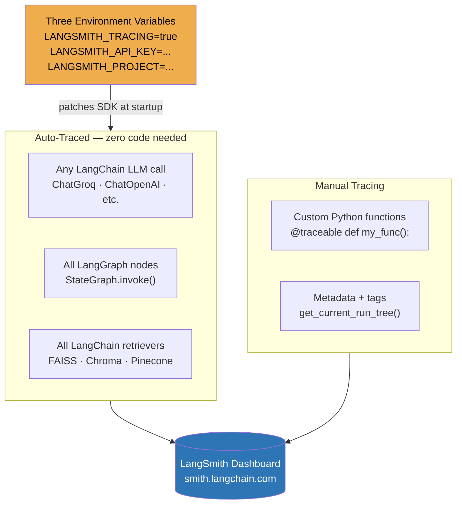

# LangSmith — LLM Tracing & Observability


## What is LangSmith?

LangSmith is an **LLM observability platform** built by LangChain. Set three environment variables and every LangChain/LangGraph call is automatically logged — model name, tokens, latency, full prompt, full response.

```
Without LangSmith:   llm.invoke("What is RAG?")  →  answer only, nothing logged

With LangSmith:      llm.invoke("What is RAG?")  →  answer PLUS:
                       model = llama-3.3-70b-versatile
                       input_tokens = 8, output_tokens = 142
                       latency = 412ms
                       full prompt text
                       full response text
                       cost = $0.00002
```

### Why LangSmith Is Useful

| Problem in production | How LangSmith solves it |
|-----------------------|------------------------|
| "Why did the LLM give a bad answer?" | See the **exact prompt** that was sent, including all retrieved context |
| "Which users are costing the most tokens?" | Filter by `metadata.user_id` and sum tokens across traces |
| "Is the agent looping or calling the wrong tool?" | Every tool call and LLM reasoning step is a visible child Run |
| "How fast are my LLM calls?" | Latency recorded per Run — spot slow retrievers or models immediately |
| "What changed between yesterday and today?" | Compare runs across time in the dashboard with tags and metadata |

### The Three Env Vars That Activate Everything

```bash
LANGSMITH_TRACING=true          # master switch — turns tracing on
LANGSMITH_API_KEY=ls__...       # your API key from smith.langchain.com
LANGSMITH_PROJECT=my-project    # groups your traces under a project name
```

That's it. No `configure()` call, no `instrument_openai()`, no spans. Just env vars.

---


---

## How LangSmith Tracing Works



---

## Core Terminology

### Run
A **Run** is LangSmith's unit of tracing — one recorded execution of any component. Every `llm.invoke()`, every retriever call, every LangGraph node creates a Run automatically.

```
Run types:
  llm       → a language model call
  chain     → an orchestrator / graph run
  retriever → a vector store search
  tool      → a function/tool call by an agent
```

### Trace
A **Trace** is a tree of Runs for one logical operation. When a chain calls a retriever and an LLM, the chain is the parent Run; retriever and LLM are child Runs.

```
Trace: production_guide_rag  (run_type=chain)
  └── ChatGroq                (run_type=llm)
        full prompt + response, tokens, cost visible here
```

### Project
A **Project** groups related traces. Set via `LANGSMITH_PROJECT=my-project`. Use separate projects for dev, staging, and production.

### @traceable
The `@traceable` decorator makes any custom Python function appear in the trace tree, just like a LangChain object. It intercepts the function call, wraps it in a Run, and sends it to LangSmith.

```python
from langsmith import traceable

@traceable(run_type="tool", name="doc_keyword_search")
def search_document(query: str) -> list:
    # now visible as a child Run in LangSmith
    ...

@traceable(run_type="chain", name="doc_qa_pipeline")
def doc_qa(question: str) -> str:
    # parent Run — search_document and llm.invoke() nest inside this
    sections = search_document(question)   # child Tool Run
    return llm.invoke(prompt).content     # child LLM Run
```

**`run_type` values:**

| Value | When to use |
|-------|------------|
| `"llm"` | Function that calls a language model |
| `"tool"` | Function that retrieves data, searches, or calls an API |
| `"chain"` | Orchestrator function that calls other functions |

### get_current_run_tree
`get_current_run_tree()` returns the currently active LangSmith Run object from inside a `@traceable` function. Use it to attach metadata and tags to the parent Run from within the function body — where the values are actually known.

```python
from langsmith import traceable, get_current_run_tree

@traceable(run_type="chain", name="support-query")
def support_qa(question: str, user_id: str, session_id: str) -> str:
    run = get_current_run_tree()
    if run:
        run.metadata.update({"user_id": user_id, "session_id": session_id})
        run.tags = ["production", "support-bot", "groq"]
    return llm.invoke(question).content
```


### Tags & Metadata
- **Tags** — string labels for filtering: `["production", "groq"]`
- **Metadata** — key-value dict for analytics: `{"user_id": "alice", "session": "s1"}`
- Set via `get_current_run_tree()` inside any `@traceable` function

