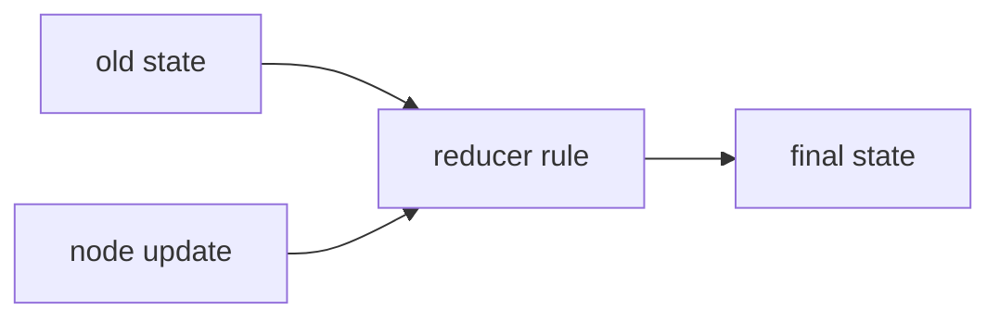
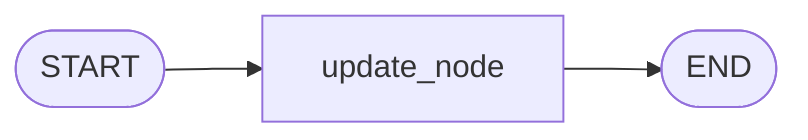
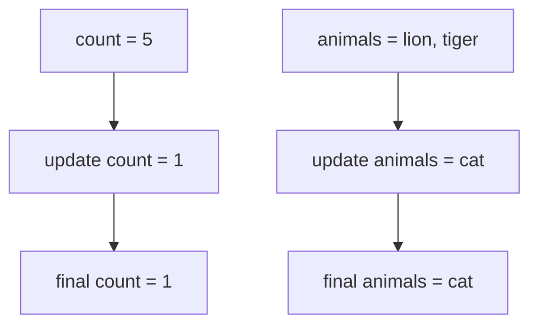
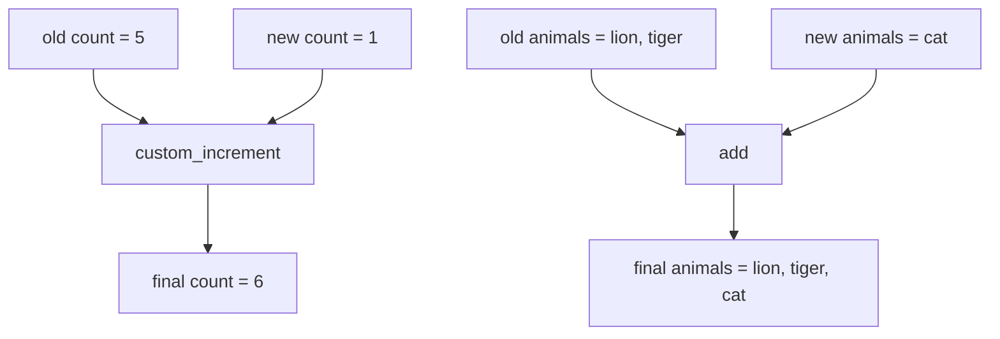
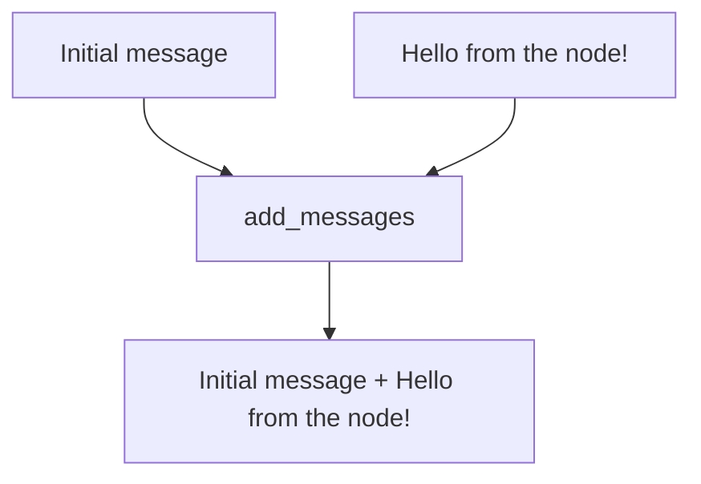

# 2. Reducers

This tutorial teaches reducers by showing the same idea in two worlds: first without reducers, then with reducers.

## What You'll Learn

After this tutorial, you will be able to:

- Explain the difference between replacing and merging state updates
- Attach custom reducers to state fields with `Annotated`
- Use `add_messages` to append conversation history instead of replacing it

## Part 1 — Core Tutorial

A node usually returns a partial state update. LangGraph then has to answer an important question:

```text
Should this update replace the old value, or should it be combined with the old value?
```

That combining rule is called a **reducer**.



Without a reducer, the update usually replaces the old value. With a reducer, you choose how values are merged. In LangGraph, reducer rules live on individual state fields, so one field can replace while another field appends.

All examples use the same graph shape:



The interesting part is not the graph path. The interesting part is what happens to state after `update_node` returns.

### What To Look For In The Code Example

Part 2 is the practical version of the reducer concept. It uses three files to show the same idea step by step:

| Concept | Code To Watch |
|---|---|
| No reducer | `StateWithoutReducer` |
| Node update | `node_to_update()` returns `{"count": 1, "animals": ["cat"]}` |
| Custom reducer | `custom_increment(current, new)` |
| Attach reducer | `Annotated[int, custom_increment]` |
| Message reducer | `Annotated[List[HumanMessage], add_messages]` |

So when you read the code, focus on the state schema first. That is where reducer behavior is defined.

## Part 2 — Code Example That Reinforces The Concept

### Example A: Without A Reducer

File:

```text
01_state_without_reducer.py
```

Initial state:

```python
{
    "count": 5,
    "animals": ["lion", "tiger"]
}
```

Node update:

```python
{
    "count": 1,
    "animals": ["cat"]
}
```

Because there is no reducer, the old values are replaced:



Final state:

```python
{
    "count": 1,
    "animals": ["cat"]
}
```

What to notice: `5` disappeared, and `["lion", "tiger"]` disappeared. That is replacement behavior.

### Example B: With Reducers

File:

```text
02_custom_reducer.py
```

Now the state tells LangGraph how to merge updates:

```python
count: Annotated[int, custom_increment]
animals: Annotated[List[str], add]
```

So the same style of update behaves differently:



Final state:

```python
{
    "count": 6,
    "animals": ["lion", "tiger", "cat"]
}
```

What to notice: the old values stayed, and the new values were combined with them. That is reducer behavior.

### Example C: Message Reducer

File:

```text
03_messages_reducer.py
```

Conversation history should not be replaced every time a new message appears. For that, LangGraph provides `add_messages`, the message-focused reducer used throughout chat and tool-calling graphs.



Final messages:

```text
Initial message.
Hello from the node!
```

Run the examples from the repo root:

```bash
python "2-Reducer/01_state_without_reducer.py"
python "2-Reducer/02_custom_reducer.py"
python "2-Reducer/03_messages_reducer.py"
```

### Try It Yourself

In `02_custom_reducer.py`, change the node update from `"count": 1` to `"count": 10`. The final count should become `15` because the reducer adds the old and new values.

## Code Explanation

Without a reducer:

```python
class StateWithoutReducer(TypedDict):
    count: int
    animals: list[str]
```

There is no merge rule attached to `count` or `animals`, so returned values replace old values.

With a custom reducer:

```python
def custom_increment(current: int, new: int) -> int:
    return current + new
```

This function receives the current value and the new update, then returns the merged value.

```python
count: Annotated[int, custom_increment]
animals: Annotated[List[str], add]
```

`Annotated` attaches a reducer to a field. `custom_increment` adds numbers. `add` concatenates lists.

For messages:

```python
messages: Annotated[List[HumanMessage], add_messages]
```

`add_messages` preserves existing message history and appends new messages. This is why message state can grow turn by turn instead of being overwritten.

## What You Learned

- Without a reducer, node updates **replace** existing values
- With `Annotated[field, reducer]`, you control how updates are **merged**
- `add_messages` is the standard reducer for growing conversation history

## Next Step

Continue to [3. LLM Messages](../3_LLM_Messages/README.md) to connect an LLM to a graph with message history.
