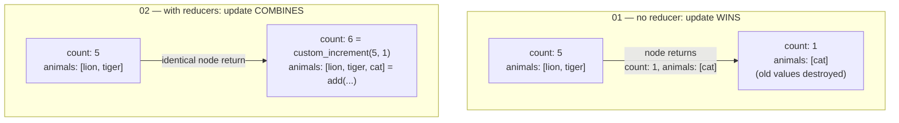

# 2. Reducers — Controlling How State Updates Merge

**Example files:**
- [`01_state_without_reducer.py`](01_state_without_reducer.py) — the default: updates overwrite
- [`02_custom_reducer.py`](02_custom_reducer.py) — custom merge rules per field
- [`03_messages_reducer.py`](03_messages_reducer.py) — the built-in `add_messages` reducer

Tutorial 1 said "LangGraph merges the node's return value into the state." This tutorial answers the question that statement hides: **merges *how*?** The answer is per-field, and you control it with reducers. No LLM or API key is needed for any of these examples.

## The Concept: A Merge Rule Per Field

**What is it?** A reducer is a function attached to a single state field that decides how a node's update combines with the field's existing value. Its signature is always the same shape:

```text
reducer(current_value, new_value) → merged_value
```

**What problem does it solve?** When a node returns `{"count": 1}`, LangGraph must choose between two interpretations: *"set count to 1"* or *"combine 1 with what's already there."* Both are legitimate — it depends on the field. A `status` field should be overwritten; a conversation history should never be. Reducers let each field declare its own answer, so nodes can stay simple (return what you produced) while the schema handles accumulation.

**When do you need one?** Any field that *accumulates* across nodes: message histories, collected results, counters, logs. Reducers become non-negotiable in two situations you'll hit later in this series:
- **Loops** (tutorials 4–5): a node that runs multiple times would erase its own previous output.
- **Parallel branches** (tutorial 5): several nodes write the same field in the same step — without a reducer, LangGraph has no way to combine the concurrent writes, and you get either lost data or an error.

**When is the default fine?** Fields that hold "the current value of something" — the latest draft, a routing decision, a flag. Overwriting is exactly right there. Don't reflexively add reducers to every field; overwrite semantics are the correct choice more often than not.

**Intuition:** think of each state field as a ledger with its own posting rule. Some ledgers record only the latest balance (overwrite). Some append every transaction (list concat). Some keep a running total (sum). The node just submits an entry; the ledger's rule decides what the page looks like afterward.

## Architecture

All three examples deliberately use the *same* trivial graph:


That's the point of the design: since the wiring never changes, any difference in output must come from the state schema alone. The experiment isolates one variable.

## Code Highlights

### Example A — no reducer, so updates replace

```python
class StateWithoutReducer(TypedDict):
    count: int
    animals: list[str]
```

Plain type hints, no merge rules. The node returns `{"count": 1, "animals": ["cat"]}` against an initial state of `{"count": 5, "animals": ["lion", "tiger"]}`. Result: `5` is gone, the lions and tigers are gone. The update didn't *combine* — it *won*.

### Example B — `Annotated` attaches the merge rule to the type

```python
def custom_increment(current: int, new: int) -> int:
    return current + new

class StateWithCustomReducer(TypedDict):
    count: Annotated[int, custom_increment]
    animals: Annotated[List[str], add]   # operator.add concatenates lists
```

`Annotated[type, reducer]` is the entire mechanism. Note what did **not** change between examples A and B: the node function is byte-for-byte the same return statement. Where the update lands differently is decided by the schema, not the node. This is deliberate separation of concerns — nodes describe *what happened*, the schema describes *how history is kept*.

Also note the reducer for `animals` is just `operator.add` from the standard library. Any `(current, new) → merged` function qualifies; nothing about reducers is LangGraph-specific magic.

### Example C — `add_messages`, the reducer you'll use most

```python
from langgraph.graph.message import add_messages

class StateWithMessages(TypedDict):
    messages: Annotated[List[HumanMessage], add_messages]
```

The node returns a list containing **one** new `HumanMessage`, and the final state contains the initial message *plus* the new one. `add_messages` is LangGraph's built-in reducer for conversation history — it appends new messages, and (beyond simple appending) it also understands message identity, so a message re-sent with the same ID updates in place rather than duplicating. Every chat example in tutorials 3, 6, and 7 relies on this one line.

## Execution Walkthrough

State evolution for each example, same node behavior, three different schemas:

```text
Example A (no reducer — overwrite):
  {"count": 5, "animals": ["lion", "tiger"]}
      ↓  node returns {"count": 1, "animals": ["cat"]}
  {"count": 1, "animals": ["cat"]}                       ← old values destroyed

Example B (custom reducers — combine):
  {"count": 5, "animals": ["lion", "tiger"]}
      ↓  node returns {"count": 1, "animals": ["cat"]}
      ↓  custom_increment(5, 1) → 6 ; add(["lion","tiger"], ["cat"]) → all three
  {"count": 6, "animals": ["lion", "tiger", "cat"]}      ← old values preserved

Example C (add_messages — append):
  messages: [Initial message.]
      ↓  node returns one new HumanMessage
  messages: [Initial message., Hello from the node!]
```

The key mental model: **the node's return value is not a state assignment — it is an *argument* passed to each field's reducer.** With no reducer declared, the "reducer" is effectively `lambda current, new: new`.

Same node return, two schemas, two outcomes:



## Overwrite vs. Reducer at a Glance

| | Without reducer | With reducer |
|---|---|---|
| Node returns `{"count": 1}` means | "count is now 1" | "apply 1 to count via the rule" |
| Old value | discarded | passed into the reducer |
| Safe in loops? | node erases its own history | accumulates correctly |
| Safe with parallel writers? | conflicting writes | writes merge deterministically |
| Right for | current status, latest draft, flags | histories, collections, counters, logs |

## Running the Examples

From the repo root:

```bash
python "2-Reducer/01_state_without_reducer.py"
python "2-Reducer/02_custom_reducer.py"
python "2-Reducer/03_messages_reducer.py"
```

Expected final states, respectively:

```python
{'count': 1, 'animals': ['cat']}                          # A: replaced
{'count': 6, 'animals': ['lion', 'tiger', 'cat']}         # B: merged
# C prints both message contents: "Initial message." then "Hello from the node!"
```

Quick experiment: in `02_custom_reducer.py`, change the node's return to `"count": 10` — the final count becomes `15`, because the reducer computes `5 + 10` rather than assigning.

## Design Questions Worth Asking

- **Why put the merge rule on the field instead of inside the node?** Because multiple nodes may write the same field. If accumulation logic lived in nodes, every writer would have to re-implement it identically — and parallel writers couldn't coordinate at all. One rule on the schema governs all writers.
- **What happens if you remove `Annotated[..., add]` from `animals` in example B?** It silently reverts to overwrite behavior — no error, just lost data. Reducer bugs are usually *silent*, which is why it pays to decide overwrite-vs-accumulate explicitly for every field when designing a schema.
- **Why does the node in example C return a *list* with one message rather than a bare message?** The field's type is a list; the reducer combines list-with-list. Returning a one-element list keeps the contract uniform whether a node produces one message or several.

## Exercises

**Exercise 1 — Write a max reducer.** Field `high_score: int` whose reducer keeps whichever value is higher. Start at `42`, return `{"high_score": 10}` → still `42`; return `{"high_score": 100}` → `100`.

**Exercise 2 — Deduplicate a list.** An `animals` reducer that appends but skips duplicates: `["lion", "tiger"]` + `["tiger", "cat"]` → `["lion", "tiger", "cat"]`. *Hint: sets deduplicate but lose order — decide whether that matters.*

**Exercise 3 — Two nodes accumulating.** Wire `START → node_a → node_b → END`, each returning `{"count": 5}`, starting from `0`. Confirm the result is `10` — reducers apply at *every* node's update, not just the last.

Solutions live in [`Exercise-Solutions/2-reducers/`](../Exercise-Solutions/2-reducers/).

## Key Takeaways

1. A node's return value is an **input to each field's reducer**, not a direct assignment.
2. Default behavior (no reducer) is **overwrite** — correct for "current value" fields, destructive for histories.
3. `Annotated[type, fn]` attaches any `(current, new) → merged` function as a field's merge rule; standard-library functions like `operator.add` work fine.
4. `add_messages` is the standard reducer for conversation history and underpins every chat graph later in this series.
5. Choose overwrite vs. accumulate **per field, at schema design time** — reducer mistakes fail silently.

## Next Step

[Tutorial 3 — LLM Messages](../3_LLM_Messages/README.md): put `add_messages` to work in a real chatbot node that calls an LLM.
