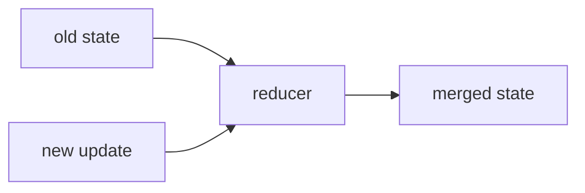

# 2. Reducers

This folder explains how LangGraph updates state when nodes return new values.

## What This Covers

- What happens when state is updated without a reducer
- How reducers merge state instead of replacing it
- How to write a custom reducer
- How message reducers append conversation history

## Files

| File | Purpose |
|---|---|
| `01_state_without_reducer.py` | Shows default state replacement behavior |
| `02_custom_reducer.py` | Shows custom reducer logic for merging updates |
| `03_messages_reducer.py` | Shows message-style state updates with a reducer |

## Key Idea

Without a reducer, a new value usually replaces the old value.
With a reducer, you decide how old state and new updates combine.

