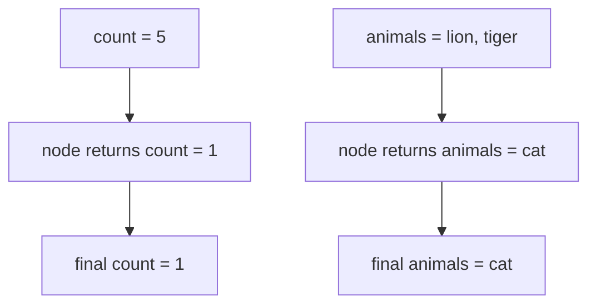
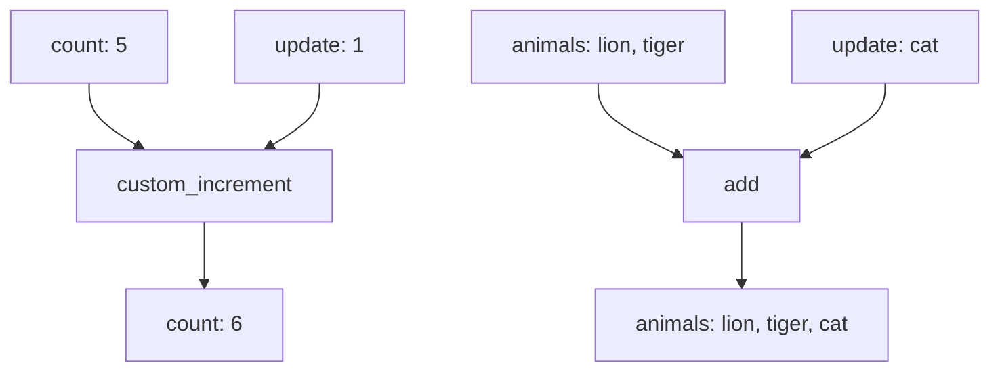
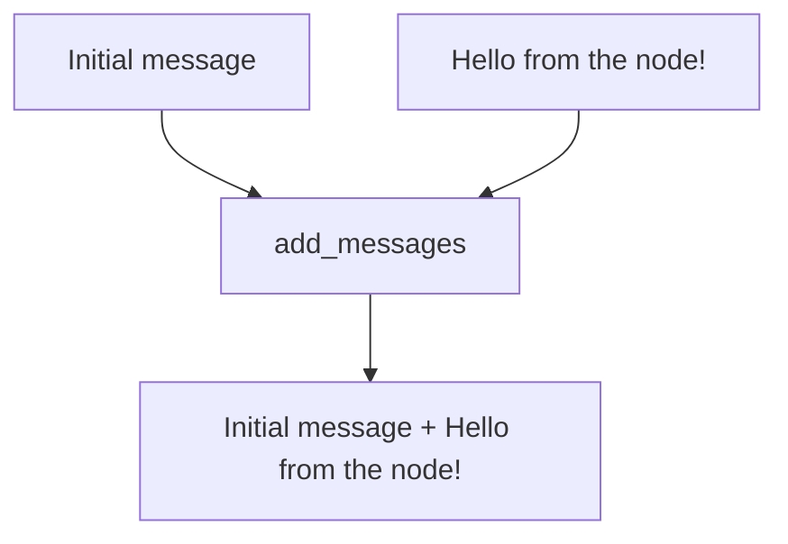

# 2. Reducers

This folder is a step-by-step tutorial about **reducers** in LangGraph.

A reducer controls how LangGraph combines:

- the **current state**
- the **update returned by a node**

Without a reducer, the new value usually replaces the old value. With a reducer, you decide how to merge them.

## The Graph Used In This Folder

All files use the same simple graph:


The graph is simple on purpose. The important lesson is not the graph shape — it is how the state changes.

---

## 1. First: State Without A Reducer

File:

```text
01_state_without_reducer.py
```

The state starts like this:

```python
initial_state = {
    "count": 5,
    "animals": ["lion", "tiger"]
}
```

The node returns this update:

```python
return {
    "count": 1,
    "animals": ["cat"]
}
```

Because there is **no reducer**, LangGraph replaces the old values.



Final result:

```python
{
    "count": 1,
    "animals": ["cat"]
}
```

### What You Learn

If a state field has no reducer, the node update replaces the old value.

---

## 2. Then: State With Reducers

File:

```text
02_custom_reducer.py
```

Now the state fields use reducers:

```python
count: Annotated[int, custom_increment]
animals: Annotated[List[str], add]
```

This means:

| Field | Reducer | What Happens |
|---|---|---|
| `count` | `custom_increment` | old count + new count |
| `animals` | `add` | old list + new list |

The same initial state starts here:

```python
{
    "count": 5,
    "animals": ["lion", "tiger"]
}
```

The node still returns:

```python
{
    "count": 1,
    "animals": ["cat"]
}
```

But now reducers merge the values:



Final result:

```python
{
    "count": 6,
    "animals": ["lion", "tiger", "cat"]
}
```

### What You Learn

Reducers let the old state and new update work together instead of replacing each other.

---

## 3. Finally: Message Reducer

File:

```text
03_messages_reducer.py
```

Chatbots need to keep conversation history. If every new message replaced the old messages, the chatbot would forget everything.

LangGraph provides `add_messages` for this:

```python
messages: Annotated[List[HumanMessage], add_messages]
```

Initial messages:

```python
[
    HumanMessage(content="Initial message.")
]
```

The node returns one new message:

```python
HumanMessage(content="Hello from the node!")
```

`add_messages` appends the new message to the existing list:



Final message history:

```text
Initial message.
Hello from the node!
```

### What You Learn

`add_messages` is a reducer made for conversation history. It keeps old messages and appends new ones.

---

## Mental Model

Think of a reducer as the rule for this question:

```text
old value + new update = what should the final value be?
```

Examples:

| Situation | Without Reducer | With Reducer |
|---|---|---|
| Number update | replace old number | add numbers together |
| List update | replace old list | append/concatenate lists |
| Message update | replace message history | append new message |

---

## Run The Examples

```bash
python "2-Reducer/01_state_without_reducer.py"
python "2-Reducer/02_custom_reducer.py"
python "2-Reducer/03_messages_reducer.py"
```

## Takeaway

Reducers are important when you want LangGraph to **preserve and combine state** instead of simply replacing it.
