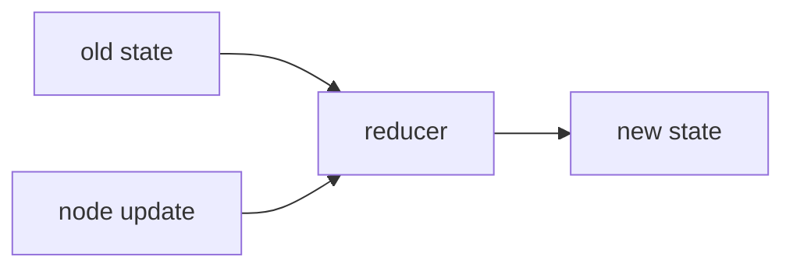

# 2. Reducers

This folder explains how LangGraph decides what happens when a node returns a state update.

## Objective

Understand the difference between replacing state and merging state.

Reducers matter because nodes usually return **partial updates**, not the whole state.

## Graph Plot

All examples in this folder use the same graph shape:

The graph shape is simple on purpose. The lesson is about how state changes after `update_node` runs.

## Reducer Concept

## Files

| File | Covers | Result |
|---|---|---|
| `01_state_without_reducer.py` | No reducer | New values replace old values |
| `02_custom_reducer.py` | Custom reducer | `count` is incremented and `animals` are appended |
| `03_messages_reducer.py` | Message reducer | New messages are appended to message history |

## Logical Flow

1. Start with normal state updates.
2. Notice that values get replaced.
3. Add reducers to control how updates merge.
4. Apply the same idea to chat/message history.

## Key Code Ideas

- No reducer means default overwrite behavior.
- `Annotated[type, reducer]` attaches a reducer to a state field.
- A custom reducer receives the old value and new value.
- `add_messages` is a reducer designed for message history.

## Takeaway

Reducers answer this question: **when a node returns an update, should LangGraph replace the old value or combine it with the new one?**
