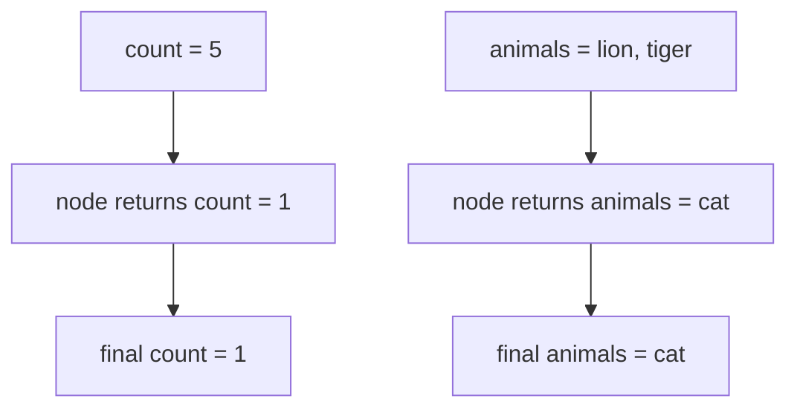
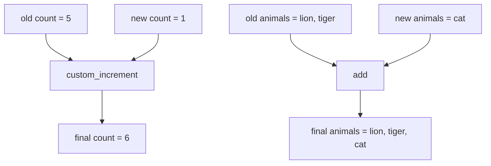
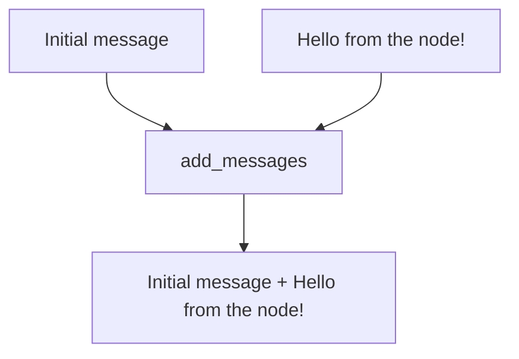

# 2. Reducers

This folder teaches reducers by comparing the same kind of update in three situations:

1. without a reducer
2. with custom reducers
3. with the built-in message reducer

## Goal

Understand this question:

```text
When a node returns an update, should LangGraph replace the old value or combine it with the new value?
```

That rule is controlled by a reducer.

## Graph Plot

All examples use this simple graph:


The graph shape is simple so you can focus on how state changes.

---

## Step 1: Without A Reducer

File:

```text
01_state_without_reducer.py
```

Initial state:

```python
{
    "count": 5,
    "animals": ["lion", "tiger"]
}
```

Node update:

```python
{
    "count": 1,
    "animals": ["cat"]
}
```

Because there is no reducer, the update replaces the old values.



Final state:

```python
{
    "count": 1,
    "animals": ["cat"]
}
```

---

## Step 2: With Reducers

File:

```text
02_custom_reducer.py
```

Now the state uses reducers:

```python
count: Annotated[int, custom_increment]
animals: Annotated[List[str], add]
```

The node returns the same kind of update:

```python
{
    "count": 1,
    "animals": ["cat"]
}
```

But the result is different:



Final state:

```python
{
    "count": 6,
    "animals": ["lion", "tiger", "cat"]
}
```

---

## Step 3: Message Reducer

File:

```text
03_messages_reducer.py
```

Message history should usually be preserved. A chatbot should not forget old messages every time a new message is added.

LangGraph provides `add_messages` for this:

```python
messages: Annotated[List[HumanMessage], add_messages]
```

Flow:



Final messages:

```text
Initial message.
Hello from the node!
```

## Run

```bash
python "2-Reducer/01_state_without_reducer.py"
python "2-Reducer/02_custom_reducer.py"
python "2-Reducer/03_messages_reducer.py"
```

## Code Explanation

Without a reducer:

```python
class StateWithoutReducer(TypedDict):
    count: int
    animals: list[str]
```

There is no merge rule, so updates replace old values.

With reducers:

```python
def custom_increment(current: int, new: int) -> int:
    return current + new
```

This tells LangGraph how to combine the old count and the new count.

```python
count: Annotated[int, custom_increment]
animals: Annotated[List[str], add]
```

`Annotated` attaches a reducer to a state field.

For messages:

```python
messages: Annotated[List[HumanMessage], add_messages]
```

`add_messages` keeps existing messages and appends new messages.
