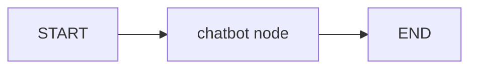

# 3. LLM Messages

This folder shows how to use LangGraph with chat-style message history.

## What This Covers

- Creating a message-based state
- Using `add_messages` as a reducer
- Sending the full conversation to an LLM
- Returning only the new AI message from a node

## File

| File | Purpose |
|---|---|
| `04_simple_chatbot.py` | A simple one-turn chatbot graph using message history |

## Flow



## Note

This example needs an OpenAI API key in a local `.env` file:

```bash
OPENAI_API_KEY=your_api_key_here
```
