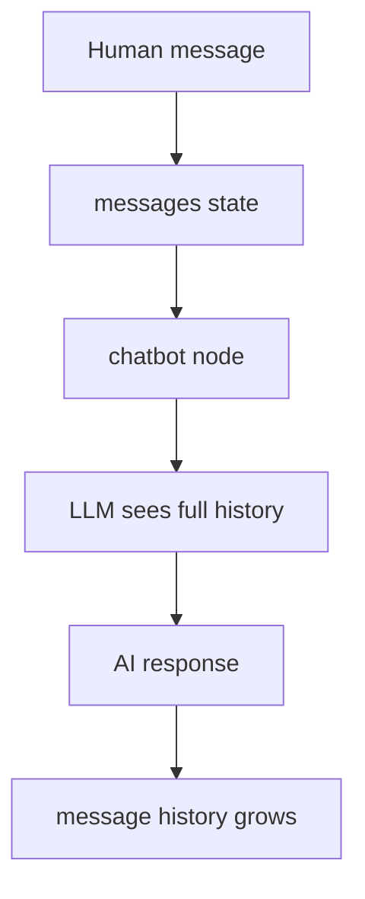
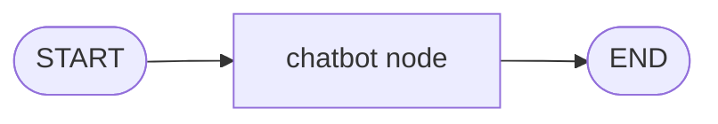

# 3. LLM Messages

This tutorial shows how LangGraph can carry chat history through a graph.

## Part 1 — Concept

Chatbots need memory. Not long-term memory yet — just the conversation so far.

In LangGraph, that conversation usually lives in a `messages` field inside the state.



The key idea: each node can return a new message, and LangGraph appends it to the existing message history.

The graph itself is simple:



### Built-In Message State

LangGraph provides `MessagesState`, a built-in state type for message history.

You can extend it when your graph needs extra fields:

```python
from langgraph.graph import MessagesState

class MyGraphState(MessagesState):
    turn_count: int
```

This means:

- `MessagesState` already gives you `messages`
- `MyGraphState` adds `turn_count`
- your graph state can now contain both

```python
{
    "messages": [...],
    "turn_count": 3
}
```

Conceptually, it is like this:

```python
class MyGraphState(TypedDict):
    messages: list
    turn_count: int
```

But `MessagesState` is special because it already handles LangGraph messages properly.

## Part 2 — Code Illustration

File:

```text
04_simple_chatbot.py
```

The example starts with one human message:

```python
HumanMessage(content="What is RAG?")
```

The chatbot node sends the full conversation to the LLM:

```python
response = llm.invoke(state["messages"])
```

Then it returns only the new AI message:

```python
return {"messages": [response]}
```

`add_messages` appends the response to the existing history.

Setup for this example:

```bash
OPENAI_API_KEY=your_api_key_here
```

## Code Explanation

```python
class ChatState(TypedDict):
    messages: Annotated[list, add_messages]
```

This manually defines a message state. The `messages` field stores chat history, and `add_messages` appends new messages.

```python
def chatbot_node(state: ChatState) -> dict:
    response = llm.invoke(state["messages"])
    return {"messages": [response]}
```

This node receives the conversation history, calls the LLM, and returns the new AI message.

```python
graph = StateGraph(ChatState)
graph.add_node("chatbot", chatbot_node)
graph.add_edge(START, "chatbot")
graph.add_edge("chatbot", END)
```

This creates a one-node chatbot graph.

A more built-in style is:

```python
from langgraph.graph import MessagesState

class MyGraphState(MessagesState):
    turn_count: int
```

That keeps LangGraph's built-in message behavior and adds your own fields.
