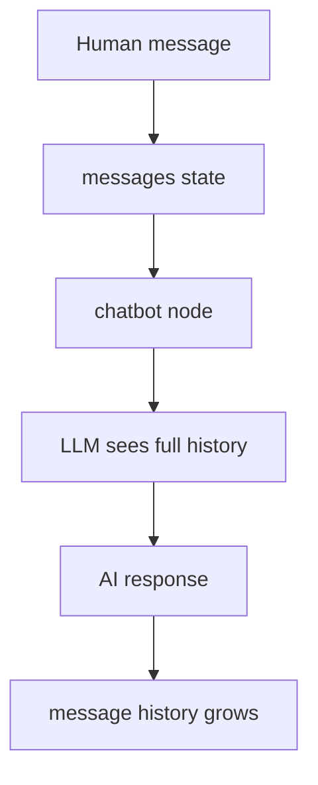
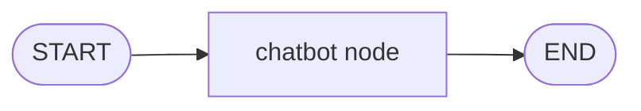

# 3. LLM Messages

This tutorial shows how LangGraph can carry chat history through a graph.

## Prerequisites

- Complete [2. Reducers](../2-Reducer/README.md) first — specifically the `add_messages` reducer
- **OpenAI API key required**: create a `.env` file in the repo root with `OPENAI_API_KEY=your_key_here`
- You should know: reducers, `Annotated`, `add_messages`

## What You'll Learn

After this tutorial, you will be able to:

- Store conversation history in graph state using `add_messages`
- Send the full message history to an LLM inside a node
- Understand when to use manual `ChatState` vs LangGraph's built-in `MessagesState`

## Part 1 — Core Tutorial

Chatbots need memory. Not long-term memory yet — just the conversation so far.

In LangGraph, that conversation usually lives in a `messages` field inside the state.



The key idea: each node can return a new message, and LangGraph appends it to the existing message history. This matches the official pattern: chat history is just graph state, usually stored under `messages`.

The graph itself is simple:



### Built-In Message State

LangGraph provides `MessagesState`, a built-in state type for message history.

You can extend it when your graph needs extra fields:

```python
from langgraph.graph import MessagesState

class MyGraphState(MessagesState):
    turn_count: int
```

This means:

- `MessagesState` already gives you `messages`
- `MyGraphState` adds `turn_count`
- your graph state can now contain both

```python
{
    "messages": [...],
    "turn_count": 3
}
```

Conceptually, it is like this:

```python
class MyGraphState(TypedDict):
    messages: list
    turn_count: int
```

But `MessagesState` is special because it already handles LangGraph messages properly. Use it when your graph is message-first, then extend it only for extra fields like counters, routing labels, or metadata.

### What To Look For In The Code Example

Part 2 uses code to make the message-state concept concrete. It shows the manual version first:

| Concept | Code To Watch |
|---|---|
| Message state | `class ChatState(TypedDict)` |
| Message field | `messages` |
| Message reducer | `add_messages` |
| LLM call | `llm.invoke(state["messages"])` |
| New message update | `return {"messages": [response]}` |

After that, the tutorial shows how `MessagesState` can replace the manual `messages` setup when you want built-in message handling.

## Part 2 — Code Example That Reinforces The Concept

File:

```text
04_simple_chatbot.py
```

This example uses a manual `ChatState` on purpose — it shows the same pattern that `MessagesState` wraps for you: a `messages` field with the `add_messages` reducer attached.

The example starts with one human message:

```python
HumanMessage(content="What is RAG?")
```

The chatbot node sends the full conversation to the LLM:

```python
response = llm.invoke(state["messages"])
```

Then it returns only the new AI message:

```python
return {"messages": [response]}
```

`add_messages` appends the response to the existing history.

### Setup

Create a `.env` file in the repo root with your OpenAI API key:

```bash
OPENAI_API_KEY=your_api_key_here
```

Run it from the repo root:

```bash
python "3_LLM_Messages/04_simple_chatbot.py"
```

### Expected Output

You should see the initial human message, then a final conversation with two messages:

```text
HumanMessage: What is RAG?
AIMessage: RAG stands for Retrieval-Augmented Generation. ...
```

The exact AI reply will vary, but the structure is always: one human message in, one AI message appended.

### Exercises

**Exercise 1 — Multi-turn conversation**

Start with two messages instead of one:

```python
HumanMessage(content="My name is Alex."),
HumanMessage(content="What is my name?"),
```

Run the graph and check whether the AI correctly answers "Alex". This shows that the LLM receives the full history, not just the last message.

**Exercise 2 — Add a system prompt**

Import `SystemMessage` from `langchain_core.messages` and add it as the first message in the initial state:

```python
SystemMessage(content="You are a helpful assistant who always answers in one sentence."),
HumanMessage(content="What is RAG?"),
```

Re-run and observe how the AI's style changes. This demonstrates the role of system-level instructions in the message history.

**Exercise 3 — Extend with MessagesState**

Replace `ChatState` with a subclass of `MessagesState` that adds a `turn_count: int` field. Update `chatbot_node` to increment `turn_count` on every call and return it alongside the new message. Verify the final state contains both `messages` and `turn_count: 1`.

*Hint:* `from langgraph.graph import MessagesState` — then `class MyChatState(MessagesState): turn_count: int`.

## Code Explanation

```python
class ChatState(TypedDict):
    messages: Annotated[list, add_messages]
```

This manually defines a message state. The `messages` field stores chat history, and `add_messages` appends new messages.

```python
def chatbot_node(state: ChatState) -> dict:
    response = llm.invoke(state["messages"])
    return {"messages": [response]}
```

This node receives the conversation history, calls the LLM, and returns the new AI message. The node does not manually append; the reducer does that merge step.

```python
graph = StateGraph(ChatState)
graph.add_node("chatbot", chatbot_node)
graph.add_edge(START, "chatbot")
graph.add_edge("chatbot", END)
```

This creates a one-node chatbot graph.

A more built-in style is:

```python
from langgraph.graph import MessagesState

class MyGraphState(MessagesState):
    turn_count: int
```

That keeps LangGraph's built-in message behavior and adds your own fields.

## What You Learned

- Conversation history lives in a `messages` field with the `add_messages` reducer
- Nodes return **only new messages**; LangGraph appends them to history
- `MessagesState` is a convenient built-in base for message history, and you can extend it with extra fields

## Next Step

Continue to [4. Conditional Edges](../4-Conditional%20Edges/README.md) to learn how a graph chooses different paths at runtime.
