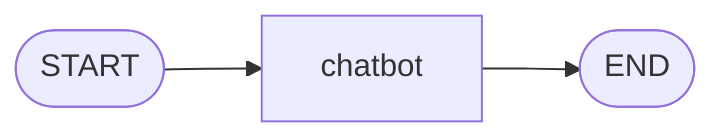
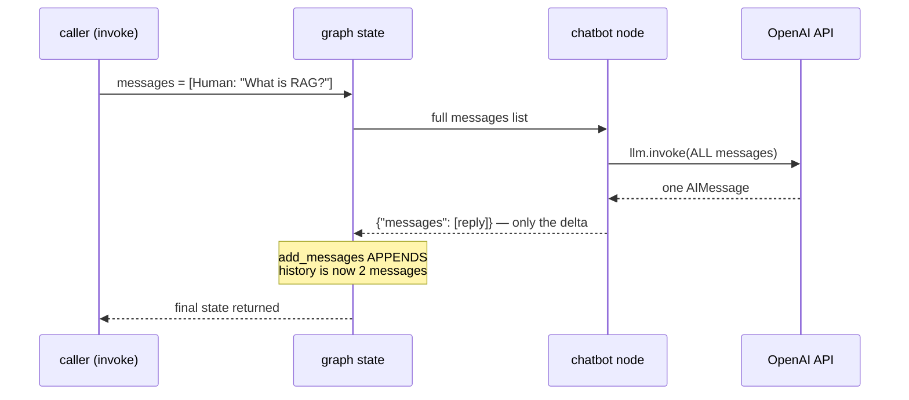

# 3. LLM Messages — Chat History as Graph State

**Example file:** [`04_simple_chatbot.py`](04_simple_chatbot.py)
**Requires:** an `OPENAI_API_KEY` in a `.env` file at the repo root (see [Setup](#running-it)).

This tutorial connects the first real LLM to a graph. The graph shape is the same one-node line you already know — what's new is *what flows through it*: a growing list of chat messages instead of plain strings and ints.

## The Concept: Conversation as Accumulating State

**What is it?** In LangGraph, a conversation is just a state field — conventionally named `messages` — holding a list of typed message objects (`HumanMessage`, `AIMessage`, `SystemMessage`). A chatbot node reads that list, sends it to the model, and returns the model's reply as a *new entry to append*.

**What problem does it solve?** LLM APIs are stateless: every call must include all context the model should remember. Something has to own the running transcript and pass it in full on every call. Making the transcript a state field with the `add_messages` reducer solves both halves at once — the state carries the history, and the reducer guarantees new turns *extend* it rather than replace it.

**When is this pattern appropriate?** Any graph where an LLM participates in a dialogue or needs prior turns as context — chatbots, agents, multi-step reasoning. That is most LLM graphs, which is why LangGraph ships `MessagesState` as a ready-made base class for exactly this schema.

**When is it not?** Single-shot transformations ("summarize this text") don't need a message history in state — a plain string field and a one-off prompt are simpler. Tutorial 5's workflow examples mostly work that way. Reach for `messages` when *turns* matter.

**Intuition:** the LLM is a consultant with no memory who bills by the meeting. Each meeting, you hand over the full case file, they read it, and they add one new page. The `messages` field is the case file; `add_messages` is the rule that pages get added, never torn out.

## Architecture



| Stage | Reads | Calls | Writes |
|---|---|---|---|
| `chatbot` | entire `messages` list | `llm.invoke(messages)` — one OpenAI request | appends one `AIMessage` |

One node, one LLM call, straight-line execution. The interesting motion is inside the state, not the graph.

## Code Highlights

### The state schema — a hand-rolled `MessagesState`

```python
class ChatState(TypedDict):
    messages: Annotated[list, add_messages]
```

This is tutorial 2's message reducer, now doing real work. The example defines `ChatState` manually *on purpose*: it's exactly the pattern that LangGraph's built-in `MessagesState` wraps. Once you've seen it spelled out, `StateGraph(MessagesState)` stops being magic — it's this line, pre-written. When you need extra fields alongside history, extend the built-in:

```python
from langgraph.graph import MessagesState

class MyGraphState(MessagesState):   # already has `messages` + add_messages
    turn_count: int
```

### The model configuration

```python
llm = ChatOpenAI(model="gpt-4o", temperature=0)
```

Two decisions worth noticing: the model object is created **once at module level**, not inside the node — nodes may run many times (loops, multiple turns), and the client is reusable. And `temperature=0` makes replies as deterministic as the API allows, so repeated tutorial runs are comparable.

### The chatbot node — full history in, one message out

```python
def chatbot_node(state: ChatState) -> dict:
    response = llm.invoke(state["messages"])   # send the WHOLE conversation
    return {"messages": [response]}            # return ONLY the new reply
```

Two things matter here, and they're asymmetric:

1. **Input is everything.** `llm.invoke(state["messages"])` sends the complete history. Send only the last message and the model forgets everything before it — statelessness is unforgiving.
2. **Output is only the delta.** The node returns just the new `AIMessage`, wrapped in a list. It does *not* concatenate `state["messages"] + [response]` — that's the reducer's job. If the node concatenated manually *and* the reducer appended, you'd duplicate the entire history every turn.

The node also prints each incoming message before calling the model — a small debugging habit worth copying: you see *exactly* the context the LLM receives.

## Execution Walkthrough

```text
1. invoke() starts with messages = [HumanMessage("What is RAG?")].
2. START → chatbot: the node prints the current history.
3. llm.invoke() sends the one-message conversation to OpenAI.
4. The API returns an AIMessage explaining RAG.
5. The node returns {"messages": [that AIMessage]}.
6. add_messages appends it — it does not replace the list.
7. chatbot → END; the final state holds both messages.
```

State evolution:

```text
Initial:  messages = [HumanMessage("What is RAG?")]
              ↓  chatbot appends the model reply
Final:    messages = [HumanMessage("What is RAG?"),
                      AIMessage("RAG stands for Retrieval-Augmented Generation...")]
```

The same turn as a conversation between the moving parts — note that the node hands the *whole* list to the API but returns only the reply:



Worth being precise about scope: this graph run is a **single turn**. The history grows *within* the run, but nothing persists after `invoke()` returns — run the script twice and the second run starts fresh. Carrying history *across* invocations is checkpointing, which is tutorial 7's subject.

## Running It

Create `.env` in the repo root if you haven't:

```bash
OPENAI_API_KEY=your_api_key_here
```

Then, from the repo root:

```bash
python "3_LLM_Messages/04_simple_chatbot.py"
```

Expected shape of the output (exact wording of the reply will vary):

```text
===== Final Conversation =====
HumanMessage: What is RAG?
AIMessage: RAG stands for Retrieval-Augmented Generation. ...
```

Always one human message in, one AI message appended — never a replaced list.

## Design Questions Worth Asking

- **Why does the node return `[response]` (a list) rather than `response`?** The reducer merges list-with-list. A one-element list keeps the same contract whether a node emits one message or several — you'll see multi-message returns in the agent tutorial when tool results come back.
- **What happens if you swap `add_messages` for no reducer?** The returned one-element list *overwrites* the history: the final state would contain only the AI reply, and the next turn's LLM call would have no memory of the user's question. The bug is silent — the graph runs fine, the model just gets amnesia.
- **Why keep the LLM outside the state?** State is data that changes per run and gets serialized (important for checkpointing later). The model client is configuration — shared, stateless, and not something you want in a snapshot.

## Exercises

**Exercise 1 — Multi-turn context.** Start with two human messages: `"My name is Alex."` then `"What is my name?"`. If the model answers "Alex," you've proven it receives the full history, not just the last message.

**Exercise 2 — System prompt.** Prepend a `SystemMessage(content="You are a helpful assistant who always answers in one sentence.")` and watch the reply style change. System messages ride in the same list as everything else.

**Exercise 3 — Extend `MessagesState`.** Replace `ChatState` with a `MessagesState` subclass adding `turn_count: int`; increment it in the node. Verify the final state carries both `messages` and `turn_count: 1`.

Solutions live in [`Exercise-Solutions/3-llm-messages/`](../Exercise-Solutions/3-llm-messages/).

## Key Takeaways

1. LLM APIs are stateless — the graph state owns the transcript and sends it **in full** on every call.
2. Nodes return **only the new message(s)**; `add_messages` handles appending. Never concatenate manually on top of the reducer.
3. `MessagesState` is the built-in version of the `messages` + `add_messages` schema; subclass it when you need extra fields.
4. History accumulates **within** one `invoke()` — persistence across runs requires a checkpointer (tutorial 7).

## Next Step

[Tutorial 4 — Conditional Edges](../4-Conditional%20Edges/README.md): so far every graph has been a straight line. Next, the graph learns to choose its path at runtime.
