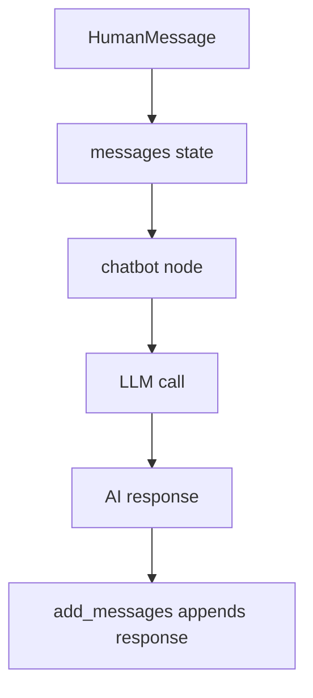

# 3. LLM Messages

This folder shows how to use LangGraph for a simple chatbot-style workflow.

## Objective

Understand how message history moves through a graph and how a node can call an LLM.

The important idea is that the graph keeps a `messages` list, and each new response is added to that list.

## Graph Plot


## Message Flow



## File

| File | Covers |
|---|---|
| `04_simple_chatbot.py` | Sends conversation history to an LLM and appends the AI response |

## Key Code Ideas

- `messages` stores the conversation history.
- `add_messages` appends new messages instead of replacing the list.
- `llm.invoke(state["messages"])` sends the full conversation to the model.
- The node returns only the new AI message.
- LangGraph merges that message into state using the reducer.

## `MessagesState` Note

This example manually defines message state with:

```python
messages: Annotated[list, add_messages]
```

LangGraph also provides `MessagesState`, which already includes a `messages` field with the `add_messages` reducer.

## Setup

Create a local `.env` file before running LLM examples:

```bash
OPENAI_API_KEY=your_api_key_here
```

## Takeaway

For chatbots, state usually means conversation history. The `add_messages` reducer keeps that history growing turn by turn.
