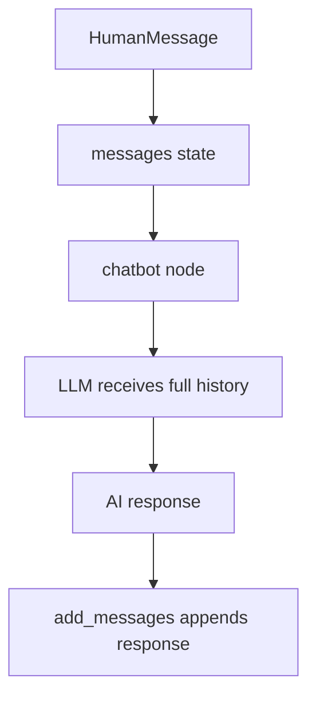

# 3. LLM Messages

This folder teaches how to use LangGraph with chat-style message history.

## Goal

Understand how a graph can keep conversation history and send that history to an LLM.

The key idea is that the state has a `messages` field. Each node can add new messages without deleting the old ones.

## Graph Plot


## Message Flow



## What The Example Does

File:

```text
04_simple_chatbot.py
```

The initial state contains one human message:

```python
HumanMessage(content="What is RAG?")
```

The chatbot node sends the full `messages` list to the LLM:

```python
response = llm.invoke(state["messages"])
```

Then it returns only the new AI message:

```python
return {"messages": [response]}
```

The `add_messages` reducer appends that response to the conversation history.

## Setup

Create a local `.env` file before running this example:

```bash
OPENAI_API_KEY=your_api_key_here
```

## Code Explanation

```python
class ChatState(TypedDict):
    messages: Annotated[list, add_messages]
```

This defines state with a `messages` field. `add_messages` tells LangGraph to append new messages instead of replacing the list.

```python
def chatbot_node(state: ChatState) -> dict:
    response = llm.invoke(state["messages"])
    return {"messages": [response]}
```

This node receives the current conversation, calls the LLM, and returns the new AI message.

```python
graph = StateGraph(ChatState)
graph.add_node("chatbot", chatbot_node)
graph.add_edge(START, "chatbot")
graph.add_edge("chatbot", END)
```

This creates a one-node chatbot graph.

Note: LangGraph also provides `MessagesState`, which already includes a `messages` field with the `add_messages` reducer.
