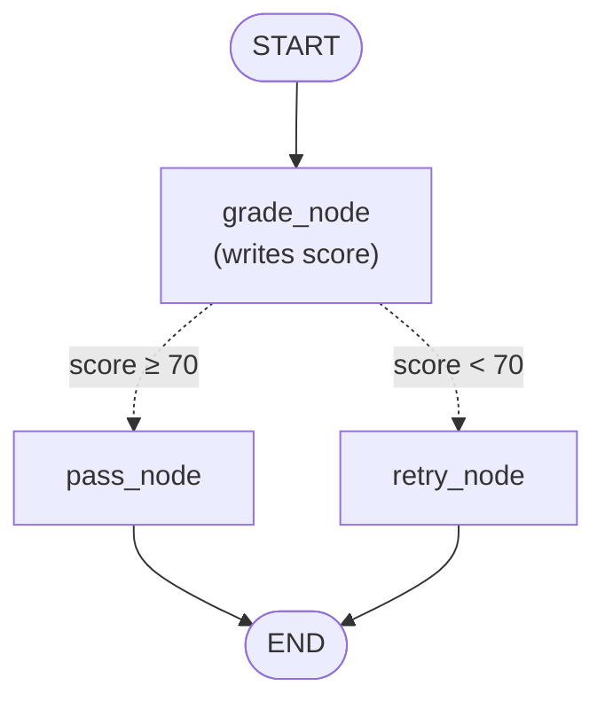
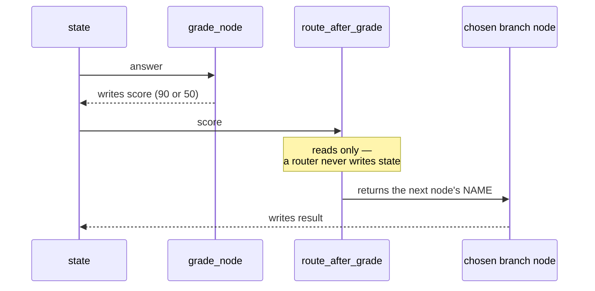

# 4. Conditional Edges — Graphs That Choose Their Path

**Example file:** [`05_conditional_edges.py`](05_conditional_edges.py)
No API key needed — the "grading" is deliberately fake so you can focus entirely on control flow.

Every graph so far has been a straight line: the path was fully determined before `invoke()` ran. This tutorial introduces the piece that makes graphs *interesting* — an edge whose destination is decided at runtime by looking at the state.

## The Concept: Runtime Routing

**What is it?** A **conditional edge** replaces a fixed next-node with a **router function**. After the source node finishes, LangGraph calls the router with the current state; the router returns the *name* of the next node, and execution continues there.

**What problem does it solve?** Real processes branch. Grade an answer and either accept it or send it back. Classify a request and dispatch it to the right handler. Check a tool call's result and decide whether to loop. Without conditional edges you'd need to encode branching *inside* nodes — giant if/else bodies doing several jobs — and the graph diagram would lie about what actually happens.

**When is it appropriate?** Whenever "what happens next" depends on data produced during the run: quality gates, classification-based dispatch, retry loops, agent decide-to-continue checks. Conditional edges are the mechanism behind almost everything in tutorials 5 and 6.

**When is it not?** If the next step never varies, a normal edge is strictly better — it's statically checkable and self-documenting. Don't add a router that always returns the same name.

**Intuition:** a normal edge is a conveyor belt bolted between two stations. A conditional edge is a switch operator standing at a rail junction: as each train (the state) arrives, the operator looks at its cargo and throws the switch. Crucially, the operator only *directs* traffic — they never load or unload cargo.

## Architecture



Solid edges always fire; dotted edges are the two possible outcomes of one router decision. Exactly **one** branch runs per invocation.

| Stage | Kind | Reads | Writes / Returns |
|---|---|---|---|
| `grade_node` | node | `answer` | writes `score` (90 if the answer mentions "rag", else 50) |
| `route_after_grade` | router — *not a node* | `score` | returns `"pass_node"` or `"retry_node"` |
| `pass_node` / `retry_node` | nodes | — | write `result` |

## Code Highlights

### The node/router division of labor

This example's most important design decision is that scoring and routing are **two separate functions**:

```python
def grade_node(state: AgentState) -> dict:      # a NODE: updates state
    score = 90 if "rag" in state["answer"].lower() else 50
    return {"score": score}

def route_after_grade(state: AgentState) -> str:  # a ROUTER: picks a path
    if state["score"] >= 70:
        return "pass_node"
    return "retry_node"
```

The contracts are different and worth memorizing:

| | Node | Router |
|---|---|---|
| Registered with | `add_node` | `add_conditional_edges` |
| Returns | a **dict** (state update) | a **string** (next node's name) |
| May change state? | yes | no — it only reads |
| Appears as a box in the diagram? | yes | no — it *is* the branching arrows |

*Why not have `grade_node` decide the route itself?* Because then the decision data (`score`) would never land in state — you couldn't log it, test the threshold separately, or later route on it again (e.g., an attempts cap). Writing the evidence to state, then routing on it, keeps every decision inspectable after the fact.

### Wiring the branch

```python
graph.add_conditional_edges(
    "grade_node",          # after this node runs...
    route_after_grade,     # ...call this function with the state...
    {
        "pass_node": "pass_node",      # ...and map its return value to a destination
        "retry_node": "retry_node",
    }
)
```

The third argument maps *router return values* to *node names*. Here the labels equal the node names, so the mapping looks redundant — but the indirection is the feature. The router could return abstract labels like `"good"` / `"bad"`, mapped to whatever nodes implement those outcomes; the routing *logic* and the graph *topology* stay independently changeable. The mapping also tells `compile()` (and the diagram renderer) the complete set of possible destinations — which is how `plot_graph` can draw both dotted branches without executing anything.

### Every branch must reach END

```python
graph.add_edge("pass_node", END)
graph.add_edge("retry_node", END)
```

Both destinations terminate. When you add branches (or turn one into a loop — see Exercise 2), each possible path still needs a way to finish; dead-end branches are the classic wiring mistake in branched graphs.

## Execution Walkthrough

With the shipped input `"RAG means retrieval augmented generation."`:

```text
1. START → grade_node.
2. grade_node finds "rag" in the answer → returns {"score": 90}.
3. LangGraph merges the update, then calls route_after_grade(state).
4. 90 ≥ 70 → the router returns "pass_node".
5. pass_node runs → returns {"result": "Passed ✅"}.
6. pass_node → END. retry_node never executes.
```

State evolution:

```text
{"answer": "RAG means...", "score": 0,  "result": ""}
    ↓ grade_node
{"answer": "RAG means...", "score": 90, "result": ""}
    ↓ router chooses pass_node (no state change — routers never write)
    ↓ pass_node
{"answer": "RAG means...", "score": 90, "result": "Passed ✅"}
```

Change `answer` to something without "rag" (e.g. `"I am not sure."`) and re-run: score 50, router returns `"retry_node"`, result `"Retry needed 🔁"`. Same graph, different journey — that's the whole feature.

The division of labor over time — who writes state and who only reads it:



## Running It

From the repo root:

```bash
python "4-Conditional Edges/05_conditional_edges.py"
```

Expected output for the default input:

```python
Final State:
{'answer': 'RAG means retrieval augmented generation.', 'score': 90, 'result': 'Passed ✅'}
```

The script also saves `graph.png` — look at it and note that *both* branches appear, even though any single run takes only one.

## Design Questions Worth Asking

- **What happens if the router returns a name not in the mapping?** A runtime error — the mapping is the contract of allowed destinations. Keep the router's possible return values and the mapping dict in sync.
- **Could the router call an LLM?** Yes — a router is any function of state returning a label. But the cleaner pattern (used in tutorial 5's routing workflow) is: an LLM *node* writes a structured decision into state, then a plain-Python router reads it. That keeps expensive, fallible calls in nodes where their output is captured, and keeps routers trivial and testable.
- **What if a run's branch never reaches END?** `compile()` validates reachability where it can, but a *logical* dead loop (a cycle with no exit condition) runs until LangGraph's recursion limit stops it: after **25 super-steps by default**, the run raises a `GraphRecursionError`. You can raise the ceiling per run — `app.invoke(state, config={"recursion_limit": 50})` — but treat that as headroom for legitimately long loops, not as a fix. Every loop still needs its own counted or condition-based exit — Exercise 2 makes you build one.

## Exercises

**Exercise 1 — Third branch.** Add a `"needs_review"` branch for scores 60–69: make `grade_node` return 65 for partial answers (contains `"retrieval"` but not `"generation"`), extend the router with an `elif`, add a `review_node`, and add one entry to the mapping.

**Exercise 2 — Retry loop.** Route `retry_node` back to `grade_node` instead of END. Add `attempts: int`, increment it each grading pass, and route to END when `attempts >= 3` regardless of score. This is the skeleton of tutorial 5's evaluator-optimizer pattern.

**Exercise 3 — LLM grader.** Replace the keyword check with a real model call: prompt `gpt-4o` with "Score this answer from 0–100. Respond with only the number.", parse it, use it as the score. (Needs the tutorial-3 `.env` setup.)

Solutions live in [`Exercise-Solutions/4-conditional-edges/`](../Exercise-Solutions/4-conditional-edges/).

## Key Takeaways

1. A conditional edge = source node + **router function** + a mapping of router labels to destinations.
2. Routers **read state and return a name**; nodes **return state updates**. Keeping the two roles separate keeps decisions inspectable and testable.
3. Write decision evidence (scores, classifications) into state first, then route on it — don't bury routing inside worker nodes.
4. The mapping dict declares every possible destination, which is what makes the graph statically drawable and validated at compile time.
5. Branches and loops both come from this one primitive — everything in the workflow and agent tutorials builds on it.

## Next Step

[Tutorial 5 — Workflows](../5-Workflows/README.md): reducers + messages + conditional edges combined into the classic LLM workflow patterns — chaining, routing, parallelization, orchestrator-workers, and evaluator-optimizer.
