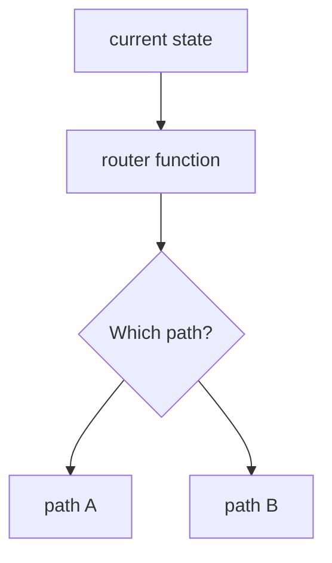
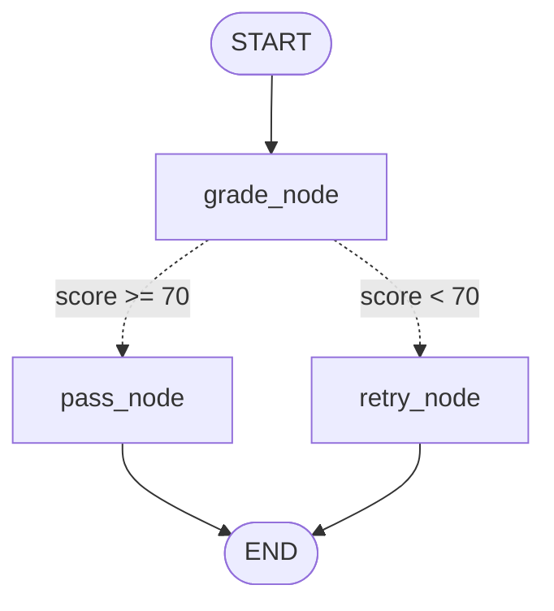
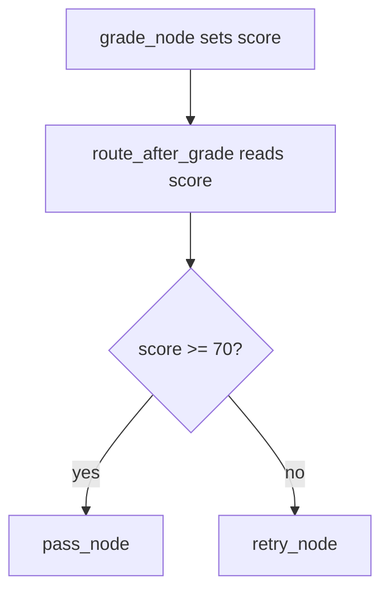

# 4. Conditional Edges

This tutorial teaches how a LangGraph workflow can choose different paths.

## Prerequisites

- Complete [1. LangGraph Basics](../1-Langgraph%20basics/README.md) first
- You should know: `StateGraph`, nodes, and normal edges
- No API key needed — this example uses no LLM

## What You'll Learn

After this tutorial, you will be able to:

- Distinguish normal edges from conditional edges
- Write a router function that returns the next node name
- Wire branching paths with `add_conditional_edges`

## Part 1 — Core Tutorial

A normal edge always goes to the same next node.

A conditional edge asks a router function where to go next. The router reads state and returns a label or node name; it should not be treated like a normal state-updating node.

Think of it like a small traffic controller inside the graph:



In this example, the graph grades an answer. If the score is high enough, it goes to `pass_node`. If not, it goes to `retry_node`.



Solid edges always run. Dotted edges are conditional.

### Normal Edge vs Conditional Edge

| Edge Type | What It Does | Example |
|---|---|---|
| Normal edge | Always goes to one next node | `START -> grade_node` |
| Conditional edge | Router chooses the next node | `grade_node -> pass_node` or `retry_node` |

### What To Look For In The Code Example

Part 2 uses code to make routing concrete. It turns the idea into these pieces:

| Concept | Code Name |
|---|---|
| Node that creates the decision data | `grade_node()` |
| Router that chooses the branch | `route_after_grade()` |
| Conditional wiring | `graph.add_conditional_edges(...)` |
| Success branch | `pass_node()` |
| Retry branch | `retry_node()` |

When reading the code example, keep this split in mind: `grade_node()` updates state, while `route_after_grade()` chooses the next node. This separation is the heart of conditional routing.

## Part 2 — Code Example That Reinforces The Concept

File:

```text
05_conditional_edges.py
```

The graph starts with an answer:

```python
{
    "answer": "RAG means retrieval augmented generation.",
    "score": 0,
    "result": ""
}
```

The `grade_node` checks the answer and sets a score.

Then the router reads the score:



If the score is `70` or higher, the graph returns:

```python
"Passed ✅"
```

If the score is below `70`, the graph returns:

```python
"Retry needed 🔁"
```

Run it from the repo root:

```bash
python "4-Conditional Edges/05_conditional_edges.py"
```

### Graph Visualization

Like tutorial 1, this example prints a Mermaid diagram and saves `graph.png` in your current directory so you can see both branches before running the graph.

### Try It Yourself

Open `05_conditional_edges.py` and change the `answer` field to something that does not contain `"rag"`, for example:

```python
"answer": "I am not sure.",
```

Run the script again. The score will be `50`, the graph will route to `retry_node`, and the result will be `"Retry needed 🔁"`.

### Exercises

**Exercise 1 — Add a third branch**

Add a `"needs_review"` branch for scores between `60` and `69`. Update `grade_node` to return `65` for partial answers (e.g., answers containing `"retrieval"` but not `"generation"`). Update the router and add a `review_node` that sets `result` to `"Needs human review 👀"`.

*Hint:* The router just needs one more `elif` and `add_conditional_edges` needs one more entry in its mapping dict.

**Exercise 2 — Loop on retry**

Instead of routing `retry_node` directly to `END`, loop it back to `grade_node`. Add a `attempts: int` field to the state and increment it on each pass through `grade_node`. Add a second conditional edge after `grade_node` that routes to `END` if `attempts >= 3`, regardless of the score.

This is the foundation of evaluator-optimizer loops.

**Exercise 3 — LLM-based router**

Replace the keyword-matching in `grade_node` with an actual LLM call. Send the answer to `gpt-4o` with the prompt: `"Score this answer from 0–100. Respond with only the number."` Parse the response and use it as the score. You will need an OpenAI API key (see Tutorial 3 setup).

## Code Explanation

```python
def grade_node(state: AgentState) -> dict:
    if "rag" in state["answer"].lower():
        score = 90
    else:
        score = 50
    return {"score": score}
```

This node reads the answer and returns a score update.

```python
def route_after_grade(state: AgentState) -> str:
    if state["score"] >= 70:
        return "pass_node"
    return "retry_node"
```

This is the router. It is not a normal node that updates state. It returns the name of the next node.

```python
graph.add_conditional_edges(
    "grade_node",
    route_after_grade,
    {
        "pass_node": "pass_node",
        "retry_node": "retry_node",
    }
)
```

This tells LangGraph: after `grade_node`, call `route_after_grade`, then follow the matching path.

```python
graph.add_edge("pass_node", END)
graph.add_edge("retry_node", END)
```

Both possible branches end the graph cleanly.

## What You Learned

- Normal edges always go to the same next node
- Router functions **read state** and return a **node name**, not a state update
- `add_conditional_edges` connects a source node to multiple possible destinations

## Next Step

Continue to [5. Workflows](../5-Workflows/README.md) to see how conditional edges, messages, and reducers combine into larger LLM workflow patterns.
