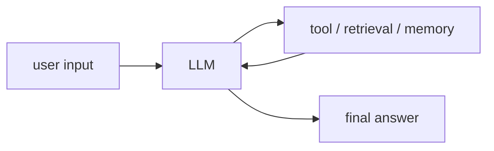

# 00. Augmented LLM

## Part 1 — Core Tutorial

An augmented LLM is an LLM that can use extra capabilities instead of relying only on its internal knowledge.

Common augmentations include:

- tools
- retrieval
- memory
- structured outputs

## When To Use

Use this pattern when the model needs outside information or actions, such as searching documents, calling APIs, or remembering prior state.

## Part 2 — Code Example That Reinforces The Concept

Placeholder for future LangGraph implementation.

## Code Explanation

TODO: Explain state, nodes, tool calls, and final response flow once code is added.
