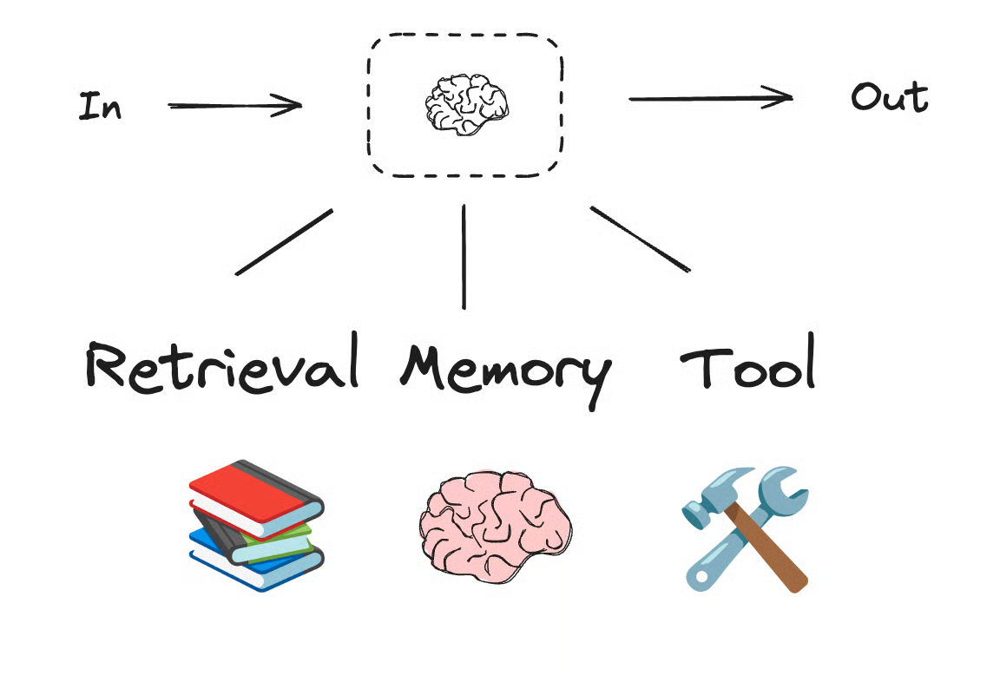

# 00. LLM Augmentations

This page explains **LLM augmentations**: ways to give a model extra capabilities beyond plain text generation.

Common augmentations include:

- **tools**: Python functions or external APIs the model can request
- **structured output**: a schema that shapes the model response
- **retrieval**: external knowledge pulled into context
- **memory**: saved context from previous interactions


Another helpful mental model: the LLM is still in the middle, but it can be connected to retrieval, memory, and tools.



## Part 1 — Core Tutorial

A normal LLM answers directly from the prompt.

An augmented LLM can use extra capabilities. For example:

- a calculator tool for math
- a weather API for live weather
- a Pydantic schema for structured JSON-like output
- a retriever for private documents

The important distinction:

```text
augmentation = capability added to the model
agent = loop where the model decides what to do next
```

For tools specifically:

```python
llm_with_tools = llm.bind_tools(tools)
```

`bind_tools()` tells the model which tools exist and what arguments they accept. It does **not** execute tools by itself. It only allows the model to produce a tool call.

A full tool-calling loop belongs in the Agents section:

```text
llm -> should_use_tools -> ToolNode -> llm
```

See [`6-Agents/01_tool_calling_agent.md`](../6-Agents/01_tool_calling_agent.md) for the runnable agent loop.

## Why This Still Lives In Workflows

The official workflows-and-agents mental model treats augmentations as building blocks. Workflows and agents can both use them.

Examples:

| Augmentation | Used In |
|---|---|
| Tool binding | Tool-calling agents, tool-using workflows |
| Structured output | Routing, planning, extraction, report sections |
| Retrieval | RAG workflows, agents with search/context |
| Memory | Chatbots, long-running agents |

So this page introduces the capability, while the Agents folder shows the dynamic tool loop.

## Part 2 — Related Examples

| Example | What It Shows |
|---|---|
| [`00_augmented_llm_structured_output.py`](00_augmented_llm_structured_output.py) | Augmenting an LLM with a Pydantic output schema |
| [`../6-Agents/01_tool_calling_agent.py`](../6-Agents/01_tool_calling_agent.py) | Letting an LLM call tools in an agent loop |
| [`resources/langchain_augmentation_snippets.md`](resources/langchain_augmentation_snippets.md) | Small snippets for tool binding and structured output |

## Code Explanation

The structured-output example uses this pattern:

```python
structured_llm = llm.with_structured_output(ProductReview)
```

That tells the model to return data matching the `ProductReview` schema.

The tool-calling agent uses this pattern:

```python
llm_with_tools = llm.bind_tools(tools)
```

That tells the model which tools it may request.

The key lesson is:

> Augmentations give the model capabilities. Graph structure decides whether those capabilities are used inside a fixed workflow or inside a dynamic agent loop.
