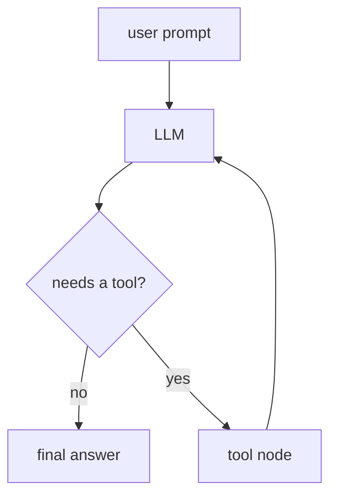
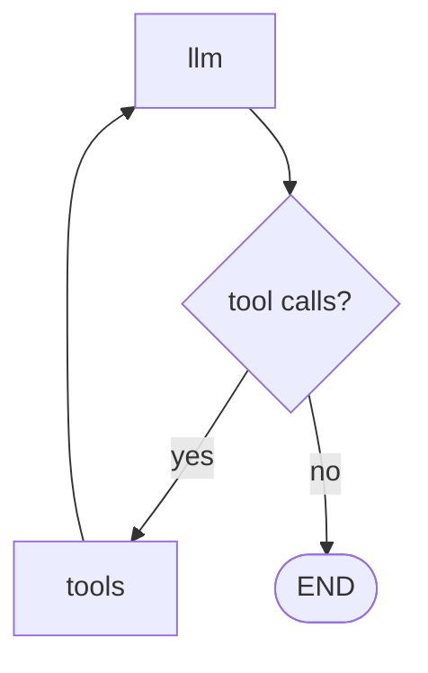

# 00. Augmented LLM

This tutorial shows an LLM that can use tools. That is the core idea behind an **augmented LLM**.

## Part 1 — Core Tutorial

A normal LLM receives a prompt and responds directly.

An augmented LLM can pause, call a tool, read the tool result, and then answer with better information.



The loop is important:

1. the user asks a question
2. the LLM decides whether a tool is needed
3. the tool runs
4. the tool result goes back to the LLM
5. the LLM writes the final answer

## Tools In This Example

| Tool | Purpose |
|---|---|
| `get_weather` | Returns fake weather for a few cities |
| `calculate_tip` | Calculates a tip amount |
| `TavilySearch` | Searches the web when `TAVILY_API_KEY` is available |

## What To Look For In The Code Example

| Concept | Code Name |
|---|---|
| Tool definitions | `@tool` functions |
| LLM tool binding | `llm.bind_tools(tools)` |
| Message state | `messages: Annotated[list, add_messages]` |
| LLM node | `call_llm()` |
| Tool execution node | `ToolNode(tools)` |
| Tool routing | `should_use_tools()` |
| Tool loop | `tools -> llm` |

The key split: the LLM node decides what should happen, while `ToolNode` runs the requested tools.

## Part 2 — Code Example That Reinforces The Concept

File:

```text
00_augmented_llm.py
```

The graph has two main nodes:



The example runs prompts like:

```python
"What's the weather in London?"
"Calculate a 20% tip on a $50 bill"
"Search for the latest news about AI agents"
```

The search prompt only runs when Tavily is installed and `TAVILY_API_KEY` exists.

## Setup

This example needs an OpenAI API key:

```bash
OPENAI_API_KEY=your_api_key_here
```

For web search, also add:

```bash
TAVILY_API_KEY=your_tavily_key_here
```

Run from the repo root:

```bash
python "5-Workflows/00_augmented_llm.py"
```

## Code Explanation

```python
@tool
def get_weather(city: str) -> str:
    ...
```

The `@tool` decorator turns a Python function into a tool the LLM can request.

```python
llm = ChatOpenAI(model="gpt-4o", temperature=0)
llm_with_tools = llm.bind_tools(tools)
```

`bind_tools()` gives the model the tool schemas so it can decide when to call them.

```python
class AgentState(TypedDict):
    messages: Annotated[list, add_messages]
```

The graph state stores the conversation. `add_messages` appends each new LLM/tool message to history.

```python
def call_llm(state: AgentState) -> dict:
    response = llm_with_tools.invoke(state["messages"])
    return {"messages": [response]}
```

The LLM node reads the message history and returns a new message. That message may contain tool calls.

```python
tool_node = ToolNode(tools)
```

`ToolNode` automatically executes whatever tool call the LLM requested.

```python
def should_use_tools(state: AgentState) -> str:
    last_message = state["messages"][-1]
    if getattr(last_message, "tool_calls", None):
        return "tools"
    return END
```

The router checks the last LLM message. If it contains tool calls, the graph goes to `tools`. Otherwise, the graph ends.

```python
graph_builder.add_edge("tools", "llm")
```

After tools run, the graph loops back to the LLM so it can turn tool results into a final answer.
