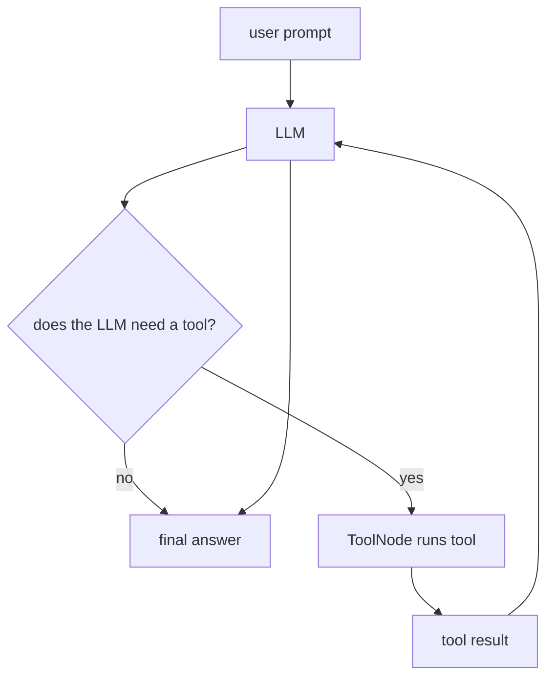
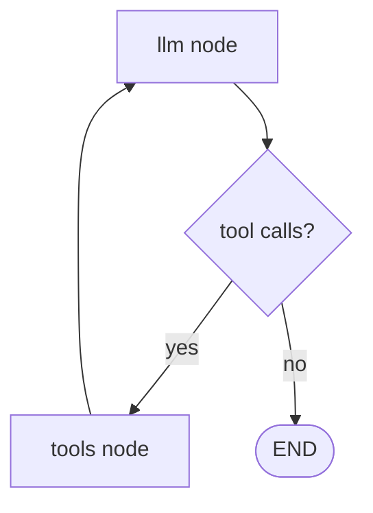

# 00. Augmented LLM With Tools

This tutorial shows an **augmented LLM**: an LLM that can use tools before giving a final answer.

In this example, the LLM can:

- fetch live weather with OpenWeatherMap
- calculate a tip
- optionally search the web with Tavily

## Part 1 — Core Tutorial

A normal LLM answers directly from the prompt.

An augmented LLM can do something more useful: it can decide, “I need a tool for this,” call that tool, read the result, and then answer the user.



The important idea is that the LLM does **not** execute Python functions by itself. Instead:

1. the LLM returns a message that contains a tool call
2. LangGraph routes the graph to `ToolNode`
3. `ToolNode` executes the real Python function
4. the tool result is appended to `messages`
5. the graph loops back to the LLM
6. the LLM uses the tool result to write the final answer

That is the augmented loop:

```text
LLM -> tool call -> ToolNode -> tool result -> LLM -> final answer
```

## Tools In This Example

| Tool | What It Does | Needs API Key? |
|---|---|---|
| `get_weather` | Calls OpenWeatherMap and returns live weather like `Scattered clouds with 15.98°C` | `OPENWEATHER_API_KEY` |
| `calculate_tip` | Calculates a tip from bill amount and percentage | No |
| `TavilySearch` | Searches the web for current information | `TAVILY_API_KEY` |

## Graph Shape



Generated graph image:


Why the graph loops back:

- first LLM call decides whether a tool is needed
- tools node runs the tool
- second LLM call turns the tool result into a human-friendly answer

## What To Look For In The Code Example

| Concept | Code Name |
|---|---|
| Tool definitions | `@tool` functions |
| Live weather tool | `get_weather(destination_city)` |
| Tool list | `tools = [get_weather, calculate_tip]` |
| Optional search tool | `TavilySearch` |
| LLM tool binding | `llm.bind_tools(tools)` |
| Message state | `messages: Annotated[list, add_messages]` |
| LLM node | `call_llm()` |
| Tool execution node | `ToolNode(tools)` |
| Router | `should_use_tools()` |
| Tool loop | `graph_builder.add_edge("tools", "llm")` |
| Graph plot | `plot_graph(graph)` |

The key split:

- `call_llm()` asks the model what to do next
- `should_use_tools()` checks whether the model requested a tool
- `ToolNode(tools)` runs the tool
- `tools -> llm` sends the tool result back to the model

## Part 2 — Code Example That Reinforces The Concept

File:

```text
00_augmented_llm.py
```

The example runs prompts like:

```python
"What's the weather in London?"
"Calculate a 20% tip on a $50 bill"
"Search for the latest news about AI agents"
```

What happens for each prompt:

| Prompt | Expected Tool Path |
|---|---|
| Weather in London | LLM calls `get_weather`, then writes final answer |
| 20% tip on $50 | LLM calls `calculate_tip`, then writes final answer |
| Latest AI agents news | LLM calls `TavilySearch` if Tavily is configured |

The search prompt only runs when both are true:

- `langchain-tavily` is installed
- `TAVILY_API_KEY` exists in `.env`

## Setup

This example needs an OpenAI API key:

```bash
OPENAI_API_KEY=your_api_key_here
```

For live weather, add:

```bash
OPENWEATHER_API_KEY=your_openweather_key_here
```

For web search, also add:

```bash
TAVILY_API_KEY=your_tavily_key_here
```

Run from the repo root:

```bash
python "5-Workflows/00_augmented_llm.py"
```

## Code Explanation

```python
@tool
def get_weather(destination_city: str) -> str:
    ...
```

`@tool` exposes the Python function to the LLM. The LLM can request this tool when the user asks about weather.

```python
response = requests.get(url, params=params, timeout=10)
```

The weather tool calls OpenWeatherMap and returns a short string such as:

```text
Scattered clouds with 15.98°C
```

```python
llm = ChatOpenAI(model="gpt-4o", temperature=0)
llm_with_tools = llm.bind_tools(tools)
```

`bind_tools()` tells the model which tools are available and what arguments each tool expects.

```python
class AgentState(TypedDict):
    messages: Annotated[list, add_messages]
```

The graph stores conversation history in `messages`. `add_messages` appends LLM messages, tool calls, and tool results.

```python
def call_llm(state: AgentState) -> dict:
    response = llm_with_tools.invoke(state["messages"])
    return {"messages": [response]}
```

The LLM node reads the current messages and returns a new AI message. Sometimes that message contains tool calls instead of a final answer.

```python
tool_node = ToolNode(tools)
```

`ToolNode` reads the tool call from the latest AI message and runs the matching Python tool.

```python
def should_use_tools(state: AgentState) -> str:
    last_message = state["messages"][-1]
    if getattr(last_message, "tool_calls", None):
        return "tools"
    return END
```

The router checks whether the latest AI message contains tool calls.

- If yes, go to `tools`
- If no, end the graph

```python
graph_builder.add_edge("tools", "llm")
```

After tools run, the graph returns to the LLM. This is what lets the model turn raw tool output into a final response.

```python
plot_graph(graph)
```

The example reuses the shared `plot_graph()` helper from `util.py` to print the Mermaid graph and save `graph.png`.
