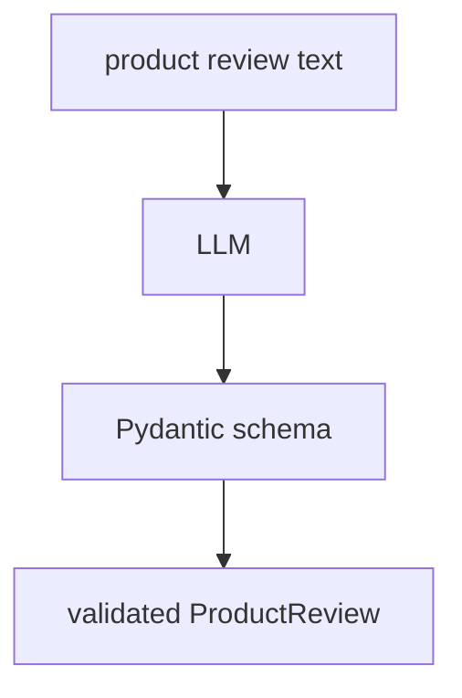
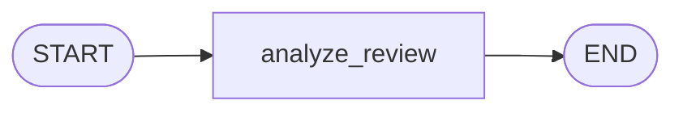
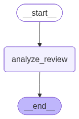

# 00. Augmented LLM With Structured Output

This tutorial shows another kind of **augmented LLM**: an LLM that returns data in a strict structure.

Instead of asking the model for free-form text, we ask it to return a validated `ProductReview` object.


## Part 1 — Core Tutorial

A normal LLM response might look like a paragraph.

A structured-output LLM response looks like data your program can trust and use. This is useful when the next graph step needs fields, not prose.



The key idea:

1. define the output shape with Pydantic
2. bind that schema to the LLM with `with_structured_output()`
3. call the LLM
4. receive a validated Python object

This is an LLM augmentation because the schema guides the model and validates the result. The official structured-output pattern is especially helpful for extraction, classification, grading, and routing.

## What To Look For In The Code Example

| Concept | Code Name |
|---|---|
| Output schema | `ProductReview` |
| Field descriptions | `Field(description=...)` |
| Structured LLM | `llm.with_structured_output(ProductReview)` |
| Prompt | `ChatPromptTemplate.from_messages(...)` |
| LangGraph node | `analyze_review()` |
| Graph flow | `START -> analyze_review -> END` |
| Final output | `analysis.model_dump()` |

## Part 2 — Code Example That Reinforces The Concept

File:

```text
00_augmented_llm_structured_output.py
```

The graph is intentionally simple:



Generated LangGraph plot from the code:



The input is a product review. The output is structured JSON-like data:

```json
{
  "product_name": "wireless mouse",
  "sentiment": "positive",
  "rating": 4,
  "pros": ["long battery life", "ergonomic design"],
  "cons": ["stiff scroll wheel", "expensive"],
  "summary": "Mostly positive review with minor complaints."
}
```

The exact wording can vary, but the shape should match the schema.

## Setup

This example needs an OpenAI API key:

```bash
OPENAI_API_KEY=your_api_key_here
```

Run from the repo root:

```bash
python "5-Workflows/00_augmented_llm_structured_output.py"
```

## Code Explanation

```python
class ProductReview(BaseModel):
    product_name: str
    sentiment: str
    rating: int = Field(ge=1, le=5)
    pros: List[str]
    cons: List[str]
    summary: str
```

This Pydantic model defines the structure the LLM must return. Field descriptions act like tiny instructions for each output key.

```python
structured_llm = llm.with_structured_output(ProductReview)
```

This tells the LLM to return output that matches `ProductReview`.

```python
chain = prompt | structured_llm
```

The prompt prepares the task, and the structured LLM produces validated output.

```python
def analyze_review(state: ReviewState) -> dict:
    result = chain.invoke({"review_text": state["review_text"]})
    return {"analysis": result}
```

This LangGraph node reads the review text, runs the chain, and stores the structured result in state.

```python
print(json.dumps(analysis.model_dump(), indent=2))
```

`model_dump()` converts the Pydantic object into a normal dictionary so it can be printed as JSON.
