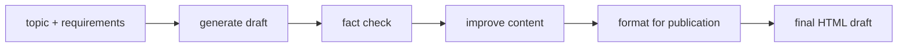
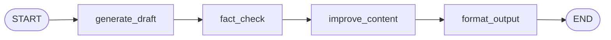
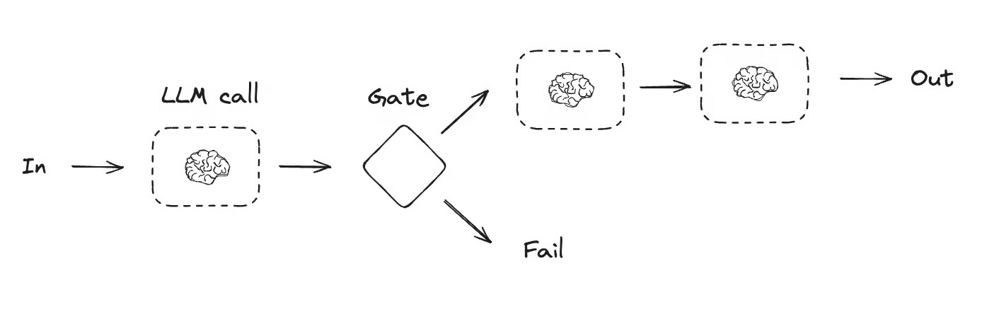
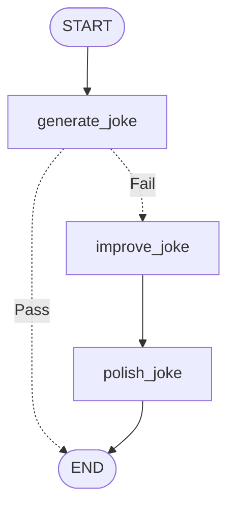
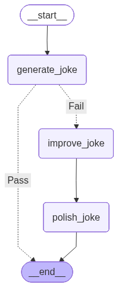
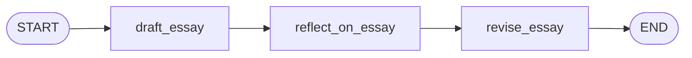

# 01. Prompt Chaining

This tutorial teaches **prompt chaining** with three examples: a content pipeline, a joke pipeline with a quality gate, and an essay drafter with reflection.

This tutorial includes three examples:

1. a content generation pipeline with quality control
2. a joke generation chain with a conditional quality gate
3. an essay drafter that drafts, reflects, and revises

The graph does not ask one giant prompt to do everything. Instead, it chains smaller LLM steps together.

## Part 1 — Core Tutorial

Prompt chaining breaks a task into multiple ordered steps. Each step uses the result from the previous step, which makes the workflow easier to inspect than one giant prompt.




The key idea is simple:

```text
output from step 1 -> input to step 2 -> input to step 3 -> final output
```

This makes the workflow easier to debug because every intermediate result is saved in state.

### Partial State Updates, Not Reducers

In this example, each node returns only the field it wants to update:

```python
return {"draft": draft}
```

This does **not** overwrite the whole state. It only updates `draft`. Fields not returned, such as `topic` and `requirements`, stay unchanged.

This is normal LangGraph state behavior: node returns are **partial state updates**.

No reducer is being used for `draft`, `fact_check_results`, `improved_content`, or `final_draft`. Without a reducer, if the same field is updated again later, that field is replaced. Reducers are only needed when you want to merge old and new values for the same field, like appending messages with `add_messages`.

## When To Use

Use prompt chaining when one big prompt would be too messy, and the task is easier as smaller stages. It works best when each stage has a clear job and a clear output for the next stage.

Good examples:

- extract -> summarize -> format
- draft -> critique -> revise
- classify -> route -> respond
- research -> outline -> write

A nice safety benefit: you can add a check between stages. If the fact-check step finds issues, the improvement step can use that feedback instead of blindly publishing the first draft.

## What To Look For In The Code Example

| Concept | Code Name |
|---|---|
| State schema | `ContentState` |
| Step 1 | `generate_draft()` |
| Step 2 | `fact_check()` |
| Step 3 | `improve_content()` |
| Step 4 | `format_output()` |
| Sequential flow | `add_edge(...)` |
| Graph plot | `plot_graph(graph)` |
| HTML report | `save_html_report(result)` |

The important design choice is that each node writes a new state field:

| Node | Writes Field | Used By |
|---|---|---|
| `generate_draft` | `draft` | `fact_check` |
| `fact_check` | `fact_check_results` | `improve_content` |
| `improve_content` | `improved_content` | `format_output` |
| `format_output` | `final_draft` | final output |

## Part 2 — Code Example A: Content Pipeline

File:

```text
01_prompt_chaining.py
```

Input:

```python
{
    "topic": "The benefits of morning exercise",
    "requirements": "Target audience: AI engineers",
}
```

Graph flow:



Generated LangGraph plot from the code:


Run from the repo root:

```bash
python "5-Workflows/01_prompt_chaining.py"
```

The script prints each stage preview, saves a graph image, and creates a local report:

```text
5-Workflows/prompt_chaining_output.html
```

Open that HTML file to inspect the full chain: topic, requirements, draft, fact-check report, improved content, and final formatted output.

The repo also includes a checked-in sample report you can view without running the LLM:

```text
5-Workflows/examples/prompt_chaining_output.html
```

## Part 3 — Code Example B: Joke Chain With A Gate

File:

```text
01_prompt_chaining_joke_gate.py
```

This second example is still prompt chaining, but it adds one conditional edge. The graph first generates a joke, then checks whether it appears to have a punchline.

The hand-drawn flow below shows the idea: one LLM call creates the first joke, a gate checks it, and only failed jokes continue into more LLM steps.





Generated LangGraph plot from the code:



Run from the repo root:

```bash
python "5-Workflows/01_prompt_chaining_joke_gate.py"
```

What makes this example interesting:

- `generate_joke()` is the first LLM call
- `check_punchline()` is a router, not a state-updating node
- if the joke passes, the graph ends early
- if it fails, the graph chains into `improve_joke()` and `polish_joke()`

This is a nice bridge between prompt chaining and conditional edges: the chain is mostly sequential, but a quality gate decides whether more steps are needed.

The original notebook-style version used `IPython.display` to show the graph inline. In this repo version, the graph is saved as a PNG so it works from a normal Python script.

## Code Explanation A: Content Pipeline

```python
class ContentState(TypedDict):
    topic: str
    requirements: str
    draft: str
    fact_check_results: str
    improved_content: str
    final_draft: str
```

The state stores both the original input and every intermediate output. This is what makes the chain inspectable.

```python
def generate_draft(state: ContentState) -> dict:
    draft = llm.invoke(prompt).content
    return {"draft": draft}
```

The first node creates the initial draft and writes it to `draft`.

```python
def fact_check(state: ContentState) -> dict:
    fact_check_results = llm.invoke(prompt).content
    return {"fact_check_results": fact_check_results}
```

The second node reads `draft`, checks it, and writes feedback to `fact_check_results`.

```python
def improve_content(state: ContentState) -> dict:
    improved_content = llm.invoke(prompt).content
    return {"improved_content": improved_content}
```

The third node reads both the original draft and the fact-check feedback, then creates a stronger version.

```python
def format_output(state: ContentState) -> dict:
    final_draft = llm.invoke(prompt).content
    return {"final_draft": final_draft}
```

The final node formats the improved content as HTML.

```python
graph_builder.add_edge("generate_draft", "fact_check")
graph_builder.add_edge("fact_check", "improve_content")
graph_builder.add_edge("improve_content", "format_output")
```

These normal edges create the chain. There is no branching here: every step always runs in order.

## Code Explanation B: Joke Chain With A Gate

```python
def generate_joke(state: JokeState) -> dict:
    msg = llm.invoke(f"Write a short joke about {state['topic']}.")
    return {"joke": msg.content}
```

The first node creates the initial joke and writes only the `joke` field.

```python
def check_punchline(state: JokeState) -> str:
    if "?" in state["joke"] or "!" in state["joke"]:
        return "Pass"
    return "Fail"
```

This function is a router. It reads state and returns a route label. It does not update state.

```python
graph_builder.add_conditional_edges(
    "generate_joke",
    check_punchline,
    {"Fail": "improve_joke", "Pass": END},
)
```

This conditional edge means: after the first joke, either stop immediately or continue the chain.

```python
graph_builder.add_edge("improve_joke", "polish_joke")
graph_builder.add_edge("polish_joke", END)
```

If the joke fails the gate, the graph continues through two more LLM calls before ending.

## Part 4 — Code Example C: Essay Drafter With Reflection

File: `01_prompt_chaining_essay_drafter.py`

This example is a LangGraph port of [essay-drafter-with-reflection](https://github.com/Walid-Ahmed/essay-drafter-with-reflection) — a standalone script that runs the same draft → reflect → revise flow as three sequential API calls in plain Python, with no graph framework. Here the same logic becomes a three-node prompt chain in LangGraph.



### State

| Field | Written by | Read by |
|---|---|---|
| `topic` | caller | `draft_essay` |
| `draft` | `draft_essay` | `reflect_on_essay`, `revise_essay` |
| `reflection` | `reflect_on_essay` | `revise_essay` |
| `revised_essay` | `revise_essay` | final output |

### How it maps to the original code

| Original (`run.py`) | LangGraph node |
|---|---|
| `call_model(prompt_drafter)` | `draft_essay` |
| `call_model(reflection_prompt)` | `reflect_on_essay` |
| `call_model(revision_prompt)` | `revise_essay` |

The prompts are identical. The only change is that intermediate results are stored in graph state instead of local variables, and the three calls are wired as nodes with edges rather than sequential lines of code.

### Why use LangGraph here?

In the original script, if you want to inspect the draft before the revision runs, you have to add print statements. In the LangGraph version, every intermediate output (`draft`, `reflection`, `revised_essay`) is in state and readable after the graph finishes — no extra instrumentation needed.

Run from the repo root:

```bash
python "5-Workflows/01_prompt_chaining_essay_drafter.py"
```

### How this differs from the evaluator-optimizer

The essay drafter always runs exactly 3 steps. The reflection does not decide whether to loop — it just produces feedback that the reviser uses once. To turn this into an evaluator-optimizer you would need the reflection to emit a verdict (`good enough` / `needs revision`) and a conditional edge that loops back to the drafter on rejection.

## What You Learned

- Prompt chaining turns one large task into smaller LLM steps
- Each node reads previous state and writes the next field
- Intermediate fields make the workflow easier to debug
- Normal edges are enough when every step should always run
- A plain sequential script (like essay-drafter) maps directly to a prompt chain — nodes replace function calls, state replaces local variables
