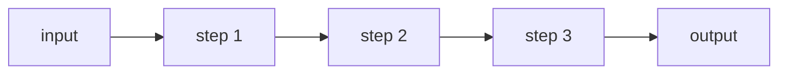

# 01. Prompt Chaining

## Part 1 — Core Tutorial

Prompt chaining breaks a task into multiple ordered steps. Each step uses the result from the previous step.

## When To Use

Use this pattern when one big prompt would be too messy, and the task is easier as smaller stages.

Example stages:

1. extract information
2. transform it
3. summarize the result

## Part 2 — Code Example That Reinforces The Concept

Placeholder for future LangGraph implementation.

## Code Explanation

TODO: Explain state passed between nodes and how each node builds on the previous result.
