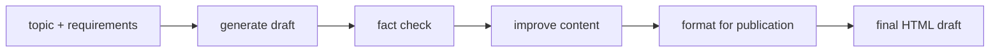
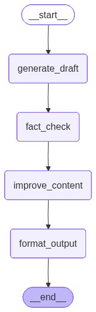

# 01. Prompt Chaining

This tutorial shows a **content generation pipeline with quality control**.

The graph does not ask one giant prompt to do everything. Instead, it chains smaller LLM steps together:

1. generate a draft
2. fact-check the draft
3. improve the draft using feedback
4. format the final result for publication

## Part 1 — Core Tutorial

Prompt chaining breaks a task into multiple ordered steps. Each step uses the result from the previous step, which makes the workflow easier to inspect than one giant prompt.




The key idea is simple:

```text
output from step 1 -> input to step 2 -> input to step 3 -> final output
```

This makes the workflow easier to debug because every intermediate result is saved in state.

### Partial State Updates, Not Reducers

In this example, each node returns only the field it wants to update:

```python
return {"draft": draft}
```

This does **not** overwrite the whole state. It only updates `draft`. Fields not returned, such as `topic` and `requirements`, stay unchanged.

This is normal LangGraph state behavior: node returns are **partial state updates**.

No reducer is being used for `draft`, `fact_check_results`, `improved_content`, or `final_draft`. Without a reducer, if the same field is updated again later, that field is replaced. Reducers are only needed when you want to merge old and new values for the same field, like appending messages with `add_messages`.

## When To Use

Use prompt chaining when one big prompt would be too messy, and the task is easier as smaller stages. It works best when each stage has a clear job and a clear output for the next stage.

Good examples:

- extract -> summarize -> format
- draft -> critique -> revise
- classify -> route -> respond
- research -> outline -> write

A nice safety benefit: you can add a check between stages. If the fact-check step finds issues, the improvement step can use that feedback instead of blindly publishing the first draft.

## What To Look For In The Code Example

| Concept | Code Name |
|---|---|
| State schema | `ContentState` |
| Step 1 | `generate_draft()` |
| Step 2 | `fact_check()` |
| Step 3 | `improve_content()` |
| Step 4 | `format_output()` |
| Sequential flow | `add_edge(...)` |
| Graph plot | `plot_graph(graph)` |
| HTML report | `save_html_report(result)` |

The important design choice is that each node writes a new state field:

| Node | Writes Field | Used By |
|---|---|---|
| `generate_draft` | `draft` | `fact_check` |
| `fact_check` | `fact_check_results` | `improve_content` |
| `improve_content` | `improved_content` | `format_output` |
| `format_output` | `final_draft` | final output |

## Part 2 — Code Example That Reinforces The Concept

File:

```text
01_prompt_chaining.py
```

Input:

```python
{
    "topic": "The benefits of morning exercise",
    "requirements": "Target audience: AI engineers",
}
```

Graph flow:


Generated LangGraph plot from the code:



Run from the repo root:

```bash
python "5-Workflows/01_prompt_chaining.py"
```

The script prints each stage preview, saves a graph image, and creates a local report:

```text
5-Workflows/prompt_chaining_output.html
```

Open that HTML file to inspect the full chain: topic, requirements, draft, fact-check report, improved content, and final formatted output.

The repo also includes a checked-in sample report you can view without running the LLM:

```text
5-Workflows/examples/prompt_chaining_output.html
```

## Code Explanation

```python
class ContentState(TypedDict):
    topic: str
    requirements: str
    draft: str
    fact_check_results: str
    improved_content: str
    final_draft: str
```

The state stores both the original input and every intermediate output. This is what makes the chain inspectable.

```python
def generate_draft(state: ContentState) -> dict:
    draft = llm.invoke(prompt).content
    return {"draft": draft}
```

The first node creates the initial draft and writes it to `draft`.

```python
def fact_check(state: ContentState) -> dict:
    fact_check_results = llm.invoke(prompt).content
    return {"fact_check_results": fact_check_results}
```

The second node reads `draft`, checks it, and writes feedback to `fact_check_results`.

```python
def improve_content(state: ContentState) -> dict:
    improved_content = llm.invoke(prompt).content
    return {"improved_content": improved_content}
```

The third node reads both the original draft and the fact-check feedback, then creates a stronger version.

```python
def format_output(state: ContentState) -> dict:
    final_draft = llm.invoke(prompt).content
    return {"final_draft": final_draft}
```

The final node formats the improved content as HTML.

```python
graph_builder.add_edge("generate_draft", "fact_check")
graph_builder.add_edge("fact_check", "improve_content")
graph_builder.add_edge("improve_content", "format_output")
```

These normal edges create the chain. There is no branching here: every step always runs in order.

## What You Learned

- Prompt chaining turns one large task into smaller LLM steps
- Each node reads previous state and writes the next field
- Intermediate fields make the workflow easier to debug
- Normal edges are enough when every step should always run
