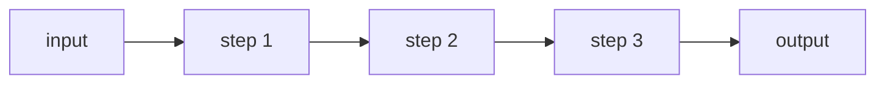

# 01. Prompt Chaining

## Part 1 — Core Tutorial

Prompt chaining breaks a task into multiple ordered steps. Each step uses the result from the previous step, which makes the workflow easier to inspect than one giant prompt.

## When To Use

Use this pattern when one big prompt would be too messy, and the task is easier as smaller stages. It works best when each stage has a clear job and a clear output for the next stage.

Example stages:

1. extract information
2. transform it
3. summarize the result

A nice safety benefit: you can add a check between stages. If extraction fails, you can stop early instead of sending bad input into the next prompt.

## Part 2 — Code Example That Reinforces The Concept

Placeholder for future LangGraph implementation.

## Code Explanation

Future code should show one state field per step, for example `extracted_keywords`, `draft_summary`, and `final_answer`. Each node should read the previous field and write the next one.
