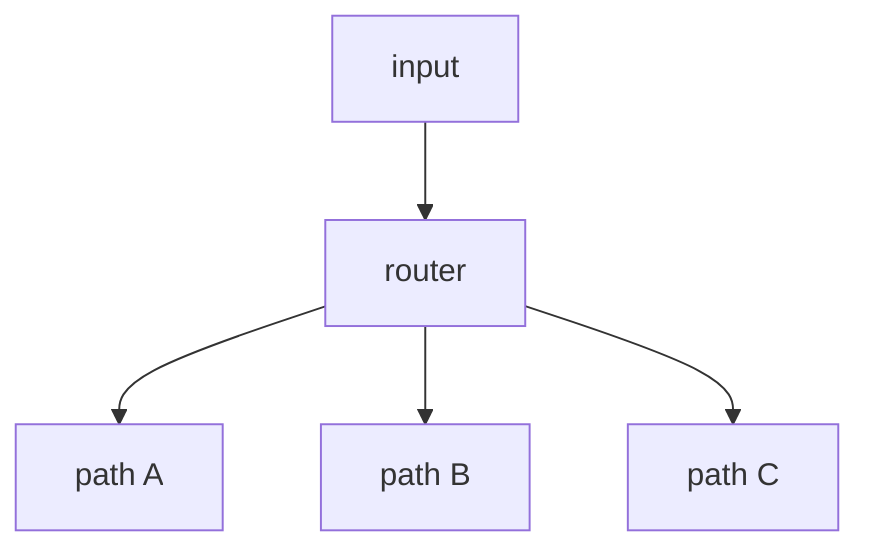

# 02. Routing

## Part 1 — Core Tutorial

Routing sends work to different paths depending on the input or current state.

## When To Use

Use this pattern when different inputs need different handling.

Examples:

- easy question vs hard question
- billing issue vs technical issue
- pass vs retry

## Part 2 — Code Example That Reinforces The Concept

Placeholder for future LangGraph implementation.

## Code Explanation

TODO: Explain router function, conditional edges, and destination nodes.
