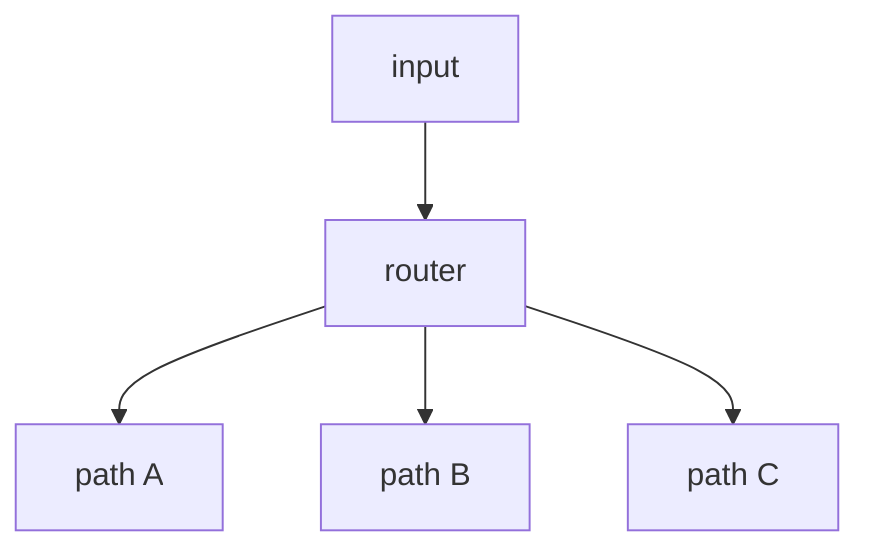

# 02. Routing

## Part 1 — Core Tutorial

Routing sends work to different paths depending on the input or current state. In real LLM workflows, the router often uses structured output so the graph receives a reliable routing label.




## When To Use

Use this pattern when different inputs need different handling. The important design question is: what small set of destinations can the router choose from?

Examples:

- easy question vs hard question
- billing issue vs technical issue
- pass vs retry

## Part 2 — Concept Example That Reinforces The Pattern

This page is concept-only for now. The important implementation idea is the same one you already saw in `4-Conditional Edges`: a router reads state and returns a route label.

A routing workflow usually looks like this:

```python
def route_request(state):
    if state["intent"] == "billing":
        return "billing"
    if state["intent"] == "technical":
        return "technical"
    return "general"
```

Then `add_conditional_edges()` maps those labels to destination nodes.

## Code Explanation

To turn this into a runnable graph, add destination nodes such as `billing`, `technical`, and `general`, then use `add_conditional_edges()` to map each route label to its node. Keep labels short and explicit so the graph stays easy to read.
