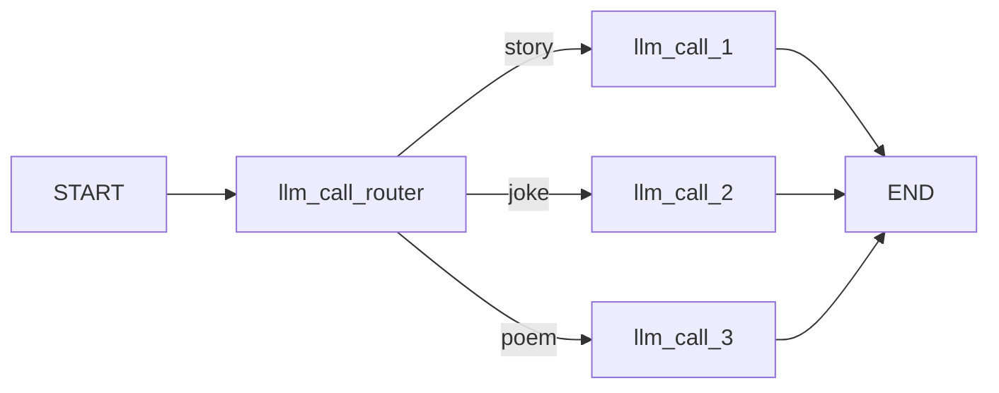
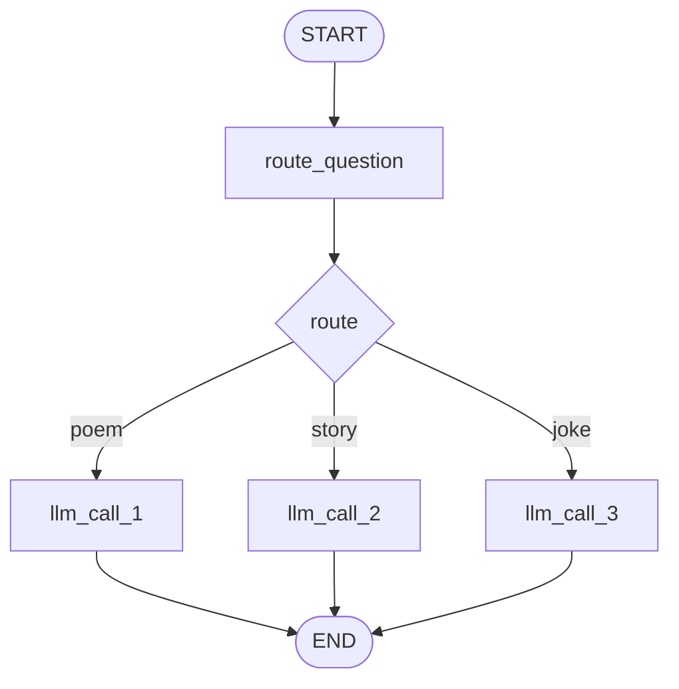

# 02. Routing

## Part 1 — Core Tutorial

Routing sends work to different paths depending on the input. The router uses structured output so the graph receives a reliable label — no free-text parsing needed.




## When To Use

Use this pattern when different inputs need different handling and you can define a small fixed set of destinations upfront.

Examples:

- easy question vs hard question
- billing issue vs technical issue
- story vs joke vs poem

## Part 2 — Code Example

File: `02_routing.py`


Graph from the code:



### How it works

**Router node** — classifies the input using structured output and writes the decision to state:

```python
class Route(BaseModel):
    step: Literal["poem", "story", "joke"]

router = llm.with_structured_output(Route)

def llm_call_router(state: State):
    decision = router.invoke([SystemMessage(...), HumanMessage(content=state["input"])])
    return {"decision": decision.step}
```

**Conditional edge** — reads `decision` from state and returns the worker node name:

```python
def route_decision(state: State):
    if state["decision"] == "story":
        return "llm_call_1"
    elif state["decision"] == "joke":
        return "llm_call_2"
    elif state["decision"] == "poem":
        return "llm_call_3"
```

**Worker nodes** — each handles one content type, all share the same structure:

```python
def llm_call_2(state: State):
    """Write a joke"""
    result = llm.invoke(state["input"])
    return {"output": result.content}
```

### State

| Field | Set by | Used by |
|---|---|---|
| `input` | caller | router + workers |
| `decision` | router node | conditional edge |
| `output` | worker node | caller |

### Key idea

Structured output is what makes routing reliable. Without it, the router returns free text that you'd have to parse. With it, `decision` is always exactly `"story"`, `"joke"`, or `"poem"` — the conditional edge reads it directly.

## Exercises

**Exercise 1 — Add a fourth route**

Add a `"haiku"` option to the `Route` schema and a `llm_call_4` node that writes a haiku. Wire it into the graph and test with `"Write me a haiku about rain"`.

**Exercise 2 — Shared prompt**

The three worker nodes currently pass `state["input"]` directly to the LLM. Update each one to prepend a short system prompt that fits its content type (e.g. `"You are a comedian. Write only jokes."`). Verify the output style changes.
