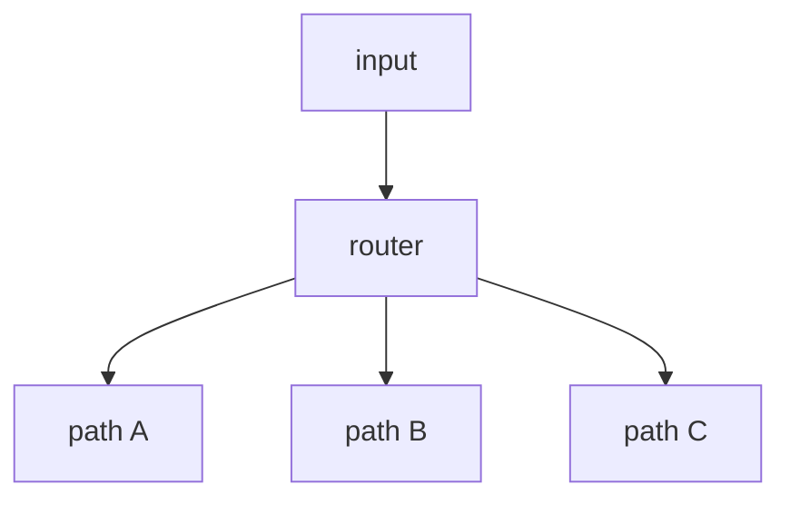

# 02. Routing

## Part 1 — Core Tutorial

Routing sends work to different paths depending on the input or current state. In real LLM workflows, the router often uses structured output so the graph receives a reliable routing label.

## When To Use

Use this pattern when different inputs need different handling. The important design question is: what small set of destinations can the router choose from?

Examples:

- easy question vs hard question
- billing issue vs technical issue
- pass vs retry

## Part 2 — Code Example That Reinforces The Concept

No runnable code yet. This page is the concept guide for a future routing example.

## Code Explanation

Future code should show a router node or router function that returns a label, then `add_conditional_edges()` mapping labels to destination nodes. Keep the labels simple, such as `billing`, `technical`, or `general`.
