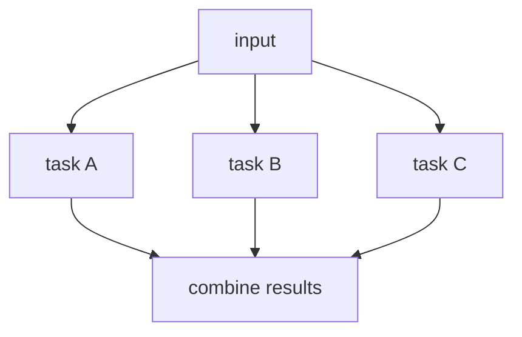

# 03. Parallelization

## Part 1 — Core Tutorial

Parallelization runs independent tasks at the same time, then combines the results. Use it when several branches can work from the same input without waiting for each other.




The mental model is simple:

1. one shared input enters the graph
2. multiple worker nodes run independently
3. each worker writes its own part of the state
4. one final node gathers the finished pieces

In LangGraph, this is a **fan-out / fan-in** shape:

- **fan-out**: `START` sends the same state to several nodes
- **fan-in**: the worker nodes all connect into one aggregation node

## When To Use

Use this pattern when several tasks do not depend on each other. If task B needs task A's output, use prompt chaining instead.

Good examples:

- analyze the same document from multiple angles
- generate several candidate answers
- run independent checks before a final response
- create different versions of the same content for different channels

Avoid this pattern when the steps must happen in a strict order. Parallel branches should be independent.

## Part 2 — Code Example That Reinforces The Concept

The code example generates a social media content package from one topic:

- Instagram post
- Twitter/X post
- LinkedIn post
- final combined package

Generated LangGraph plot from the code:


Run it:

```bash
python 5-Workflows/03_parallelization.py
```

The graph starts with one topic, sends it to three platform-specific LLM nodes, then joins their outputs in one aggregator.

```python
builder.add_edge(START, "generate_instagram")
builder.add_edge(START, "generate_twitter")
builder.add_edge(START, "generate_linkedin")
```

These edges create the fan-out. The same initial state is available to all three nodes.

```python
builder.add_edge("generate_instagram", "aggregate_posts")
builder.add_edge("generate_twitter", "aggregate_posts")
builder.add_edge("generate_linkedin", "aggregate_posts")
```

These edges create the fan-in. The aggregator runs after the platform posts are ready, then combines them.

## Code Explanation

The state contains one shared input and one output field for each branch:

```python
class OverallState(TypedDict):
    topic: str
    instagram_post: str
    twitter_post: str
    linkedin_post: str
    final_output: str
```

Each worker returns a partial state update:

```python
return {"instagram_post": instagram_post}
```

This does not overwrite the whole state. It only updates `instagram_post`; the other fields stay available.

This example does **not** need a reducer because each parallel node writes to a different key. There is no conflict:

- `generate_instagram` writes `instagram_post`
- `generate_twitter` writes `twitter_post`
- `generate_linkedin` writes `linkedin_post`

You would need a reducer if multiple parallel nodes wrote to the same field, for example if every node returned `{"posts": [...]}` and you wanted LangGraph to merge all lists together.

The final node reads the finished branch outputs and creates one formatted result:

```python
def aggregate_posts(state: OverallState) -> dict:
    final_output = f"""
    INSTAGRAM POST
    {state['instagram_post']}

    TWITTER/X POST
    {state['twitter_post']}

    LINKEDIN POST
    {state['linkedin_post']}
    """
    return {"final_output": final_output}
```

So the key lesson is simple: use parallelization when branches are independent, and join them only when the graph has enough information to build the final answer.
