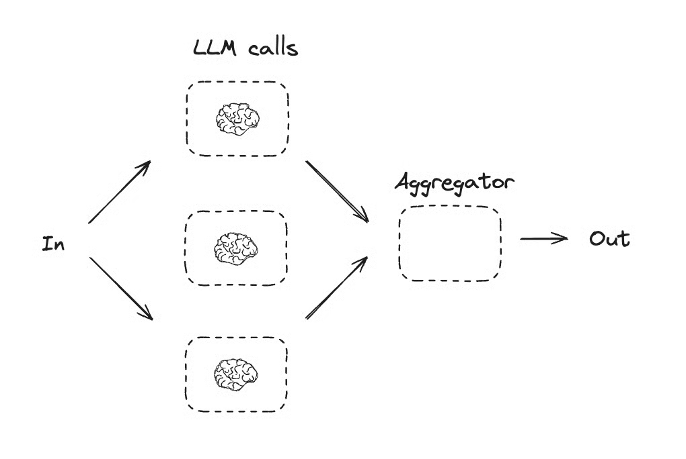
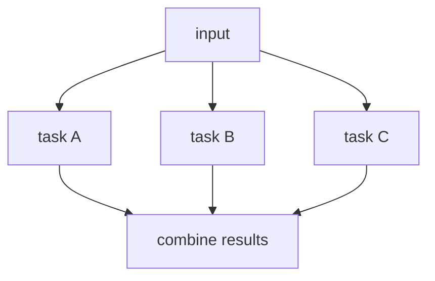
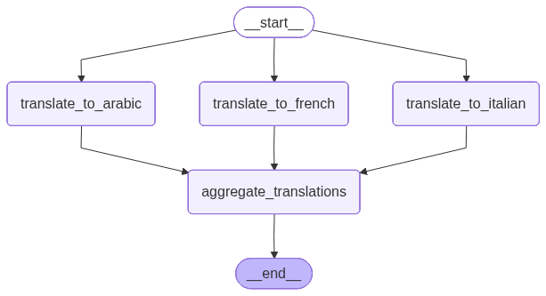

# 03. Parallelization

## Part 1 — Core Tutorial

Parallelization runs independent tasks at the same time, then combines the results. Use it when several branches can work from the same input without waiting for each other.


The hand-drawn view below shows the same idea in plain language: one input fans out to several LLM calls, then an aggregator joins their results into one output.





The mental model is simple:

1. one shared input enters the graph
2. multiple worker nodes run independently
3. each worker writes its own part of the state
4. one final node gathers the finished pieces

In LangGraph, this is a **fan-out / fan-in** shape:

- **fan-out**: `START` sends the same state to several nodes
- **fan-in**: the worker nodes all connect into one aggregation node

Parallelization is different from prompt chaining. In prompt chaining, each step depends on the previous step. In parallelization, the branches should be able to run without waiting for each other.

## When To Use

Use this pattern when several tasks do not depend on each other.

Good examples:

- analyze the same document from multiple angles
- translate the same paragraph into multiple languages
- generate several candidate answers
- run independent checks before a final response
- create different versions of the same content for different channels

Avoid this pattern when the steps must happen in a strict order. If task B needs task A's output, use prompt chaining instead.

## Part 2 — Code Examples That Reinforce The Concept

### Example A — Joke, Story, And Poem

Start here. This is the smallest version of the pattern.

The graph receives one topic, then runs three independent LLM calls:

- `generate_joke` writes `joke`
- `generate_story` writes `story`
- `generate_poem` writes `poem`
- `aggregator` combines all three into `combined_output`

Generated LangGraph plot from the code:


Run it:

```bash
python 5-Workflows/03_parallelization_creative.py
```

The fan-out happens here:

```python
parallel_builder.add_edge(START, "generate_joke")
parallel_builder.add_edge(START, "generate_story")
parallel_builder.add_edge(START, "generate_poem")
```

The fan-in happens here:

```python
parallel_builder.add_edge("generate_joke", "aggregator")
parallel_builder.add_edge("generate_story", "aggregator")
parallel_builder.add_edge("generate_poem", "aggregator")
```

### Example B — Translate One Paragraph Into Three Languages

This example shows a very common real use case: one English paragraph is translated into Arabic, French, and Italian at the same time.

Each translation branch is independent:

- `translate_to_arabic` writes `arabic_translation`
- `translate_to_french` writes `french_translation`
- `translate_to_italian` writes `italian_translation`
- `aggregate_translations` combines them into `combined_output`

Generated LangGraph plot from the code:



Run it:

```bash
python 5-Workflows/03_parallelization_translation.py
```

This is a strong example of parallelization because the French translation does not need to wait for the Arabic translation, and the Italian translation does not need either one.

### Example C — Social Media Content Package

The third example uses the same graph shape for a content workflow. It generates platform-specific content from one topic:

- Instagram post
- Twitter/X post
- LinkedIn post
- final combined package

Generated LangGraph plot from the code:


Run it:

```bash
python 5-Workflows/03_parallelization.py
```

The graph starts with one topic, sends it to three platform-specific LLM nodes, then joins their outputs in one aggregator.

## Code Explanation

The translation example state has one shared input and one output field for each branch:

```python
class TranslationState(TypedDict):
    english_paragraph: str
    arabic_translation: str
    french_translation: str
    italian_translation: str
    combined_output: str
```

Each worker returns a partial state update:

```python
return {"arabic_translation": msg.content}
```

This does not overwrite the whole state. It only updates `arabic_translation`; the other fields stay available.

This example does **not** need a reducer because each parallel node writes to a different key. There is no conflict:

- `translate_to_arabic` writes `arabic_translation`
- `translate_to_french` writes `french_translation`
- `translate_to_italian` writes `italian_translation`

You would need a reducer if multiple parallel nodes wrote to the same field, for example if every node returned `{"translations": [...]}` and you wanted LangGraph to merge all lists together.

The aggregator reads the completed branch outputs and creates one final result:

```python
def aggregate_translations(state: TranslationState) -> dict:
    combined_output = f"""
    ORIGINAL ENGLISH
    {state['english_paragraph']}

    ARABIC
    {state['arabic_translation']}

    FRENCH
    {state['french_translation']}

    ITALIAN
    {state['italian_translation']}
    """
    return {"combined_output": combined_output}
```

The creative example and social media example use the same idea with different state fields. Same graph shape, different task.

So the key lesson is simple: use parallelization when branches are independent, and join them only when the graph has enough information to build the final answer.
