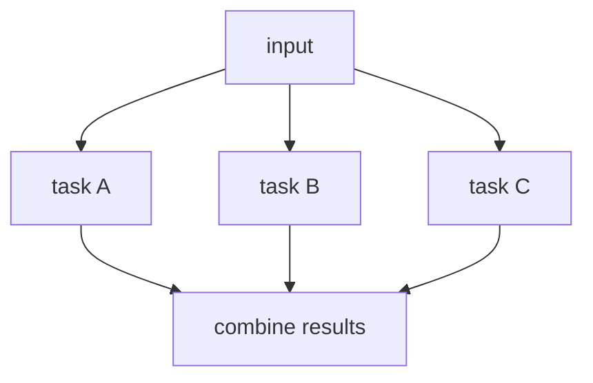

# 03. Parallelization

## Part 1 — Core Tutorial

Parallelization runs independent tasks at the same time, then combines the results.

## When To Use

Use this pattern when several tasks do not depend on each other.

Examples:

- analyze the same document from multiple angles
- generate several candidate answers
- run independent checks before a final response

## Part 2 — Code Example That Reinforces The Concept

Placeholder for future LangGraph implementation.

## Code Explanation

TODO: Explain fan-out, reducers for merging results, and final aggregation node.
