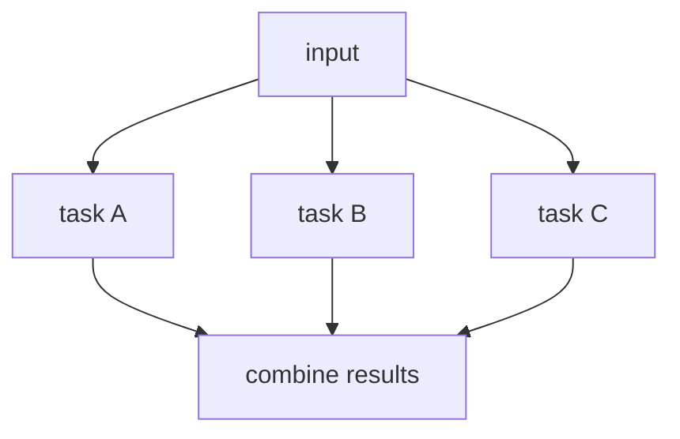

# 03. Parallelization

## Part 1 — Core Tutorial

Parallelization runs independent tasks at the same time, then combines the results. The official workflow pattern is useful when tasks do not depend on each other, such as generating multiple analyses of the same input.

## When To Use

Use this pattern when several tasks do not depend on each other. If task B needs task A's output, use prompt chaining instead.

Examples:

- analyze the same document from multiple angles
- generate several candidate answers
- run independent checks before a final response

## Part 2 — Code Example That Reinforces The Concept

No runnable code yet. This page is the concept guide for a future parallelization example.

## Code Explanation

Future code should show fan-out from one input into several worker nodes, reducers to collect their outputs, and a final aggregation node that turns the collected results into one answer.
