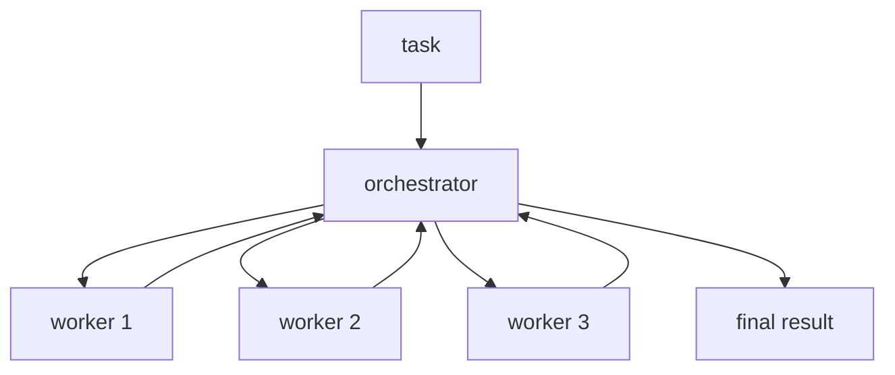

# 04. Orchestrator-Workers

## Part 1 — Core Tutorial

An orchestrator-worker workflow uses one central node to plan or delegate work to specialized worker nodes.

## When To Use

Use this pattern when the task has multiple parts and one controller should decide who does what.

Examples:

- research assistant
- multi-step report generation
- task planner with specialist workers

## Part 2 — Code Example That Reinforces The Concept

Placeholder for future LangGraph implementation.

## Code Explanation

TODO: Explain orchestrator state, worker nodes, routing, and result collection.
