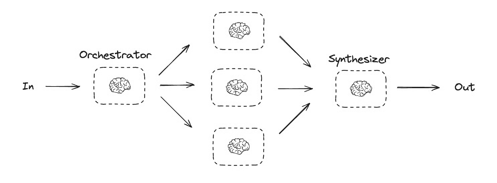
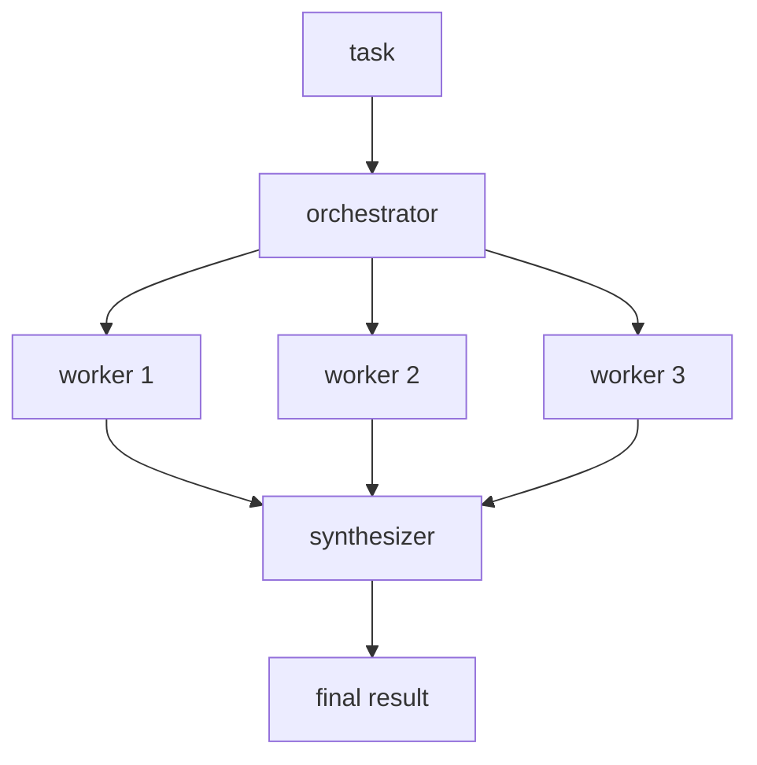
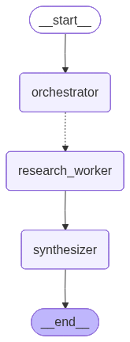
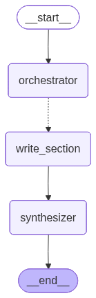

# 04. Orchestrator-Workers

## Part 1 — Core Tutorial

An orchestrator-worker workflow uses one central node to plan or delegate work to specialized worker nodes. The orchestrator decides the subtasks; the workers focus on execution; a final node usually synthesizes the worker outputs.


The hand-drawn view below shows the same pattern in plain language: one orchestrator receives the input, creates worker calls, and a synthesizer combines their outputs.





The mental model is:

1. the **orchestrator** looks at the big task
2. it breaks the task into smaller subtasks
3. it delegates those subtasks to workers
4. each **worker** handles one focused subtask
5. the **synthesizer** combines worker outputs into a final result

This pattern is more flexible than simple parallelization. In basic parallelization, the branches are usually known when you write the graph. In orchestrator-workers, the subtasks may not be known upfront, so the orchestrator decides the number and type of workers at runtime.

This is useful for workflows that write code, edit content across multiple files, or need to update an unknown number of documents. For example, if a workflow needs to update installation instructions for several Python libraries across many documents, the orchestrator can first inspect the task, decide which documents or libraries need workers, then synthesize the final update.

## When To Use

Use this pattern when the task has multiple parts and one controller should decide who does what. It is especially useful when the number or type of subtasks is not known upfront.

Good examples:

- research assistant
- multi-step report generation
- task planner with specialist workers
- document analysis where sections need different expertise
- content production where one planner assigns different angles

Avoid this pattern when the task always has a small fixed set of branches. In that case, normal parallelization is simpler.

## Part 2 — Code Examples That Reinforce The Concept

### Example A — Research Assistant

The first runnable example builds a research assistant:

- `orchestrator` creates a structured research plan
- `research_worker` runs once per research source/aspect
- `synthesizer` combines all worker findings into one report

Generated LangGraph plot from the code:



Run it:

```bash
python 5-Workflows/04_orchestrator_workers.py
```

The example topic is:

```text
Renewable energy adoption barriers in developing countries
```

The graph first asks the LLM to create 3-5 research areas. Then LangGraph dynamically creates one worker call for each area.


### Example B — Report Sections With `Send`

The second runnable example creates a report by dynamically assigning one worker per section:

- `orchestrator` creates a structured report plan
- `assign_workers` sends each `Section` to a separate worker with `Send`
- `write_section` writes one section in markdown
- `synthesizer` joins all completed sections into `final_report`

Generated LangGraph plot from the code:



Run it:

```bash
python 5-Workflows/04_orchestrator_workers_report_sections.py
```

The example topic is:

```text
Create a report on LLM scaling laws
```

This is close to the common LangGraph example where an orchestrator plans report sections, then uses `Send` to kick off one worker for each section. The notebook-specific `display(Image(...))` and `Markdown(...)` calls were replaced with `plot_graph(...)` and normal terminal output so the example works as a regular Python script.

## Code Explanation

The research assistant example state stores the big task, the generated plan, all worker findings, and the final report:

```python
class OverallState(TypedDict):
    research_topic: str
    sources: List[str]
    worker_findings: Annotated[List[dict], add]
    final_report: str
```

The important field is:

```python
worker_findings: Annotated[List[dict], add]
```

This uses a reducer. Multiple workers return `worker_findings` in parallel, so LangGraph needs to know how to combine them. The `add` reducer appends/merges the returned lists instead of letting one worker overwrite another worker.

The report-sections example uses the same idea with different state keys:

```python
class State(TypedDict):
    topic: str
    sections: list[Section]
    completed_sections: Annotated[list[str], operator.add]
    final_report: str
```

Here, `completed_sections` is the shared reducer key. Every section worker writes one markdown section to that key, and the reducer collects all sections for the synthesizer.

The orchestrator uses structured output to create a plan:

```python
class ResearchPlan(BaseModel):
    sources: List[str]
    reasoning: str
```

Then the orchestrator node returns only the generated sources:

```python
def plan_research(state: OverallState) -> dict:
    research_plan = planner_llm.invoke(prompt)
    return {"sources": research_plan.sources}
```

The research assistant dynamic dispatch function creates one `Send` per source:

```python
def create_research_workers(state: OverallState) -> list[Send]:
    return [
        Send(
            "research_worker",
            {
                "source": source,
                "worker_id": index + 1,
                "research_topic": state["research_topic"],
            },
        )
        for index, source in enumerate(state["sources"])
    ]
```

`Send` is the key idea here. It tells LangGraph:

> Run this node with this worker-specific state.

LangGraph has built-in support for this orchestrator-worker pattern. The `Send` API lets the graph create worker executions dynamically and pass each one a specific input. In the research example, the graph loops over generated research sources. In the report example, it loops over generated report sections.

Each worker receives its own `WorkerState`, but worker results are written back into a shared reducer key on the orchestrator graph state, such as `worker_findings` or `completed_sections`. That gives the synthesizer access to all worker outputs when it creates the final report.

The conditional edge connects the orchestrator to this dynamic dispatch function:

```python
builder.add_conditional_edges(
    "orchestrator",
    create_research_workers,
    ["research_worker"],
)
```

This is different from a normal router that chooses one next node. Here, the routing function returns multiple `Send(...)` objects, so LangGraph creates multiple worker executions.

Each worker returns one finding:

```python
return {"worker_findings": [findings]}
```

Because `worker_findings` has a reducer, all worker results are collected into one list. In the report-sections example, `completed_sections` plays the same role.

Finally, the synthesizer reads the collected findings and writes the final report:

```python
def synthesize_report(state: OverallState) -> dict:
    final_report = llm.invoke(prompt).content
    return {"final_report": final_report}
```

So the key lesson is: use orchestrator-workers when an LLM should first decide the work breakdown, then send focused workers to complete those subtasks, then synthesize everything into one answer.
