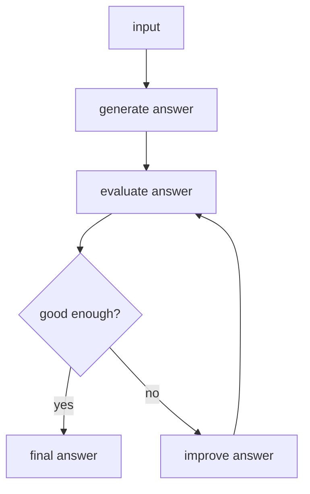

# 05. Evaluator-Optimizer

## Part 1 — Core Tutorial

An evaluator-optimizer workflow generates an output, checks it, then improves it if needed. This pattern is useful when quality matters more than a single fast answer.




## When To Use

Use this pattern when quality matters and the system should review or improve its own output. Always define a stopping rule, otherwise the loop can keep trying forever.

Examples:

- writing assistant
- code review assistant
- answer quality checker

## Part 2 — Concept Example That Reinforces The Pattern

This page is concept-only for now. The core implementation idea is a loop with a stopping rule:

```text
generate -> evaluate -> accept or improve -> evaluate again
```

The evaluator should return a clear decision, such as `accept` or `revise`, plus feedback for the optimizer.

## Code Explanation

To turn this into a runnable graph, add a generator node, an evaluator node that returns feedback, a conditional edge that decides `revise` vs `accept`, and a maximum iteration count so the graph cannot loop forever.
