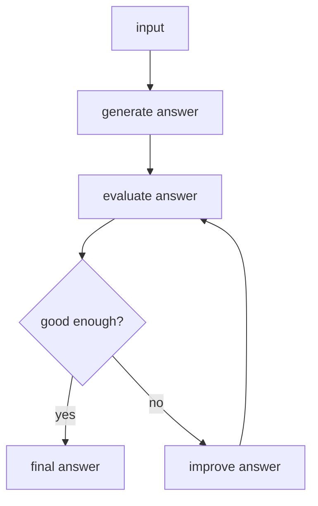

# 05. Evaluator-Optimizer

## Part 1 — Core Tutorial

An evaluator-optimizer workflow generates an output, checks it, then improves it if needed.

## When To Use

Use this pattern when quality matters and the system should review or improve its own output.

Examples:

- writing assistant
- code review assistant
- answer quality checker

## Part 2 — Code Example That Reinforces The Concept

Placeholder for future LangGraph implementation.

## Code Explanation

TODO: Explain generation node, evaluator node, conditional retry loop, and stopping condition.
