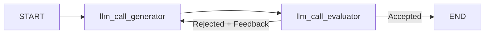
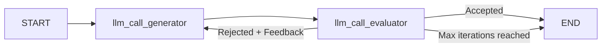

# 05. Evaluator-Optimizer

## Part 1 — Core Tutorial

An evaluator-optimizer workflow loops between two LLM calls: a **generator** that produces an output and an **evaluator** that grades it. If the output is good enough the loop exits; if not, the evaluator's feedback flows back into the generator for another attempt.


### How it works

```
In → Generator → Evaluator ──accepted──→ Out
                     │
                  rejected
                     │
                     └──(+ feedback) ──→ Generator
```

The key idea is the **feedback loop**: the evaluator does not just say "try again" — it explains *why* the output failed. The generator uses that critique on the next pass, so quality improves with each iteration rather than restarting from scratch.

## When To Use

Use this pattern when:

- A single LLM pass is not reliably good enough
- You can write a clear acceptance criterion (structured `pass / fail` verdict)
- Incremental improvement is possible (the generator can act on critique)

Real-world examples:

- Writing assistant — draft → critique → rewrite
- Code review — generate code → run linter / tests → fix errors
- Answer quality checker — answer → fact-check → correct

> **Always define a stopping rule.** Without a maximum iteration count, a hard evaluator can trap the graph in an infinite loop.

## Part 2 — Joke Optimizer Example

This example runs the pattern on a deliberately lightweight task (joke generation) so the loop structure is easy to follow without domain knowledge getting in the way.

### State

| Field | Set by | Used by |
|---|---|---|
| `topic` | caller | generator (first prompt) |
| `joke` | generator | evaluator |
| `funny_or_not` | evaluator | router |
| `feedback` | evaluator | generator (retry prompt) |

### Structured output

The evaluator uses `with_structured_output(Feedback)` to return a reliable `"funny"` / `"not funny"` verdict alongside plain-text feedback. Structured output removes the need to parse free text in the router.

```python
class Feedback(BaseModel):
    grade: Literal["funny", "not funny"]
    feedback: str
```

### Conditional edge

The router function reads `funny_or_not` and returns a string label that LangGraph maps to the next node:

```
"Accepted"          → END
"Rejected + Feedback" → llm_call_generator
```

### Graph



## Part 3 — Joke Optimizer with Max Iterations

File: `05_evaluator_optimizer_max_iterations.py`

The base example loops until the evaluator accepts the joke, which could in theory run forever if the LLM keeps rejecting. This variant adds a hard stop: after `MAX_ITERATIONS` rejections the graph exits regardless of the verdict.

### What changed

**State** — one new field:

```python
class State(TypedDict):
    ...
    iterations: int   # incremented by the evaluator on every pass
```

**Evaluator node** — increments the counter on every call:

```python
return {
    "funny_or_not": grade.grade,
    "feedback": grade.feedback,
    "iterations": state.get("iterations", 0) + 1,
}
```

**Router** — checks the counter before deciding to retry:

```python
def route_joke(state: State):
    if state["funny_or_not"] == "funny":
        return "Accepted"
    if state["iterations"] >= MAX_ITERATIONS:
        return "Max iterations reached"
    return "Rejected + Feedback"
```

The graph maps both `"Accepted"` and `"Max iterations reached"` to `END`, so the loop always terminates.

### Graph



### Key idea

Incrementing in the **evaluator** (not the generator or router) means the count reflects how many times the output was actually judged — a cleaner place to track it than hiding the increment inside the routing logic.

## Part 4 — Exercises

1. **Add a loop guard** — add an `iterations` counter to `State` and stop after 3 attempts regardless of the verdict.
2. **Swap the domain** — replace the joke generator with a headline writer and update the evaluator schema to grade on `"clear"` / `"unclear"`.
3. **Stricter evaluator** — make the `Feedback` schema include a `score: int` (1–10) and only accept jokes scoring 8 or higher.
