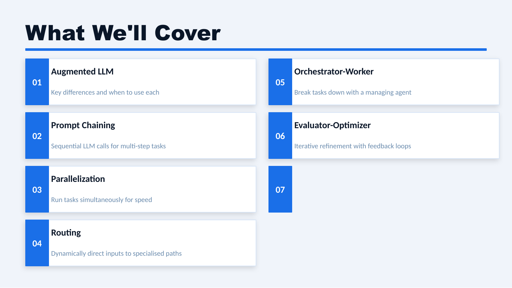
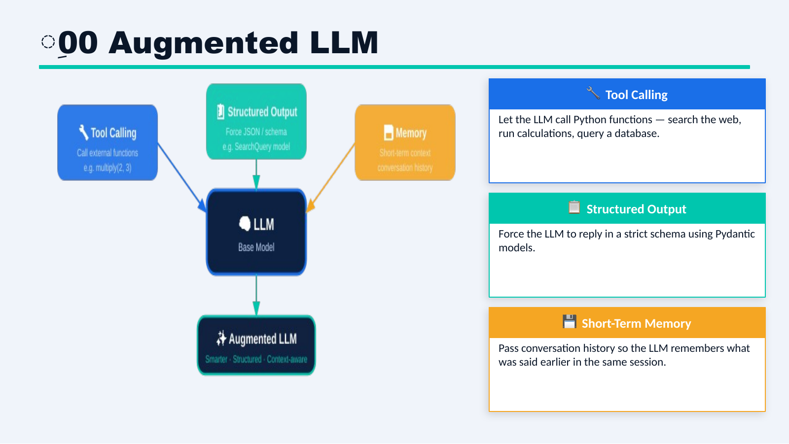
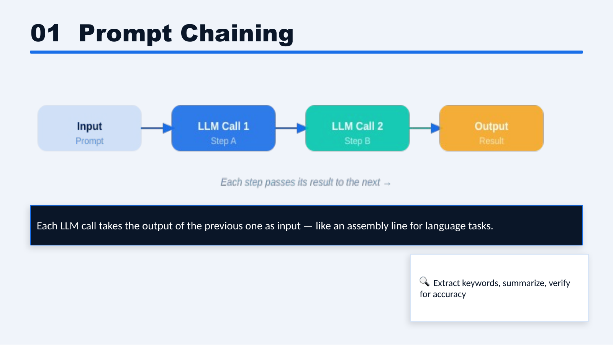
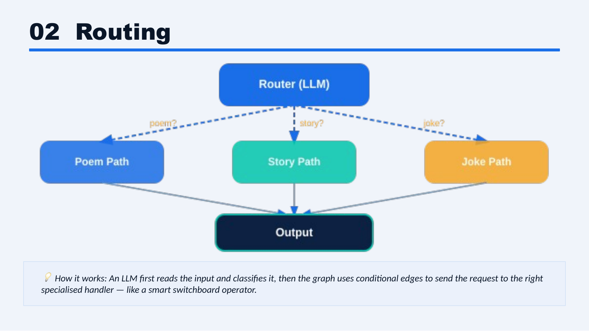
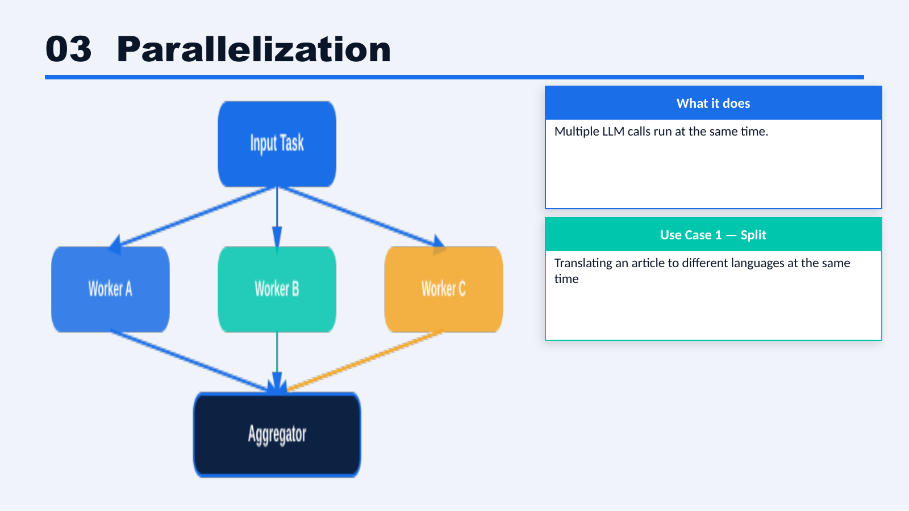
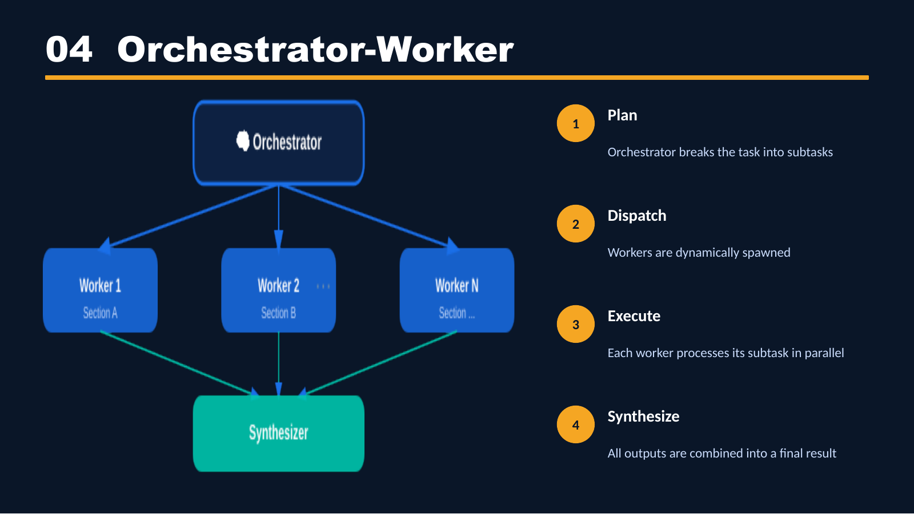
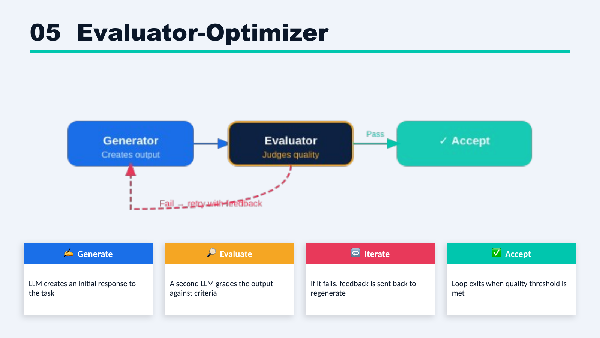

# 5. Workflows

This folder teaches common LangGraph workflow patterns: how an LLM system can use augmentations, chain steps, route work, run tasks in parallel, delegate to workers, and improve its own output.

This folder mixes runnable examples with concise concept pages. The runnable examples come first, and the remaining pages mark patterns that will get code later.

Reference: [LangGraph Workflows and Agents](https://docs.langchain.com/oss/python/langgraph/workflows-agents#llms-and-augmentations)

Source figures: [Workflow types deck](https://docs.google.com/presentation/d/1SuUtO_OCcglql3DRU5KnbKtxxHokxPhX/edit?slide=id.p2#slide=id.p2)



## Part 1 — Core Tutorial

A workflow is a reusable pattern for organizing how an LLM system thinks, uses augmentations, makes decisions, and checks results. The official LangGraph docs describe workflows as more predictable than open-ended agents: the path is mostly defined by code, even when an LLM helps with a step.

Earlier folders teach the building blocks:

- state
- nodes
- reducers
- message history
- conditional edges

This folder uses those building blocks to explain larger workflow patterns. The goal is not to memorize names; it is to recognize the shape of the problem and pick the simplest graph that fits.

## Workflow vs Agent

A **workflow** has edges that you define in code. The route is mostly fixed when you build the graph. Even when a workflow uses conditional edges, routing, or evaluator-optimizer loops, it is still choosing among paths you already defined.

An **agent** gives more control to the LLM at runtime. A common agent loop is:

```text
llm_call -> should_continue -> tool_node -> llm_call
```

That loop repeats until the model stops requesting tool calls. The number of iterations is not known ahead of time; the model decides whether to keep using tools or stop.

So the practical difference is:

- **workflow**: code controls the path
- **agent**: the model controls more of the path

## Visual Workflow Map

| Workflow | Figure | Core Idea |
|---|---|---|
| Augmented LLM |  | Add tools, structured output, or memory to the model |
| Prompt chaining |  | Pass one LLM result into the next step |
| Routing |  | Classify input and send it to the right path |
| Parallelization |  | Run independent LLM calls at the same time |
| Orchestrator-workers |  | Let a manager break work into subtasks |
| Evaluator-optimizer |  | Generate, evaluate, improve, and stop when good enough |

## Workflow Tutorials

| File | Workflow | Purpose |
|---|---|---|
| `00_augmented_llm.md` | LLM augmentations | Tools, structured output, retrieval, and memory as building blocks |
| `00_augmented_llm_structured_output.md` + `00_augmented_llm_structured_output.py` | Augmented LLM with structured output | LLM output constrained by a Pydantic schema |
| `01_prompt_chaining.md` + `01_prompt_chaining.py` + `01_prompt_chaining_joke_gate.py` | Prompt chaining | Break tasks into ordered LLM steps, with an optional quality gate |
| `02_routing.md` | Routing | Send work to different paths based on input or state |
| `03_parallelization.md` + `03_parallelization_creative.py` + `03_parallelization_translation.py` + `03_parallelization.py` | Parallelization | Run independent LLM calls side by side, then combine them |
| `04_orchestrator_workers.md` + `04_orchestrator_workers.py` + `04_orchestrator_workers_report_sections.py` | Orchestrator-workers | One controller dynamically delegates work to specialized workers |
| `05_evaluator_optimizer.md` | Evaluator-optimizer | Generate, evaluate, and improve outputs iteratively |

## Supporting Resources

| Resource | Purpose |
|---|---|
| `resources/langchain_augmentation_snippets.md` | Small LangChain snippets for structured output and tool binding before they are used inside LangGraph workflows |

## How To Use This Folder

Start with the runnable examples:

1. `00_augmented_llm_structured_output.py` for Pydantic output
2. `01_prompt_chaining.py` for a sequential content pipeline
3. `01_prompt_chaining_joke_gate.py` for prompt chaining with a quality gate
4. `03_parallelization_creative.py` for a minimal joke/story/poem fan-out
5. `03_parallelization_translation.py` for translating one paragraph into three languages
6. `03_parallelization.py` for a practical social-media content package
7. `04_orchestrator_workers.py` for dynamic worker dispatch with `Send`
8. `04_orchestrator_workers_report_sections.py` for assigning one report section per worker

Then read the concept pages for routing and evaluator-optimizer. Those pages explain the pattern before code is added.

Each tutorial should make clear:

1. what state fields are needed
2. which nodes are involved
3. how edges connect the workflow
4. where conditional edges or reducers are used
5. what output to expect
