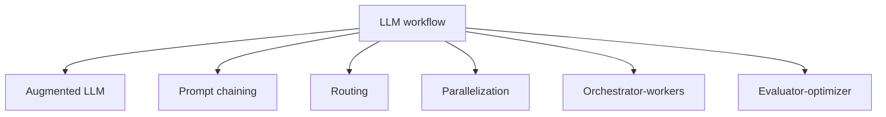

# 5. Workflows

This folder is a placeholder area for future LangGraph workflow tutorials.

The goal is to collect common workflow patterns and later turn each one into a clear tutorial with diagrams, explanation, and code examples.

No code is included here yet. These files are planning placeholders.

Reference: [LangGraph Workflows and Agents](https://docs.langchain.com/oss/python/langgraph/workflows-agents#llms-and-augmentations)

## Part 1 — Core Tutorial

A workflow is a reusable pattern for organizing how an LLM system thinks, calls tools, makes decisions, and checks results.

Earlier folders teach the building blocks:

- state
- nodes
- reducers
- message history
- conditional edges

This folder will use those building blocks to explain larger workflow patterns.

## Planned Workflow Tutorials

| File | Workflow | Purpose |
|---|---|---|
| `00_augmented_llm.md` + `00_augmented_llm.py` | Augmented LLM | LLM enhanced with tools, retrieval, or memory |
| `01_prompt_chaining.md` | Prompt chaining | Break a task into ordered LLM steps |
| `02_routing.md` | Routing | Send work to different paths based on input or state |
| `03_parallelization.md` | Parallelization | Run independent steps side by side |
| `04_orchestrator_workers.md` | Orchestrator-workers | One controller delegates work to specialized workers |
| `05_evaluator_optimizer.md` | Evaluator-optimizer | Generate, evaluate, and improve outputs iteratively |

## Part 2 — Code Example That Reinforces The Concept

The augmented LLM workflow now has a code example. Other workflow patterns are still placeholders.

For now, each markdown file includes:

- concept summary
- when to use it
- graph shape placeholder
- future code placeholder
- notes for implementation

## Code Explanation

No code yet. When code is added, each workflow tutorial should explain:

1. what state fields are needed
2. which nodes are involved
3. how edges connect the workflow
4. where conditional edges or reducers are used
5. what output to expect
