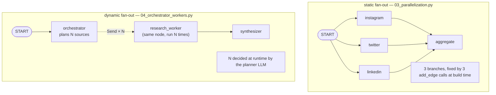
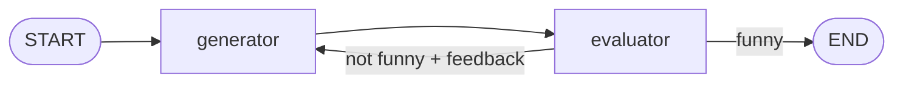

# 5. Workflows — The Classic LLM Orchestration Patterns

This folder combines everything from tutorials 1–4 — state, reducers, messages, conditional edges — into the six workflow patterns that cover most real LLM systems. Every pattern here is a **runnable script** plus a companion `.md` deep-dive.

**Prerequisites:** tutorials 1–4, and an `OPENAI_API_KEY` in the repo-root `.env` (every script makes real model calls).

## Workflow vs. Agent — the distinction this folder rests on

A **workflow** is a graph whose possible paths you drew at build time. An LLM may fill in content, classify, or grade — but it only ever chooses *among routes you wired*. An **agent** (tutorial 6) hands the model more control: it decides at runtime whether to call tools and when to stop, so the number of steps isn't known in advance.

| | Workflow | Agent |
|---|---|---|
| Path decided by | your edges (possibly conditional) | the model, each iteration |
| Step count | bounded and known-ish | open-ended loop |
| Predictability / debuggability | high | lower |
| Flexibility on novel inputs | limited to wired paths | high |
| Cost control | easy to reason about | needs caps and guards |

Rule of thumb: **use the most constrained shape that solves the problem.** Every pattern below is a workflow; reach for an agent only when you genuinely can't enumerate the paths.

## The Six Patterns at a Glance

```text
Augmented LLM        one call, upgraded I/O        START → analyze → END
Prompt chaining      fixed sequence                 START → A → B → C → END
Routing              classify, then dispatch        START → router ─┬→ X → END
                                                                    ├→ Y → END
                                                                    └→ Z → END
Parallelization      static fan-out / fan-in        START ─┬→ A ─┐
                                                           ├→ B ─┼→ join → END
                                                           └→ C ─┘
Orchestrator-workers dynamic fan-out (Send)         START → plan →(N workers)→ merge → END
Evaluator-optimizer  generate/grade loop            START → gen → eval ─(bad)→ gen …
                                                                       └(good)→ END
```

Each pattern answers a different question about *where the structure of the task comes from*:

- structure known and linear → **chaining**
- structure depends on input category → **routing**
- structure is several independent subtasks, known in advance → **parallelization**
- structure is several subtasks, but *how many* is only knowable at runtime → **orchestrator-workers**
- structure is "try until good enough" → **evaluator-optimizer**

---

## Pattern 1 — Augmented LLM ([`00_augmented_llm_structured_output.py`](00_augmented_llm_structured_output.py))

The building block, not really a graph shape: a single LLM call upgraded with **structured output**. A Pydantic schema is bound to the model, so a free-text product review comes back as a validated object instead of prose:

```python
class ProductReview(BaseModel):
    product_name: str
    sentiment: str
    rating: int = Field(ge=1, le=5)     # validated range, not hoped-for range
    pros: List[str]
    cons: List[str]
    summary: str

structured_llm = llm.with_structured_output(ProductReview)
```

**Why it matters for everything downstream:** the moment an LLM output has to be *read by code* — a router branching on it, a dispatcher counting it, a reducer merging it — free text is a liability. `with_structured_output` turns "parse and pray" into a typed contract. Three of the five remaining patterns in this folder depend on it. The concept page [`00_augmented_llm.md`](00_augmented_llm.md) covers the other augmentations (tools, retrieval, memory); tool binding gets its full treatment in tutorial 6.

---

## Pattern 2 — Prompt Chaining ([`01_prompt_chaining.py`](01_prompt_chaining.py))

A four-node fixed pipeline: `generate_draft → fact_check → improve_content → format_output`. Each node makes one focused LLM call and writes one state field; the next node reads it.

```text
State evolution:
{topic, requirements}
   ↓ generate_draft        writes draft
   ↓ fact_check            reads draft,             writes fact_check_results
   ↓ improve_content       reads draft + results,   writes improved_content
   ↓ format_output         reads improved_content,  writes final_draft (HTML)
```

**The design insight:** each field is written exactly once, by exactly one node — so *no reducers are needed*; plain overwrite semantics are correct. And because every intermediate stays in state, the full pipeline is auditable afterward — the script exploits this by saving an HTML report showing every stage side by side (`prompt_chaining_output.html`).

**Why chain instead of one mega-prompt?** Each call does one job, so each prompt is short and checkable, and a weak stage can be improved in isolation. The cost is latency: four sequential round-trips.

**Good fit:** tasks that decompose into a known, ordered sequence where later steps consume earlier output.
**Poor fit:** subtasks that don't depend on each other (parallelize instead), or a flow that varies by input (route instead).

Variants: [`01_prompt_chaining_joke_gate.py`](01_prompt_chaining_joke_gate.py) adds a mid-chain **quality gate** — a router after the first node that ends early on "Pass" or continues through improvement nodes on "Fail." [`01_prompt_chaining_essay_drafter.py`](01_prompt_chaining_essay_drafter.py) is a draft → reflect → revise pipeline. Deep dive: [`01_prompt_chaining.md`](01_prompt_chaining.md).

---

## Pattern 3 — Routing ([`02_routing.py`](02_routing.py))

Classify the input once, then dispatch to a specialized handler. The example routes a user request to a story, joke, or poem writer.

The load-bearing detail is *how the classification becomes reliable*:

```python
class Route(BaseModel):
    step: Literal["poem", "story", "joke"]

router = llm.with_structured_output(Route)
```

The `Literal` type means the model **cannot** answer anything except one of the three labels — no fuzzy string matching on "Sure! I'd classify this as a joke request." Then the two-piece pattern from tutorial 4 applies exactly:

1. `llm_call_router` — a **node**: makes the LLM call, writes `decision` to state.
2. `route_decision` — a **router function**: pure Python, reads `decision`, returns the worker node's name.

The expensive, fallible LLM call lives in a node (its output is captured in state, inspectable); the branching function stays trivial and testable. This division is the recommended way to do LLM-driven routing.

**Good fit:** distinct input categories that genuinely need different handling — different prompts, models, or downstream flows.
**Poor fit:** categories whose handlers are nearly identical (one parameterized prompt is simpler), or classifications too fuzzy for a one-shot label.

Deep dive: [`02_routing.md`](02_routing.md).

---

## Pattern 4 — Parallelization ([`03_parallelization.py`](03_parallelization.py))

Three nodes generate an Instagram, Twitter, and LinkedIn post *for the same topic*, simultaneously; an aggregator combines them. The fan-out is nothing more than multiple edges from the same source:

```python
builder.add_edge(START, "generate_instagram")
builder.add_edge(START, "generate_twitter")
builder.add_edge(START, "generate_linkedin")
# and fan-in: all three → aggregate_posts
```

LangGraph runs nodes whose dependencies are satisfied concurrently — the fan-in node waits until **all** incoming branches finish. Three LLM calls cost roughly one call's latency instead of three.

**The reducer question, answered by design:** these three writers touch *different* fields (`instagram_post`, `twitter_post`, `linkedin_post`), so no reducer is needed — there's no contention. The moment parallel writers share a field, a reducer becomes mandatory. The next pattern is exactly that situation.

**Good fit:** independent subtasks over the same input; also N-way "drafts + pick the best" sampling.
**Poor fit:** steps with data dependencies (that's a chain); rate-limit-constrained environments where concurrency hurts you.

Variants: [`03_parallelization_creative.py`](03_parallelization_creative.py) (joke/story/poem) and [`03_parallelization_translation.py`](03_parallelization_translation.py) (one paragraph → Arabic/French/Italian). Deep dive: [`03_parallelization.md`](03_parallelization.md).

---

## Pattern 5 — Orchestrator-Workers ([`04_orchestrator_workers.py`](04_orchestrator_workers.py))

The static fan-out above hardcodes *three* branches. But what if the right number of subtasks depends on the input? Here an orchestrator LLM **plans** 3–5 research areas for a topic, and the graph spawns **one worker per planned area** — a number unknown until runtime.



```text
START
  ↓
orchestrator            plans N sources (structured output, max 5)
  ↓  create_research_workers returns [Send(...), Send(...), ...]
  ├──→ research_worker (source 1) ──┐
  ├──→ research_worker (source 2) ──┼──→ synthesizer → END
  └──→ research_worker (source N) ──┘
```

If you've met **map-reduce** before, this is exactly that shape in LLM form — *map*: split the work and process pieces independently; *reduce*: merge the pieces into one result. Knowing the name helps when reading other material, since much of the LangGraph ecosystem discusses `Send` under that heading.

Three mechanisms make this work, and they're the heart of the pattern:

**`Send` — dynamic dispatch.** The dispatch function returns a list of `Send` objects instead of a node name:

```python
def create_research_workers(state: OverallState) -> list[Send]:
    return [
        Send("research_worker", {"source": s, "worker_id": i + 1,
                                 "research_topic": state["research_topic"]})
        for i, s in enumerate(state["sources"])
    ]
```

Each `Send` says "run this node once, with *this* input." One `Send` per source = one worker per source, decided at runtime.

**A private `WorkerState`.** Workers don't receive the full graph state — each gets a small dict (`source`, `worker_id`, `research_topic`). This is deliberate: a worker only sees *its own assignment*, which keeps workers independent and their prompts focused.

**A reducer on the shared results field.** All N workers write to the *same* field concurrently, so this is the situation tutorial 2 warned about:

```python
worker_findings: Annotated[List[dict], add]
```

Each worker returns a one-element list; `operator.add` concatenates them all. Remove that reducer and N−1 workers' findings silently vanish.

Finally the synthesizer reads the accumulated findings and writes one integrated report — the step that turns "N answers" into "an answer."

**Good fit:** work that decomposes into a variable number of independent chunks — research areas, report sections, files to review.
**Poor fit:** subtask count knowable at build time (static parallelization is simpler to reason about and debug); subtasks that depend on each other's output.
**Trade-offs:** one extra planning call and a synthesis call; token cost scales with N; debugging is harder because worker count and inputs vary per run.

Variant: [`04_orchestrator_workers_report_sections.py`](04_orchestrator_workers_report_sections.py) — plan a report's sections, one worker per section, stitch into markdown. Deep dive: [`04_orchestrator_workers.md`](04_orchestrator_workers.md).

---

## Pattern 6 — Evaluator-Optimizer ([`05_evaluator_optimizer.py`](05_evaluator_optimizer.py))

The only pattern with a **cycle**: a generator writes a joke, an evaluator grades it, and a conditional edge either exits or loops back *with feedback in state*.



The loop improves rather than just retries because of one `if` in the generator:

```python
if state.get("feedback"):
    msg = llm.invoke(f"Write a joke about {state['topic']} but take into account the feedback: {state['feedback']}")
else:
    msg = llm.invoke(f"Write a joke about {state['topic']}")
```

First pass: plain generation. Every retry: the evaluator's critique is injected into the prompt. Meanwhile the evaluator uses structured output (`grade: Literal["funny", "not funny"]` plus a `feedback` string) so the router has a reliable branch signal — the same trick as the routing pattern, now powering a loop instead of a dispatch.

**The stopping-criteria caveat — read this before copying the pattern:** the base script loops *until the evaluator says funny*, with no upper bound of its own. (LangGraph's built-in recursion limit — 25 super-steps by default, then a `GraphRecursionError` — will eventually kill a runaway loop, but "crash after ~12 rejected jokes" is a safety net, not a stopping strategy.) That's fine for a demo and dangerous in production: a strict evaluator plus a weak generator means unbounded API spend up to that crash. [`05_evaluator_optimizer_max_iterations.py`](05_evaluator_optimizer_max_iterations.py) shows the fix — an iteration counter in state and a router that force-exits after `MAX_ITERATIONS` regardless of the verdict. Always ship the bounded version.

**Good fit:** output quality is checkable (by rubric or judge-LLM) and worth extra latency/cost — copy that must meet criteria, code that must pass checks.
**Poor fit:** no meaningful evaluation signal (the loop just burns tokens), or first-draft quality is already acceptable.
**Trade-offs:** every iteration costs a generate + an evaluate call; the evaluator is itself an LLM and can misjudge; convergence isn't guaranteed — hence the cap.

Deep dive: [`05_evaluator_optimizer.md`](05_evaluator_optimizer.md).

---

## Running the Examples

All from the repo root; suggested order:

```bash
python "5-Workflows/00_augmented_llm_structured_output.py"   # structured output
python "5-Workflows/01_prompt_chaining.py"                   # sequential chain (+ HTML report)
python "5-Workflows/01_prompt_chaining_joke_gate.py"         # chain + quality gate
python "5-Workflows/02_routing.py"                           # classify & dispatch
python "5-Workflows/03_parallelization.py"                   # static fan-out/fan-in
python "5-Workflows/04_orchestrator_workers.py"              # dynamic workers via Send
python "5-Workflows/05_evaluator_optimizer.py"               # feedback loop
python "5-Workflows/05_evaluator_optimizer_max_iterations.py"# feedback loop, bounded
```

Each script saves its graph PNG under [`diagrams/`](diagrams/) — comparing those pictures side by side is the fastest way to internalize the six shapes. Supporting material: [`figures/`](figures/) (pattern illustrations used in the concept pages) and [`resources/langchain_augmentation_snippets.md`](resources/langchain_augmentation_snippets.md) (standalone structured-output and tool-binding snippets).

## Choosing a Pattern — Quick Reference

| Your task… | Pattern | Key mechanism |
|---|---|---|
| needs machine-readable LLM output | Augmented LLM | `with_structured_output` |
| is a known, ordered sequence | Prompt chaining | one field per node, plain edges |
| varies by input category | Routing | `Literal` classifier node + router fn |
| is N independent subtasks, N fixed | Parallelization | multi-edge fan-out, distinct fields |
| is N independent subtasks, N runtime-decided | Orchestrator-workers | `Send` + worker state + reducer |
| is "retry until good enough" | Evaluator-optimizer | cycle + feedback in state + iteration cap |

## Exercises

**Exercise 1 — Tone step in the chain.** In `01_prompt_chaining.py`, add a node after `improve_content` that rewrites the content casually into a new `casual_version` field.

**Exercise 2 — Fourth parallel branch.** In `03_parallelization_creative.py`, add a haiku branch: new state field, new node, fan-out and fan-in edges.

**Exercise 3 — Structured-output router.** Build a graph that classifies a question as `"factual"` / `"creative"` / `"technical"` via a Pydantic `Literal` schema, then routes to a category-specific prompt node.

**Exercises 4–6 — Evaluator-optimizer series** (defined in [`05_evaluator_optimizer.md`](05_evaluator_optimizer.md)): add a loop guard with `MAX_ITERATIONS`; swap the domain to a headline writer graded clear/unclear; extend the evaluator with a numeric `score` and accept only ≥ 8.

Solutions live in [`Exercise-Solutions/5-workflows/`](../Exercise-Solutions/5-workflows/).

## Key Takeaways

1. Workflows keep **code in control of the path**; the LLM fills in content and makes *labeled*, wired choices. That predictability is a feature — spend it before reaching for an agent.
2. **Structured output is the connective tissue**: routers, planners, and evaluators all become reliable the moment their output is a typed schema instead of prose.
3. Static fan-out (edges) when the branch count is known; **`Send`** when it's decided at runtime — and shared result fields then *require* a reducer.
4. Loops need **explicit stopping criteria**. An evaluator verdict is a stopping *signal*; an iteration cap is a stopping *guarantee*. Use both.
5. Pattern choice is about where the task's structure comes from — sequence, category, independence, runtime planning, or iteration. Pick the simplest shape that fits.

## Next Step

[Tutorial 6 — Agents](../6-Agents/README.md): hand the model the steering wheel — a loop where the LLM itself decides which tools to call and when it's done.
