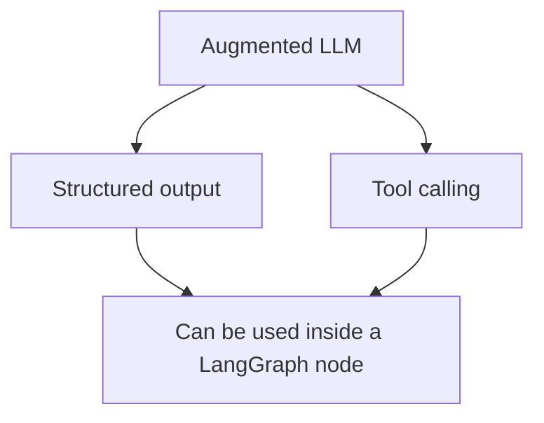
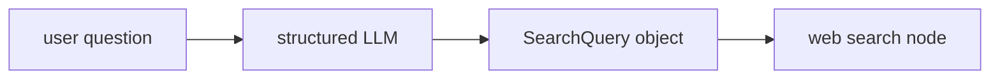
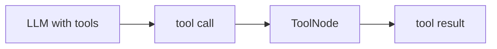

# LangChain Augmentation Snippets

These snippets are LangChain building blocks that fit inside the larger **Augmented LLM** workflow idea.

They are useful because LangGraph workflows often use LangChain models, tools, prompts, and structured outputs inside graph nodes.

## Where This Fits



Use this file as a reference before turning these ideas into full LangGraph examples.

---

## 1. Structured Output With Pydantic

Structured output means: instead of getting free-form text, you ask the LLM to return data that matches a schema.

```python
from pydantic import BaseModel, Field


class SearchQuery(BaseModel):
    search_query: str = Field(
        None,
        description="Query that is optimized web search."
    )
    justification: str = Field(
        None,
        description="Why this query is relevant to the user's request."
    )
```

This schema says the LLM should return two fields:

| Field | Meaning |
|---|---|
| `search_query` | A search query optimized for web search |
| `justification` | Why the query is useful |

Then bind the schema to the LLM:

```python
structured_llm = llm.with_structured_output(SearchQuery)
```

Now the LLM is augmented with a structured output schema:

```python
output = structured_llm.invoke(
    "How does Calcium CT score relate to high cholesterol?"
)
```

The result should be a `SearchQuery` object, not just plain text.

### Why This Matters

This is useful when a workflow needs reliable fields for the next step.

For example:



The structured output can become input to another node.

---

## 2. Tool Binding

Tool binding means: you give the LLM a list of functions it is allowed to request.

```python
def multiply(a: int, b: int) -> int:
    return a * b
```

Then bind the tool to the LLM:

```python
llm_with_tools = llm.bind_tools([multiply])
```

Now the model can decide to call `multiply` when needed:

```python
msg = llm_with_tools.invoke("What is 2 times 3?")
```

The model response can contain tool calls:

```python
msg.tool_calls
```

Example conceptually:

```python
[
    {
        "name": "multiply",
        "args": {"a": 2, "b": 3},
        "id": "..."
    }
]
```

Important: the LLM does not execute the Python function by itself. It requests a tool call. In LangGraph, a `ToolNode` can execute that call.



---

## How This Connects To This Repo

| Snippet | Full Tutorial Location |
|---|---|
| `with_structured_output(SearchQuery)` | `5-Workflows/00_augmented_llm_structured_output.md` |
| `bind_tools([multiply])` | `5-Workflows/00_augmented_llm.md` |

These snippets are small LangChain concepts. The workflow tutorials show how to place similar ideas inside LangGraph graphs.
