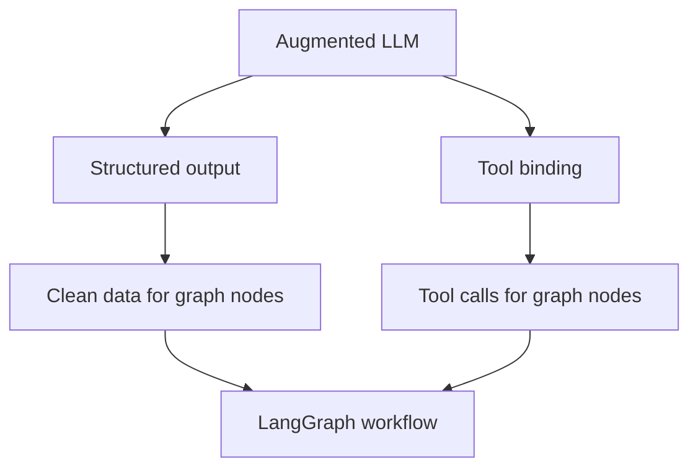

# LangChain Augmentation Snippets

This page collects small **LangChain augmentation patterns** that fit naturally into the LangGraph workflow lessons.

These examples are not full graphs by themselves. Think of them as building blocks:

- **Structured output** makes the LLM return data in a predictable shape.
- **Tool binding** lets the LLM decide when a tool should be called.
- **LangGraph** can then place those augmented LLM calls inside graph nodes.

Before running these examples, make sure your `.env` file contains:

```bash
OPENAI_API_KEY=your_openai_key
```

## Where This Fits



---

## 1. Structured Output

Sometimes you do not want a normal paragraph from the LLM.

You want something structured, like:

```python
{
    "search_query": "...",
    "justification": "..."
}
```

This is useful when the next step in your app expects reliable fields instead of free-form text.

### Full Code

```python
from dotenv import load_dotenv
from langchain_openai import ChatOpenAI
from pydantic import BaseModel, Field

load_dotenv()


# 1. Create the base LLM
llm = ChatOpenAI(model="gpt-4o", temperature=0)


# 2. Define the structure you want back from the LLM
class SearchQuery(BaseModel):
    """Schema for an optimized web-search query."""

    search_query: str = Field(
        description="Query that is optimized for web search."
    )
    justification: str = Field(
        description="Why this query is relevant to the user's request."
    )


# 3. Augment the LLM with structured output
structured_llm = llm.with_structured_output(SearchQuery)


# 4. Invoke the augmented LLM
output = structured_llm.invoke(
    "How does Calcium CT score relate to high cholesterol?"
)


# 5. Print the structured result
print(output.model_dump())
print("Search query:", output.search_query)
print("Justification:", output.justification)
```

### What Is Happening?

The important line is:

```python
structured_llm = llm.with_structured_output(SearchQuery)
```

This tells the LLM:

> Do not just answer normally. Return an object that matches the `SearchQuery` schema.

So instead of receiving a long explanation, your code receives a predictable object with:

- `search_query`
- `justification`

This is very useful before search, retrieval, routing, grading, or any workflow step that needs clean data.

---

## 2. Tool Binding

Tool binding gives the LLM access to functions.

The LLM does not automatically run the function by itself. Instead, it can return a **tool call request** saying:

> I want to call `multiply` with these arguments.

In LangGraph, a `ToolNode` can then execute that tool call.

### Full Code

```python
from dotenv import load_dotenv
from langchain_core.tools import tool
from langchain_openai import ChatOpenAI

load_dotenv()


# 1. Create the base LLM
llm = ChatOpenAI(model="gpt-4o", temperature=0)


# 2. Define a tool
@tool
def multiply(a: int, b: int) -> int:
    """Multiply two integers."""
    return a * b


# 3. Augment the LLM with tools
llm_with_tools = llm.bind_tools([multiply])


# 4. Ask something that should trigger the tool
msg = llm_with_tools.invoke("What is 2 times 3?")


# 5. Inspect the tool call requested by the LLM
print(msg.tool_calls)
```

### What Is Happening?

The important line is:

```python
llm_with_tools = llm.bind_tools([multiply])
```

This tells the LLM:

> You are allowed to use the `multiply` tool if it helps answer the user.

When you run:

```python
msg = llm_with_tools.invoke("What is 2 times 3?")
```

The response may contain a tool call like:

```python
[
    {
        "name": "multiply",
        "args": {"a": 2, "b": 3},
        "id": "...",
        "type": "tool_call"
    }
]
```

That means the LLM selected the tool and prepared the arguments.

Important distinction:

- `bind_tools()` lets the LLM **request** a tool call.
- A `ToolNode` in LangGraph can **execute** that tool call.

That is why this snippet connects directly to the tool-calling agent example in `6-Agents/`.

---

## 3. How These Fit Into LangGraph

These snippets are LangChain patterns, but they become especially useful inside LangGraph.

| LangChain Pattern | What It Does | LangGraph Use |
|---|---|---|
| `with_structured_output()` | Forces predictable output fields | Use inside a node that needs clean state updates |
| `bind_tools()` | Lets the LLM request tool calls | Route to a `ToolNode` when tools are needed |
| Pydantic schema | Defines the shape of model output | Makes graph state updates easier to trust |
| Tool function | Gives the LLM an action it can request | Becomes part of an agent or workflow loop |

A simple mental model:

```text
LangChain augments the LLM.
LangGraph decides whether that augmented LLM fits in a workflow or an agent.
```

For example:

- A structured-output node can classify, grade, or extract information.
- A tool-calling node can decide whether external actions are needed.
- A conditional edge can route based on the structured output or tool calls.

So these snippets are small on purpose — they are the pieces you later plug into larger graphs.
