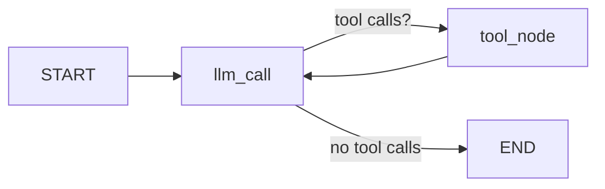

# 00. Tool-Calling Agent — Simple (Manual Tool Node)

## Part 1 — Core Tutorial

A tool-calling agent loops between an LLM and a set of tools. The LLM decides at runtime whether to call a tool or return a final answer. That decision is what makes it an **agent** rather than a workflow.




### The loop

```text
llm_call → should_continue → tool_node → llm_call → ... → END
```

On each pass the LLM either:
- emits a **tool call** → `tool_node` runs it, result is appended to messages, loop continues
- emits a **plain message** → no tool call, graph exits

The number of iterations is not fixed in code — **the LLM decides**.

## Part 2 — Code Example

File: `00_tool_calling_agent_simple.py`

### Tools

Three plain arithmetic tools decorated with `@tool`:

```python
@tool
def add(a: int, b: int) -> int: ...

@tool
def multiply(a: int, b: int) -> int: ...

@tool
def divide(a: int, b: int) -> float: ...
```

`@tool` exposes the function to the LLM with its name, description, and argument schema.

### LLM node

```python
def llm_call(state: MessagesState):
    return {
        "messages": [
            llm_with_tools.invoke(
                [SystemMessage(content="...")] + state["messages"]
            )
        ]
    }
```

A `SystemMessage` is prepended on every call to keep the model focused. The rest of the history (`state["messages"]`) follows so the model has full context.

### Tool node — written out manually

```python
def tool_node(state: MessagesState):
    result = []
    for tool_call in state["messages"][-1].tool_calls:
        t = tools_by_name[tool_call["name"]]
        observation = t.invoke(tool_call["args"])
        result.append(ToolMessage(content=str(observation), tool_call_id=tool_call["id"]))
    return {"messages": result}
```

This iterates over every tool call in the last message, runs the matching function, and wraps each result in a `ToolMessage`. The next LLM pass reads these results as part of the message history.

This is what `ToolNode` in `01_tool_calling_agent.py` does internally — written out here so the mechanics are visible.

### Router

```python
def should_continue(state: MessagesState):
    if state["messages"][-1].tool_calls:
        return "tool_node"
    return END
```

Checks one thing: did the LLM request tools? Yes → loop. No → end.

## Simple vs Full example

| | `00_tool_calling_agent_simple.py` | `01_tool_calling_agent.py` |
|---|---|---|
| Tool node | Manual loop (visible) | `ToolNode` prebuilt (hidden) |
| Tools | Simple math | Weather, tip, web search |
| State | `MessagesState` built-in | Custom `AgentState` |
| System prompt | Explicit in `llm_call` | Not used |

Start here to see exactly what happens inside the loop. Move to `01_tool_calling_agent.py` for a realistic example with external APIs.

## Exercises

**Exercise 1 — Add a new tool**

Add a `subtract(a: int, b: int) -> int` tool. Bind it alongside the existing tools and ask: `"What is 10 minus 3?"` Verify the agent calls your tool.

**Exercise 2 — Trace the messages**

After running the agent, print `result["messages"]` and identify: the `HumanMessage`, the `AIMessage` with `tool_calls`, the `ToolMessage` with the result, and the final `AIMessage` with the answer. Understanding this sequence is the key to debugging agents.
